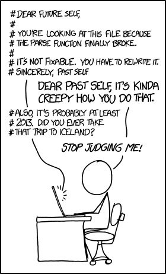
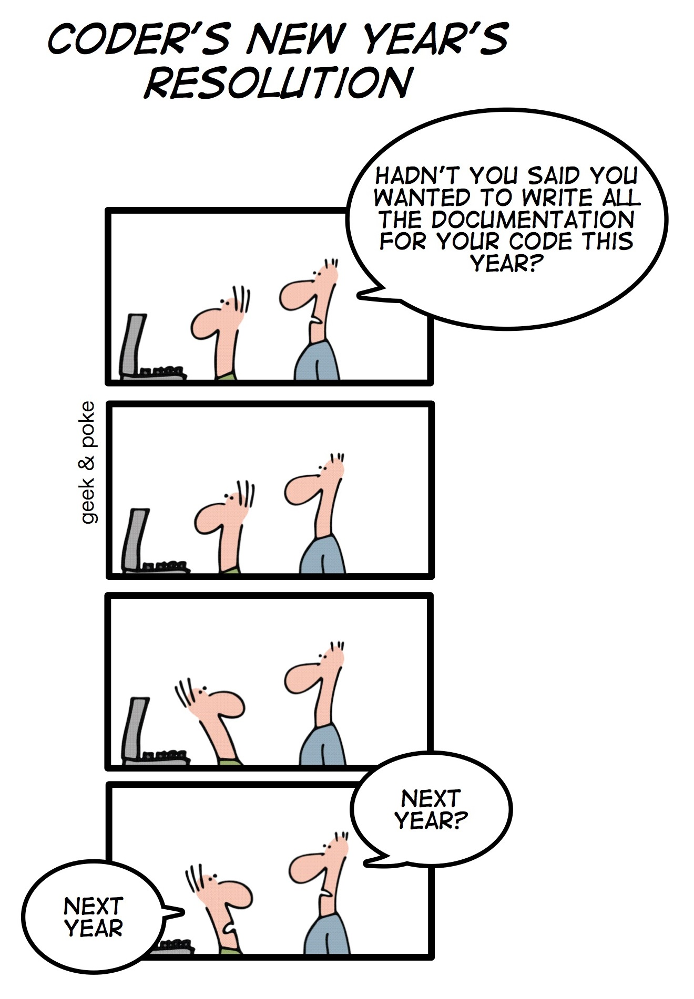
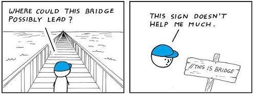
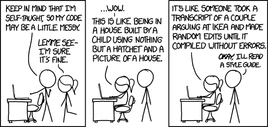
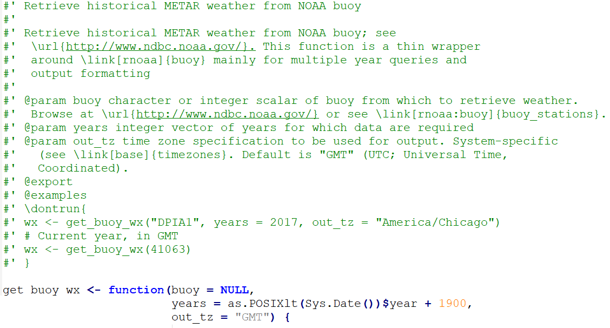
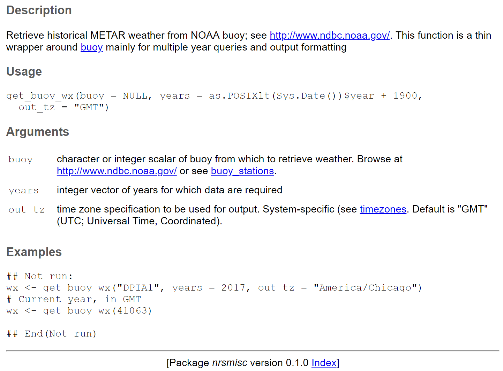

```{r setup, include = FALSE}
knitr::opts_chunk$set(warning = FALSE, message = FALSE, 
                      fig.retina = 3, fig.align = "center")
```

```{r xaringan-themer, include=FALSE, eval=FALSE}
library(xaringanthemer)
mono_light(
  code_font_family = "Fira Code",
  code_font_url    = "https://cdn.rawgit.com/tonsky/FiraCode/1.204/distr/fira_code.css"
)
```

```{r packages-data, include = FALSE}
library(dplyr)
library(flair)
```

background-image: url(images/an-image.jpg)
background-size: contain
class: hide-logo, center, middle, inverse

#  Tools for a Code-based Data Workflow

.pull-left[
`McCrea Cobb`  
`r icon::fa("envelope")` mccrea_cobb@fws.gov  
`r icon::fa("phone")` 907-786-3403  
`r icon::fa("github")` mccrea.cobb  
]

.pull-right[
`Adam D. Smith`  
`r icon::fa("envelope")` adam_d_smith@fws.gov  
`r icon::fa("phone")` 706-425-2197  
`r icon::fa("github")` adamdsmith  
]

---
class: inverse, center, middle, hide-logo

# Documenting

???

Before we dig into data acquisition, processing, and analysis, we need to have 
"THE TALK". Yep, we need to talk about documentation. 

---

# Why document our code?

???

Why should we document our code? There are plenty of good reasons to document our code, but we'll focus on one --- reproducibility. It's one of criteria McCrea mentioned that we should strive for in the data management life cycle. Namely, at the very least, given the same set of data and a road map for data manipulation and analysis, we should be able to arrive at the same analytical or graphical result. The arguments about whether our methodology was the "correct" methodology are independent of this. At the very least we should be able to start from the same results. That's reproducibility. McCrea and I are asserting that reproducibility it much easier in a code-based workflow. Documentation helps turn the "computer-speak" of code into human readable format. Those humans will often be your colleagues, but are more than likely to be you, some time into the future. And good documentation discourages the self-loathing that often accompanies the experience or reading your code 6 months after you started it...

--

.pull-left[
.large[**Reproducibility**]

Make it reproducible for:
- colleagues
- future **you**!
]

.pull-right[
.left[[](https://m.xkcd.com/1421/)]
]

---

# Documenting basics

- [Wilson et al. 2014](https://journals.plos.org/plosbiology/article?id=10.1371/journal.pbio.1001745) *Best practices for scientific computing*

- [Wison et al. 2017](https://journals.plos.org/ploscompbiol/article?id=10.1371/journal.pcbi.1005510) *Good enough practices in scientific computing*

- [Lee 2018](https://doi.org/10.1371/journal.pcbi.1006561) *Ten simple rules for documenting scientific software*

???

Most of the documentation "basics" we cover are described well in these three sources, which I leave here for posterity. These are worthy reads once you start down the slippery slope of a code-based workflow. 
---
class: despaced

# Documenting basics

.pull-left[
<br>
- Comment code as you go

- Write self-documenting code

- Make dependencies explicit

- Write modular code

- Include a project README

- Record working environment

- Version control
]

.pull-right[.center[[](http://geek-and-poke.com/geekandpoke/2010/12/31/coders-new-years-resolution.html)]]

???

I'm just going to hit you with all of these at once, as well take each in turn. There's nothing R-specific about these basics. They'll apply equally to your forays into Python, C++, Matlab, or any other coding program. As we take them in turn, however, we'll see a brief example or two of how these basics "look" in R.

---

# Comment code as you write it

- "Lab notebook" for code

- Write for people, not computers

- Bare minimum form of documentation

---

## Comment code as you write it

- In , comment marker is number sign/hash (`#`)

- <ins>Barest minimum</ins>: brief explanatory description at top of file

.large[
```{r echo = TRUE, eval = FALSE}
# This code retrieves historical METAR weather from NOAA 
# buoys; see http://www.ndbc.noaa.gov/. This function 
# wraps rnoaa::buoy() to allow multiple year queries
```
]

---

# Comment code as you write it

- Better: comment **succintly** throughout code

- Note your intentions, not mechanics: **"why"** not "what" nor "how"

.center[[](https://abstrusegoose.com/432)]

---

# Comment code as you write it

**NOT HELPFUL**

```{r echo = TRUE, eval = FALSE}
# Import data
df <- rio::import("survey_data.xlsx")

# Define new variable
df <- mutate(df, above_water = above / (above + below))
```

--

**BETTER**

```{r echo = TRUE, eval = FALSE}
# Import manatee aerial survey data
df <- rio::import("survey_data.xlsx")

# Calculate proportion of manatees above water surface at each location
df <- mutate(df, above_water = above / (above + below))
```

---

# Write self-documenting code 

- Name objects informatively

.pull-left[

**NOT HELPFUL**

```{r echo = TRUE, eval = FALSE}
# Data object naming
df <- rio::import("birds.csv")
df2 <- rio::import("veg.csv")

# Variable naming
r <- 100
a <- pi * r ^ 2

# Function naming
my_fun <- function(r) {pi * r ^ 2}
```

]

--

.pull-right[

**BETTER**

```{r echo = TRUE, eval = FALSE}
# Data object naming
bird_counts <- rio::import("birds.csv")
veg_data <- rio::import("veg.csv")

# Variable naming
survey_radius <- 100
survey_area <- pi * survey_radius ^ 2

# Function naming
calc_circle_area <- function(radius) {pi * radius ^ 2}
```

]

---

# Write self-documenting code

- Follow (or at least read) a style guide

.center[[](https://xkcd.com/1513/)]

---

# Make dependencies explicit

### Two types of dependencies

- Package dependencies of code
  - Load required packages at beginning of script

--

- Function dependencies (package source)
  - Identify the package source of used functions

---

# Make package dependencies explicit

```{r load-packages, echo=FALSE, tidy=FALSE}
decorate('
# General pattern
library(package)

# Example
library(dplyr)
', eval = FALSE) %>%
  flair_rx("package|dplyr", background = "#CBB5FF") %>%
  knit_print.with_flair()  
```

---

# Make function source package explicit

- Avoids conflicts when multiple packages share function names 

```{r explicit-dependency, echo=FALSE, tidy=FALSE}
decorate('
# General pattern
package::function()

# Examples
rio::import()
dplyr::mutate()
', eval = FALSE) %>%
  flair_rx("package|rio|dplyr", background = "#CBB5FF") %>%
  flair_rx("function|import|mutate", background = "#FFDFD1") %>% 
  knit_print.with_flair()
```

---

# Modularize your code

- Separate scripts for separate tasks

- Turn repeated code tasks into functions

- Load functionality
  - `source("your_script.R)`

---

# Modularize your code

- Makes automated documentation tools handy/available

- `roxygen2` package

  - specialized comments (`#'`) translated into documentation

  - [introductory vignette](https://cran.r-project.org/web/packages/roxygen2/vignettes/roxygen2.html)

- Human readable documentation for free!
  
---

# `roxygen2` example

.center[]

---
count: false

# `roxygen2` example

.center[]

---

# Include a README file

- Brief introduction to a project before accessing the code

--

### General Structure

1. What your code is/does (with context)
2. Demonstrate how to use your code (install, configure, find help)
3. What your code looks like in action (examples)
4. Other relevant details (license, acknowledgments, working environment)

--

### Handy templates available (e.g., [`usethis::use_readme_rmd`](https://usethis.r-lib.org/reference/use_readme_rmd.html))

---

# Record working environment

- Version info for , the OS, and packages

- `sessionInfo()` or `devtools::session_info()`

???

McCrea will mention a couple of ways to wrap all your dependencies up into a single
package prior to sharing to help avoid issues with dealing with different 
operating systems and R package versions

---

# Put documentation under version control

- Stays "synced" with code as it changes

- Modularize and take advantage of automated documentation tools

???

The same benefits of putting your code under version control (with Git/Github for example)
apply to the documentation. When code and the documentation change substantially, you
retain a record of all past versions. And if you smartly decide to modularize your code, 
and store the documentation alongside your code using comments and roxygen, you
can take advantage of the automated documentation tools R offers

---

