```{r setup, include=FALSE}
knitr::opts_chunk$set(warning = FALSE, message = FALSE, 
                      fig.retina = 3, fig.align = "center")

options(htmltools.dir.version = FALSE)
library(icon)
library(tidyverse)
library(crayon)
library(flair)
library(sbtools)
```

```{r xaringan-themer, include=FALSE, eval=FALSE}
library(xaringanthemer)
mono_light(
  code_font_family = "Fira Code",
  code_font_url    = "https://cdn.rawgit.com/tonsky/FiraCode/1.204/distr/fira_code.css",
  base_font_size = "22px",
  outfile = "css/xaringan-themer.css"
)
```


class: hide-logo, center, middle, inverse
#  Tools for a Code-based Data Workflow

.pull-left[
`McCrea Cobb`  
`r icon::fa("envelope")` mccrea_cobb@fws.gov  
`r icon::fa("phone")` 907-786-3403  
`r icon::fa("github")` mccrea.cobb  
]

.pull-right[
`Adam D. Smith`  
`r icon::fa("envelope")` adam_d_smith@fws.gov  
`r icon::fa("phone")` 706-425-2197  
`r icon::fa("github")` adamdsmith  
]

<br>

`r icon::fa("github")` usfws.github.io/data-mgt-with-r/


???
Hello and welcome to Tools for a Code-based Data Workflow. 

My name is McCrea Cobb. I work as a biometrician in the Inventory and Monitoring Program within the National Wildlife Refuge Sytem, and I am located in Anchorage, Alaska. I am co-presenting with Adam Smith, who is quantitative ecologist with the I&M program based in Athens, Georgia.

You can find our presentation slides at the link at the bottom.


---
class: inverse, center, middle, hide-logo

# Document
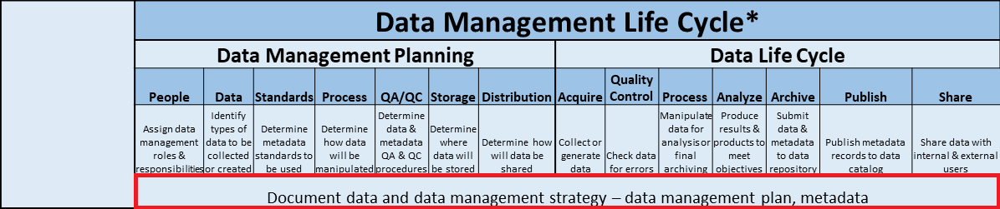

???

Before we dig into data acquisition, processing, and analysis, we need to have 
"THE TALK". Yep, we need to talk about documentation. 

---

# Why document our code?

.pull-left[
.large[**Reproducibility**]

Make it reproducible for:
- colleagues
- future **you**!
]

.pull-right[
.left[[](https://m.xkcd.com/1421/)]
]

???

Why should we document our code? There are plenty of good reasons to document our code, but we'll focus on one --- reproducibility. It's one of criteria McCrea mentioned that we should strive for in the data management life cycle. To put it simply, if you and I start with the same set of data, and a road map for data manipulation and analysis, we should at the very least be able to arrive at the same analytical or graphical results. Arguments about whether our particular analytical road map was "correct" are independent of reproducibility. Reproducibility makes sure we can start those arguments from the same place. McCrea and I are asserting that reproducibility it much easier in a code-based workflow. What does that have to do with documentation? Well, code is written for computers. Documentation helps turn the "computer-speak" of code into human readable content so we can better understand our mutual starting point for discussion/argument. Those humans will often be your colleagues, but are more than likely to be you, some time into the future. And good documentation discourages the self-loathing that often accompanies the experience or revisiting your code 6 months after you started it...

---

# Documenting basics

- [Wilson et al. 2014](https://journals.plos.org/plosbiology/article?id=10.1371/journal.pbio.1001745) *Best practices for scientific computing*

- [Wison et al. 2017](https://journals.plos.org/ploscompbiol/article?id=10.1371/journal.pcbi.1005510) *Good enough practices in scientific computing*

- [Lee 2018](https://doi.org/10.1371/journal.pcbi.1006561) *Ten simple rules for documenting scientific software*

???

Most of the documentation "basics" we cover are described well in these three sources, along with more rigorous documentation techniques. So we simply leave these references here for posterity. But they are worthy reads once you start down the slippery slope of a code-based workflow. 
---
class: despaced

# Documenting basics

.pull-left-60[
<br>
.center[]]

.pull-right-40[
<br>
- Comment code as you go

- Name objects informatively

- Write modular code

- Make dependencies explicit

- Record working environment

- Include a project README

- Version control

- Follow a style guide

]


???

Let me hit you with all of these "basics" of documentation at once, as we'll take each in turn. But it's worth pointing out there's nothing R-specific about this list. They apply equally to your forays into Python, C++, Matlab, or any other coding program. But since this *is* a presentation about R, we'll see a brief example or two of how these basics "look" in R as we work our way through them.

---

# Comment code as you write it

.pull-left[
- "Lab notebook" for code

- Write for people, not computers

- Bare minimum documentation
]
.pull-right[.right[]]

???

Our first stop on the documentation train is adding comments to the code you write. COmments give you the opportunity to integrate a "lab notebook" into your code. Code is written for computer understanding, comments are written for human understanding. Consider commenting your code as the bare minimum requirement of documenting your code. 

---

# Commenting R code

- Comment marker in : `#` (number sign/hash)

```{r echo = TRUE, eval = FALSE}
# This is a comment

x <- 2 # This is also a comment
```

--

- <ins>Barest minimum</ins>: brief explanatory description at top of file

.large[
```{r echo = TRUE, eval = FALSE}
# This code retrieves historical METAR weather from NOAA 
# buoys; see http://www.ndbc.noaa.gov/. This function 
# wraps rnoaa::buoy() to allow multiple year queries
```
]

---

# Comment code as you write it

- <ins>Better</ins>: comment **succintly** throughout code

- Focus on your intentions, not mechanics: **"why"** not "what" nor "how"

.center[[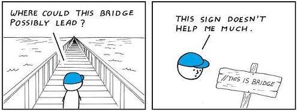](https://abstrusegoose.com/432)]

???

But if you want to be the star student, or at least not hate yourself later, a better approach is to provide thoughtful comments throughout the code that informs the reader, *succintly*, of your intentions. This isn't play-by-play. We don't need to rehash "what" we're doing with the code ("loading in my data"), or "how" the code is doing it ("looping over individuals"), but rather "why" we wrote any particular piece of code. What is that code intending to accomplish?

---
class: despaced

# Comment code as you write it

<br>
**LESS HELPFUL**

```{r echo = TRUE, eval = FALSE}
# Import data
df <- rio::import("survey_data.xlsx")

# Define new variable
df <- mutate(df, above_water = above / (above + below))
```

--

**BETTER**

```{r echo = TRUE, eval = FALSE}
# Import manatee aerial survey data
df <- rio::import("survey_data.xlsx")

# Calculate proportion of manatees above water surface at each location
df <- mutate(df, above_water = above / (above + below))
```

---

# Name objects informatively

.pull-left[

**LESS HELPFUL**

```{r echo = TRUE, eval = FALSE}
# Data object naming
df <- rio::import("birds.csv")
df2 <- rio::import("veg.csv")

# Variable naming
r <- 100
a <- pi * r ^ 2

# Function naming
my_fun <- function(r) {
  pi * r ^ 2
}
```

]

.pull-right[

**BETTER**

```{r echo = TRUE, eval = FALSE}
# Data object naming
bird_counts <- rio::import("birds.csv")
veg_data <- rio::import("veg.csv")

# Variable naming
survey_radius <- 100
survey_area <- pi * survey_radius ^ 2

# Function naming
calc_circle_area <- function(radius) {
  pi * radius ^ 2
}
```

]

???

Comments are one very useful way to help translate the code written for computers into human-readable content. Another important way to integrate human-readable language into our code, without really impacting our software's ability to interpret that code, is to give informative names to the objects we create.

On the left...

---

# Modularize your code

- Separate scripts for separate tasks

- Execute or load the functionality with the `source` function

```{r echo = TRUE, eval = FALSE}
source("code/00_load_dependencies.R")
source("code/01_import_data.R")
source("code/02_tidy_data.R")
source("code/03_fit_regression_models.R")
source("code/04_generate_figures.R")
source("code/05_generate_report.R")
```

???

Even the best commenting and object naming in the world isn't going to make it eash to reading through a single, epic script that proceeds all the way from data import to report generation. It's much easier to navigate through code that has been divided into multiple scripts that perform a focused, specific purpose. This is compared to, say, generating a single script that sequentially proceeds through much of the data management lifecycle. 

In R, we can execute the code, or load the functionality of the code, in these separate, modular scripts with the `source` function.

---

# Turn repeated code tasks into functions

### Function structure in 

```{r functions, include = FALSE, echo = FALSE}
# General usage
functionName <- function(argument1, argument2, ...) {
  # Do stuff
}

# Example
createAwesomePlot <- function(data, 
                              outpath = "plot.png") {
  # Make awesome plot
}
```

```{r, echo = FALSE}
decorate("functions") %>%
  flair_rx("functionName|createAwesomePlot", background = "#CBB5FF") %>%
  flair_rx("argument1|argument2|\\.\\.\\.|data|outpath", background = "#FFDFD1")
```

???

Regardless of whether we modularize our code, there are almost certainly going to be repetitive sections of code. Often we want to perform similar actions, make similar data transformations, generate similar plots, or repeat analyses. Well, in the spirit of avoiding long scripts, and breaking your code up into more manageable, modular chunks, consider turning those sections of repetitive code into functions.

A function is simply a chunk of code that can accept inputs and returns to us a output. We call the inputs arguments. And in R, the general structure of functions look like...

---
count: false

```{r, eval = FALSE}
source("code/functions/createAwesomePlot.R")
figure_2 <- createAwesomePlot(data = bird_counts, outpath = "output/birds_plot.png")
figure_3 <- createAwesomePlot(data = veg_data, output = "output/veg_plot.png")
```

.center[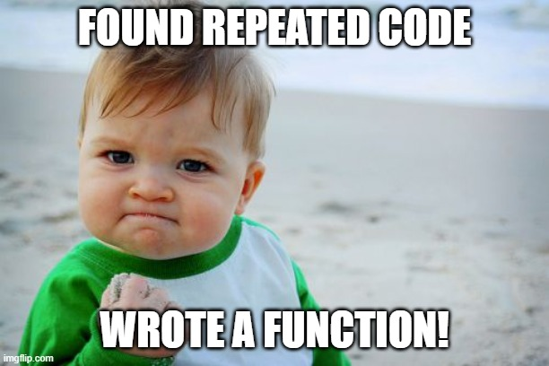]

???

It's extremely satisfying to write a stand-alone function, `source`ing that functionality into R, and then performing some task with a line of code. It's easier to troubleshoot too...

---

# Documentation for (nearly) free!

.pull-left[
- [`roxygen2`](https://cran.r-project.org/web/packages/roxygen2/vignettes/roxygen2.html)

  - specialized comments (`#'`)
  
  - translated into documentation
]

.pull-right[]

???

While we're on the topic of turning repetitive code into functions, let's bring up another perk beside easier maintenance and the satisfaction of calling your own functions - automated documentation tools

Since you'd be commenting your functions anyway (right?), R has a handy package (roxygen2) that allows you turn basically turn your comments into standardized, human readable, html documentation. You accomplish this through the use of a special comment character (roxygen comment) and a few special tags (e.g., to identify the parameters, product, and examples, etc. of your function)

---

# `roxygen2` example

.center[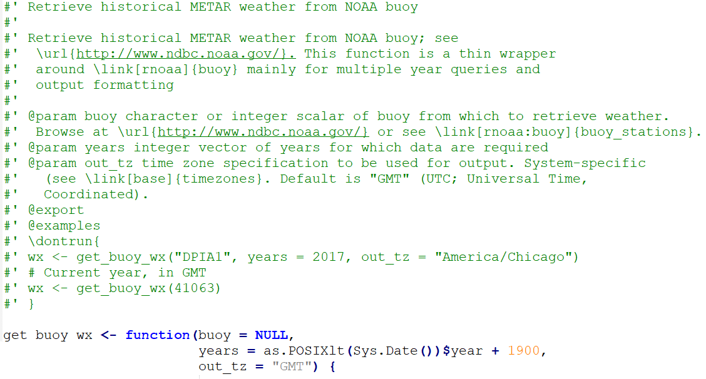]

---
count: false

# `roxygen2` example

.center[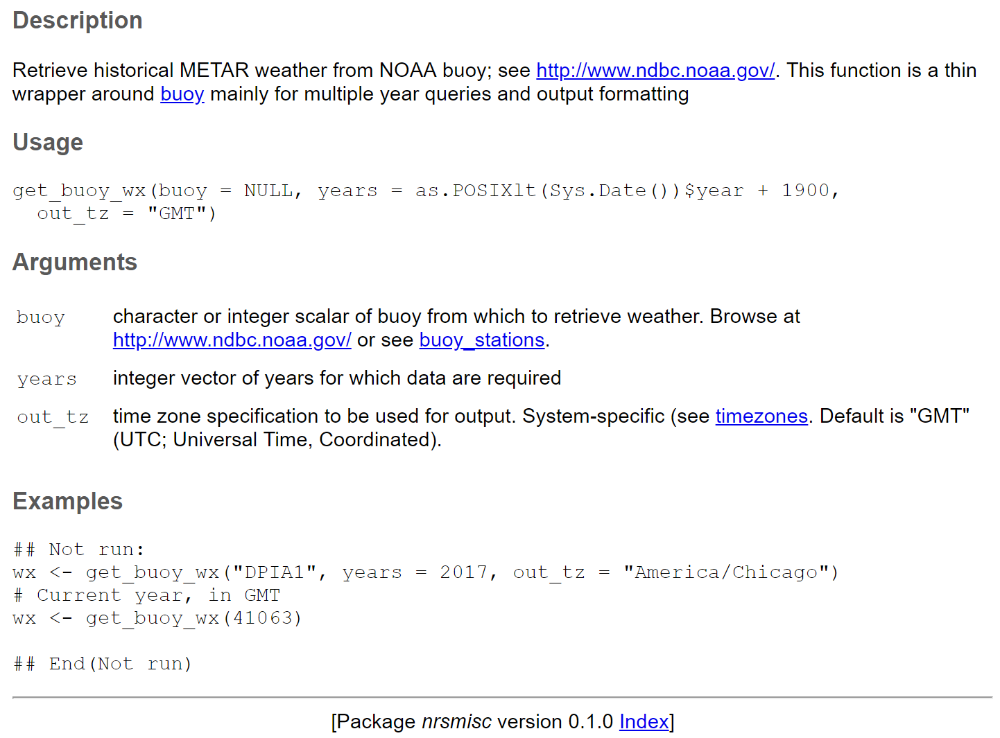]

---
# Make dependencies explicit

### Package dependencies of code

- Load required packages at beginning of script

```{r load-packages, echo=FALSE, tidy=FALSE}
decorate('
# General usage
library(package)

# Example
library(dplyr)
', eval = FALSE) %>%
  flair_rx("package|dplyr", background = "#CBB5FF") %>%
  knit_print.with_flair()  
```

---
# Make dependencies explicit

### Function dependencies (package source)

- Identify the package source of used functions
- Avoids conflicts when multiple packages share function names 

```{r explicit-dependency, echo=FALSE, tidy=FALSE}
decorate('
# General usage
package::function()

# Examples
rio::import()
dplyr::mutate()
', eval = FALSE) %>%
  flair_rx("package|rio|dplyr", background = "#CBB5FF") %>%
  flair_rx("function|import|mutate", background = "#FFDFD1") %>% 
  knit_print.with_flair()
```

---

# Record working environment

- Version info for , the OS, and packages

- `sessionInfo()` or `devtools::session_info()`

???

McCrea mention a couple of ways to wrap all your dependencies up into a single
package prior to sharing to help avoid issues with dealing with different 
operating systems and R package versions

---

# Include a README file

- Briefly introduce your project to users before they access the code

### General Structure

1. What your code is/does (with context)

2. Demonstrate how to use your code (install, configure, find help)

3. What your code looks like in action (examples)

4. Other relevant details (license, acknowledgments, working environment)

---
# Include a README file

### Handy templates available

- e.g., [`usethis::use_readme_rmd`](https://usethis.r-lib.org/reference/use_readme_rmd.html)

### Bonus points: create a [vignette](http://r-pkgs.had.co.nz/vignettes.html)

---

# Put documentation under version control

- Stays "synced" with code as it changes

.center[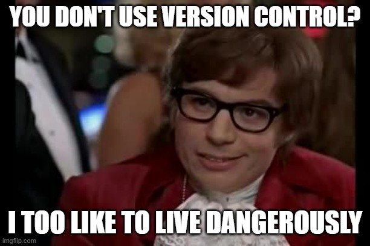]


???

The same benefits of putting your code under version control (with Git/Github for example)
apply to the documentation. When code and the documentation change substantially, you
retain a record of all past versions and can better manage keeping your documentation in step with your code.

---

# Follow (or at least read) a style guide

.center[[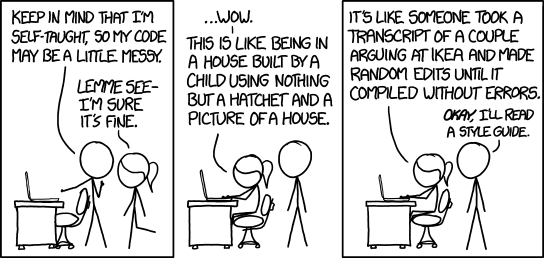](https://xkcd.com/1513/)]

???

So, thoughtful commenting and informative object naming are the two main ways you can alter the content of your code to better express your intentions and goals. 

But there are several other documentation "basics" that help you to better organize your code to make it more readable and easier to troubleshoot. The first of these is straightforward---when you write code, do it with a consistent style. McCrea covered this earlier in the presentation, so consider this a friendly reminder to at least read a style guide. 

We link several in the repository associated with this presentation. Whatever style you choose, being consistent with it can dramatically improve the readability of your code, making your intentions that much easier to follow.


---
class: inverse, center, middle, hide-logo

# Acquire
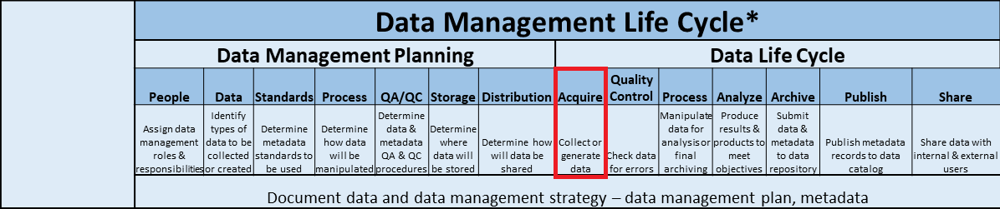


???

On to data acquisition. In our current context of a code-based workflow, we're not referring to the actual collection of data, say, as a part of field work in a biological monitoring program.(REFERENCE EARLIER WEBINAR RE DIGITATL DATA COLLECTION?) We're referring in this case to the act of retrieving the data that you've toiled to collect and bringing it into R so we can process it, quality control it, visualize it, analyze it, report on it, and share and archive it. 

---

# Data sources

.pull-left[
- Flat file database
  - e.g., `csv`, `xls`, `tsv`, `txt`, etc.

- Relational database
  - e.g., Access, SQL, etc.

- web API (open or internal)
    - AGOL, ServCat, IRMA, ...
]

.pull-right[
<br>
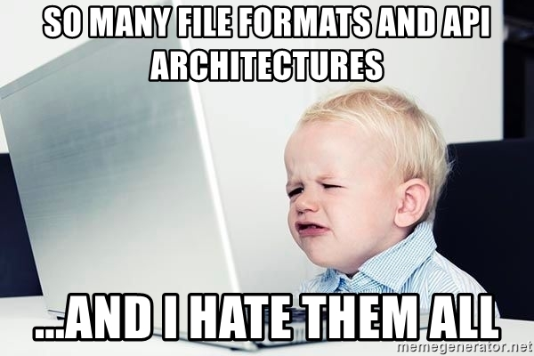]

???

We distinguish generally between three sources of the data that you might reasonably want to bring into R: flat file databases (things like csvs, Excel and Google spreadsheets, fixed width), relational databases (e.g., Microsoft Access, SQL Server, etc), or data that sitting behind a web API (either open or secured). For flat files and relational databases, R doesn't generally care if that file is sitting on your machine or on a server somewhere as long as ou can construct a path to it.

We simply don't have time to tackle these in depth, so we'll focus on a handy R package for getting data in flat files into R as well as demonstrate that one can pull directly from ArcGIS online into R.

---

# Acquiring data in flat files

.pull-left-60[
- [`rio`](https://cran.r-project.org/web/packages/rio/index.html) 

- [Opinionated defaults](https://github.com/leeper/rio#package-philosophy) simplify data I/O

- `import`, `export`, and `convert` functionality
]

.pull-right-40[.left[]]

???

There's no shortage of different flat file formats, and there's pretty much an R package to get any flat file into R. But rather than bewilder you with those different packages, we focus on a single package that attempts to import and export the vast majority of them. The rio package does this by making some pretty reasonable assumptions about how you want the data, and then using the appropriate R package behind the scenes to get your data in and out of R.

---

# [Supported `rio` file formats](https://github.com/leeper/rio#supported-file-formats)

```{r rio-formats, echo = FALSE}
library(DT)
rio_file_types <- rio::import("./data/rio_formats.csv")
DT::datatable(rio_file_types, options = list(pageLength = 8, dom = 'tip'), rownames = FALSE)
```

???

Really a Swiss army knife of data I/O
---

#`rio` example - local file or web URL

```{r flat-file, eval = FALSE}
species <- rio::import("data/species.csv")
species <- rio::import("https://motus.org/data/downloads/api-proxy/species")
```

```{r flat-output, echo = FALSE}
library(knitr); library(kableExtra)
rio::import("https://motus.org/data/downloads/api-proxy/species") %>% 
  select(english, scientific) %>%
  filter(grepl("Red Knot|Painted Bunting|Ruddy Turnston|Saltmarsh", english, TRUE)) %>%
  kable()
```

---

# Acquiring data in relational databases

.pull-left-70[
- [several database architectures supported](https://db.rstudio.com/databases)

- SQL-related options supported generally

  - can execute queries prior to import (`dplyr`)

- Communication with MS Access is problematic
  
  - export flat files (e.g., `csv`, `xlsx`) for `rio`
]

.pull-right-30[
<br>
<br>
.center[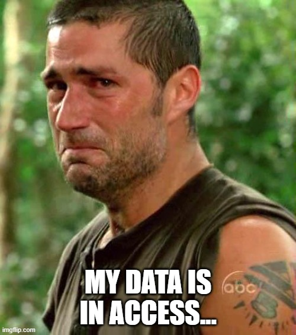]]

???

We won't dwell long on relational databases, but there is flexibility. In general, SQL-based options are well-supported. And with the `dplyr` r package that we'll see again later, there's functionality to perform SQL actions in place prior to pulling the data into memory. Getting data directly from Access is an issue, so the best option there is generally to export flat files from Access and work with those...

---

# Acquiring data behind web APIs

- Dedicated  packages

   - [ScienceBase](https://www.usgs.gov/centers/cdi/science/sbtools-r-package-sciencebase?qt-science_center_objects=0#qt-science_center_objects), [eBird](https://cran.r-project.org/web/packages/auk/index.html), [iNaturalist](https://github.com/ropensci/rinat), [FishBase](https://www.fishbase.in/search.php), [NOAA](https://cran.r-project.org/web/packages/rnoaa/index.html), [GBIF](https://cran.r-project.org/web/packages/rgbif/index.html), [BISON](https://cran.r-project.org/web/packages/rbison/index.html), [ITIS](https://cran.rstudio.com/web/packages/ritis/)

.center[      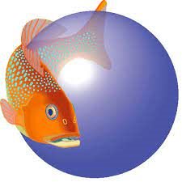]
.center[    ]

???

Another useful way for us to access data is though a web API service. Put simply, an API is any interface in which we can use a set of programming functions to access features or data from some application. In a web API, that service sits on the web, and we access via HTTP protocols. 

We expect that data access, storage, and archiving via web APIs will become commonplace. For example, we are starting to see more and more of our biological inventory and monitoring work hosted on services like ArcGIS online

For the purposes of this webinar, there is simply too much to cover, so we'll focus on a couple of points. 

FIrst, some web APIs we're likely to find useful have existing dedicated R packages. Services like USGS's ScienceBase (which McCrea will illustrate later), eBird, iNaturalist, FishBase, online biodiversity repositories like GBIF and BISON, as well as ITIS, our taxonomic information system. 

---
count: false

# Acquiring data behind web APIs

- Some APIs already have dedicated  packages

   - [ScienceBase](https://www.usgs.gov/centers/cdi/science/sbtools-r-package-sciencebase?qt-science_center_objects=0#qt-science_center_objects), [eBird](https://cran.r-project.org/web/packages/auk/index.html), [GBIF](https://cran.r-project.org/web/packages/rgbif/index.html), [BISON](https://cran.r-project.org/web/packages/rbison/index.html), [iNaturalist](https://github.com/ropensci/rinat), [ITIS](https://cran.rstudio.com/web/packages/ritis/)

.pull-left-70[
- Do-It-Yourself

  - AGOL, ServCat, IRMA, PRIMR, data.gov
  
  - [`httr`](https://cran.r-project.org/web/packages/httr/index.html) and [`crul`](https://cran.r-project.org/web/packages/crul/index.html) packages
]

.pull-right-30[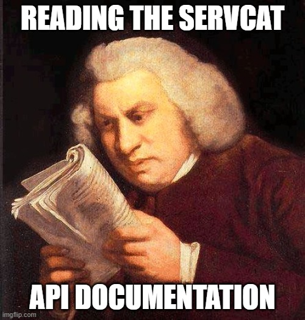]

???

But there are plenty of other APIs we're likely to find useful that don't have existing R packages, and we may be interested in setting up access on our own. Services like AGOL...

THere are a couple of handy packages to help you with passing the necessary HTTP requests, like the `httr` and `crul` packages. Although I'll note the  `crul` package is aimed more at developers than casual users.

One complication is that while most web APIs use the same HTTP requests (so most can be accessed using the `httr` package, for example), the format of those requests varies from API to API, and some are more complicated than others. But the rewards for getting it to work can be substantial to a complete code-based workflows. Let's take ArcGIS Online as an example, which the FWS is using increasingly for digital data collection, storage, and archiving of wildlife survey and monitoring data.

---
background-image: url(images/rcw-agol.png)
background-size: contain

<br>

--

.pull-left[.right[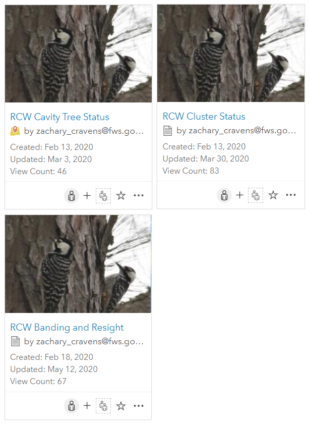]]

--

.pull-right[.left[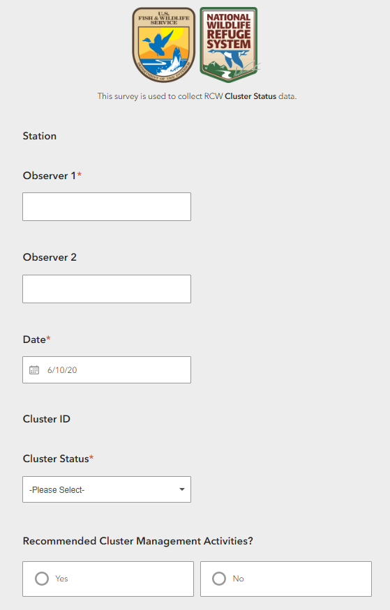]]

---
count: false
background-image: url(images/rcw-agol.png)
background-size: contain


.center[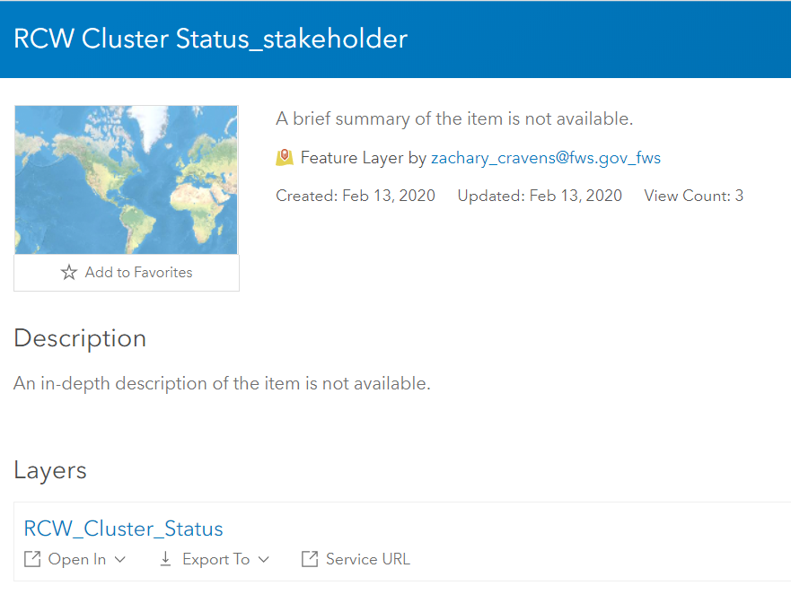]

???

Behind a secure web service API, but we can access it...

Compare to going to web browser, navigating to project and specific survey, exporting to a flat file locally, and then reading into R.

---
```{r pull-rcw, include = FALSE, echo = FALSE, eval = FALSE}
pull_rcw_cluster_survey <- function() {

  # Do some stuff...
  
  # Connect and pull content of RCW cluster status feature on USFWS AGOL
  url <- "https://services.arcgis.com/...path_RCW_cluster_feature_server"
  token <- "wouldnt_you_like_to_know"
  outFields <- "*"
  where = "1=1"
  layerInfo <- jsonlite::fromJSON(
    httr::content(httr::POST(url, 
                             query = list(f = "json", token = token), 
                             encode = "form",
                             config = httr::config(ssl_verifypeer = FALSE)), 
                  as = "text"))
  
  # Do some more stuff...
  
}
```

```{r, echo = FALSE}
decorate("pull-rcw") %>%
  flair_rx("httr::content|httr::POST|httr::config", background = "#CBB5FF")
```

---
```{r, echo = FALSE}
# source("~/FWS_Projects/Requests_for_assistance/data-mgt-with-r/code/functions/pull_rcw_cluster_survey.R")
# rcw_clusters <- pull_rcw_cluster_survey()
# saveRDS(rcw_cluster, "data/rcw_clusters.rds")
rcw_clusters <- readRDS("data/rcw_clusters.rds")
```

```{r rcw-agol, eval = FALSE}
rcw_clusters <- pull_rcw_cluster_survey()
```

.scroll-output-tall[
```{r rcw-data, echo = FALSE}
rcw_clusters %>%
  select(-globalid, -FK_cluster_ID) %>%
  kable()
```
]

---
.center[
```{r rcw-plot, echo = FALSE, fig.width=15, fig.height=8}
library(mapview); library(leaflet)
mapview(rcw_clusters, map.types = "OpenStreetMap")@map %>%
  fitBounds(-93, 30, -78, 36)
```
]

---
class: inverse, center, middle, hide-logo

# Process
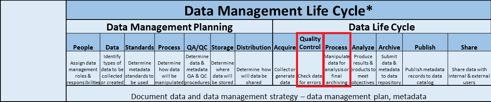


???

---
# Data processing

- Reshaping
- Manipulating, transforming, cleaning
- Quality control
- Exploratory data analysis

.center[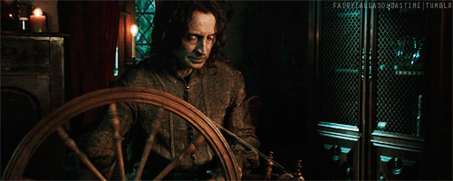]

???

One way or the other, we've wrangled our data into R. Now it's time to process that raw data into something fit for visualization and analysis. Way more time is spent on these general tasks of data reshaping, manipulation, cleaning, and quality control than you'd probably be comfortable with. But it's a fact of life, and I like to think this is where we start the process of spinning straw into golden thread...

---
# Data reshaping

.center[[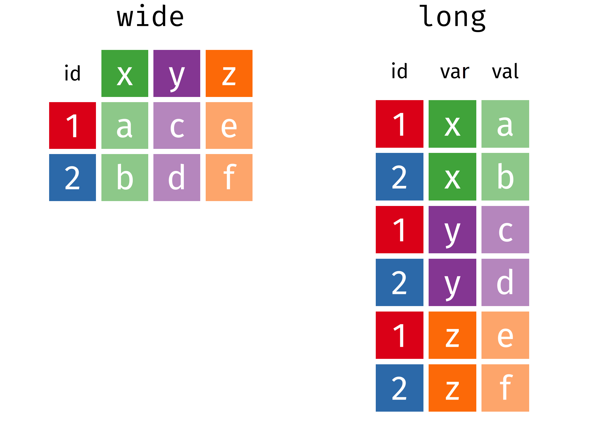](https://www.garrickadenbuie.com/project/tidyexplain/)]

???
In the vast majority of cases, we're working on tabular data. It may be spatially referenced, but there's still likely underlying tabular data association with it. We need to get comfortable moving that tabular data between two distinct presentations---wide and long.

In 'wide' format, each sample/individual occupies a row of the table, and each variable that we've measured on those samples occupies a column. This can be a useful format for recording data, and it's typically the format we need for analyzing data.

In 'long' format, that 'wide' data is pivoted such that all those variables of interest end up in a single column that provides the context for another column that contains the values of that variable. So each sample or individual is represented by multiple rows. While it may see strange, this can be a useful format for summarizing and visualizing data.

So an important data processing task is to reshape data from one form to the other.

---
# Moving from wide to long

.pull-left[
- [`tidyr::pivot_*`](https://tidyr.tidyverse.org/articles/pivot.html) functions (example)
- [`data.table`](https://cran.r-project.org/web/packages/data.table/vignettes/datatable-reshape.html)
]

.pull-right[
.center[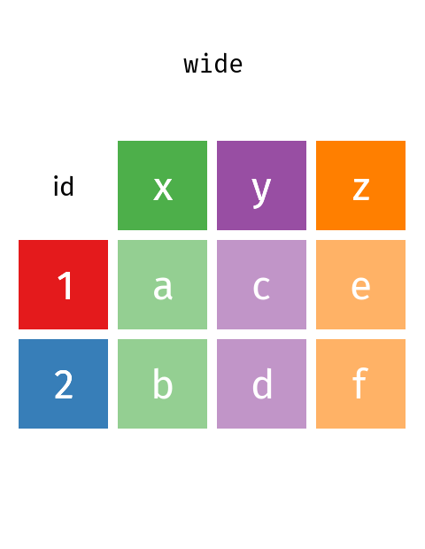]
]

???

The most convenient way to perform this action in R is with the `pivot_longer` and `pivot_wider` functions from the tidyr package, though the `data.table` package possess similar functionality.

---
# "Tidy" data

- Not "clean", but organized such that:
  - each variable has its own column
  - each observation has its own row
  - each value has its own cell
  
.center[[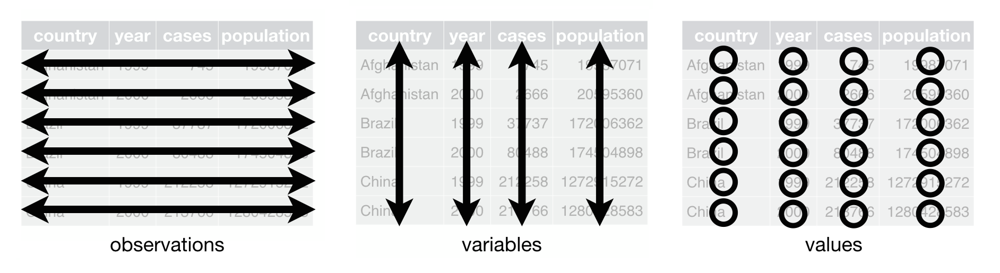](https://r4ds.had.co.nz/tidy-data.html)]

???

Somewhat related to wide data is the concept of tidy data.

These three criteria capture all the information available. There's no information encoded in color, or bold font, etc...

Tidy data is our goal as we head towards analysis, though we'll almost certainly have to wrangle the data to get there. FOrtunately, there are R tools for that...

---
# Data manipulation and wrangling

.pull-left[
- Transform variables
- Create new variables
- Filter 
- Sort
- Group and summarize
- Wrangle (clean)
  - factors
  - strings
  - dates
  - times
]

.pull-right[.left[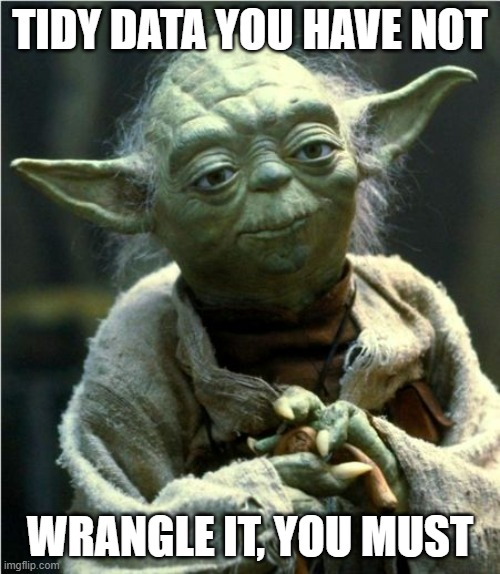]]

---
# Data manipulation/wrangling R packages

.pull-left[
### [Tidyverse](https://www.tidyverse.org/)
- [`tidyr`](https://cran.r-project.org/web/packages/tidyr/index.html) (pivoting, split/unite)
- [`dplyr`](https://cran.r-project.org/web/packages/dplyr/index.html) (data manipulation)
- [`lubridate`](https://cran.r-project.org/web/packages/lubridate/index.html) (dates, times)
- [`forcats`](https://cran.r-project.org/web/packages/forcats/index.html) (factors)
- [`stringr`](https://cran.r-project.org/web/packages/stringr/index.html) (strings)
- facilitates ["piped" workflow](https://r4ds.had.co.nz/pipes.html#pipes)
]

.pull-right[
### Alternative API
- [`data.table`](https://cran.r-project.org/web/packages/data.table/index.html) (acquisition, pivoting, manipulation)
]

---
# Piped workflow

### Traditional (no pipes)
```{r, eval = FALSE}
raw_data <- rio::import("survey_data.xlsx")
mod_data <- dplyr::mutate(raw_data, new_var = var_one + var_two)
mod_data <- dplyr::filter(mod_data, new_var < 100)
mod_data <- dplyr::arrange(mod_data, sort_var)
```

---
count: false

# Piped workflow

- Pipe operator: `%>%` 

### Piped

```{r piped, include = FALSE, eval = FALSE}
raw_data <- rio::import("survey_data.xlsx")
mod_data <- raw_data %>%
  dplyr::mutate(new_var = var_one + var_two) %>%
  dplyr::filter(new_var < 100) %>%
  dplyr::arrange(sort_var)
```

```{r, echo = FALSE}
decorate("piped", eval = FALSE) %>%
  flair("%>%", background = "#CBB5FF")
```
---
# Quality control

.pull-left[
- Passive: <ins>**data profiling**</ins>
- Active: <ins>**assertive programming**</ins>
]

.pull-right[.left[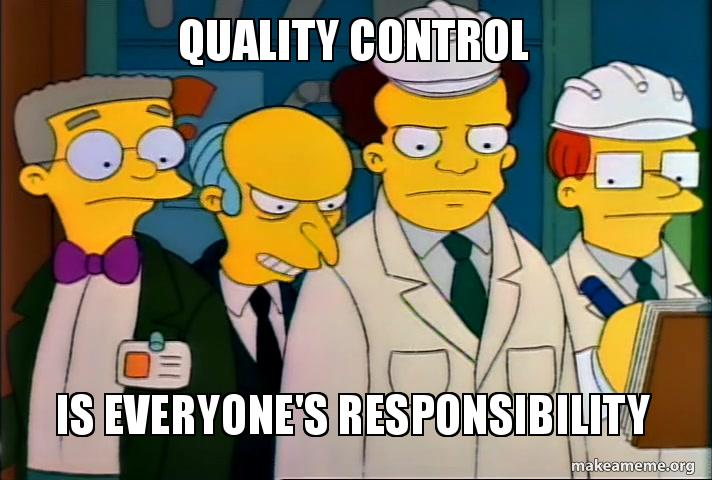]]

<br><br><br><br><br><br><br><br><br>

Small mammal trapping data set from [Portal Project Teaching Database](https://figshare.com/articles/Portal_Project_Teaching_Database/1314459)

```{r, eval = FALSE}
mammals <- rio::import("https://ndownloader.figshare.com/files/10717177")
```

???

We think about two approaches to quality control---one is a more passive, ad hoc approach we refer to as data profiling, and the second is a more explicit, active quality control we refer to as assertive programming. 

Data profiling is passive in that it doesn't involve testing any specific aspects of the data, but rather uses informative summaries to help you identify or flag potential issues like questionable data entries, extreme/unlikely values, and patterns of missing data

On the other hand, assertive programming turns your knowledge of the data into explicit tests to make sure the data meets your requirements

---
# Data profiling functions

### `str` & `summary` (base )

```{r, echo=FALSE}
mammals <- rio::import("data/small_mammals.csv")
```

```{r}
str(mammals)
```

???

We'll take the more passive data profiling approach first, illustrating some R functions to help us along. The first two examples are part of base R (not in any special package but part of the core R software)

---
```{r, get-summary, include=FALSE}
summary(mammals)
```

.scroll-output-full[.smaller[
```{r, echo = FALSE}
decorate("get-summary")
```
]]
---
## `summarytools::dfSummary`

```{r, eval = FALSE}
summarytools::view(summarytools::dfSummary(mammals))
```

.scroll-output-tall[.smaller[
```{r, echo = FALSE}
print(summarytools::dfSummary(mammals, valid.col = FALSE, graph.magnif = 0.75), method = "render")
```
]]

???

Three additional functions we've found useful give us a fairly robust profile of our data without much work. I'll speed through them a bit since they contain similar types of information with some variation in how the summaries are presented. The first is the `dfSummary` function from the `summarytools` package.

---
## `skimr::skim`

.scroll-output-tall[.smallest[
```{r, fig.width = 15}
skimr::skim(mammals)
```
]]

---
## `DataExplorer::create_report`

```{r, eval = FALSE}
# An .html file is output to your current working directory and opens in browser
DataExplorer::create_report(mammals, 
                            output_file = "mammal_data_profile.html")
```

---
.scroll-output-full[.smallest[
```{r, echo = FALSE}
htmltools::includeHTML("rmd/mammal_report.html")
```
]]  

???

More graphical presentation, plus some additional looks at covariation among your data. Each of these last three functions have additional functionality (for example, exploring data profiles by groups), so I encourage to dig a little deeper with these functions that give you a fair bit of useful information for very little overhead...

---
# Assertive programming

- [`assertr`](https://cran.r-project.org/web/packages/assertr/index.html) ([vignette](https://cran.r-project.org/web/packages/assertr/vignettes/assertr.html))

.pull-left-70[
```{r, eval = FALSE}
# Expect maximum weight
mammals %>% 
  assertr::verify(weight < 100)

# Alternative, giving weight range
mammals %>% 
  assertr::assert(assertr::within_bounds(15, 100), weight)

# Confirm expected format of sex variable
mammals %>% 
  assertr::assert(assertr::in_set(c("M", "F")), sex)
```
]

.pull-right-30[
]

???
SO that's data profiling. A good approach to take a general pulse check of your data. But in many, if not most cases, we should be very familiar with the data we've collected and are now trying to wrangle. So we should have some pretty strong intuitions or ideas of what the data *should* look like. In those cases, we can go on the quality control offensive, and be more explicit and assertive to detect problematic records as soon as possible in the processing workflow. 

The `assertr` package gives us a suite of functions designed to help us test and verify our intuitions and assumptions about the data. I only illustrate three very simple examples, such as checking that are small mammal weights meet a couple of criteria, or that we recorded sex in a consistent format. But there are many, many more possibilities, so we encourage you to check out the linked vignette

---
# Exploratory data analysis

.pull-left[
- Aims for understanding
  - variation, missing values, covariation

- Iterative (questions -> answers -> questions)

- Visualization is key
]

.pull-right[
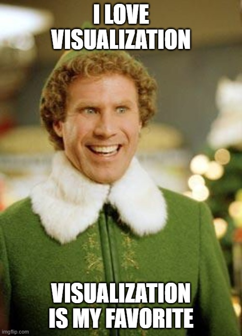]

???
Once we've wrangled the data to our liking, and finished our QC due diligence, we can be more thoughtful and intentional with our data, and attempt to start understanding it with exploratory data analysis. EDA is often an iterative process of asking questions and seeking answers from your data, and it often involves a lot of visualization. So that's were we focus this abbreviated coverage---with a quick look at the most popular visualization framework in R---ggplot2

---
# Visualization framework

.pull-left[
- [`ggplot2`](https://cran.r-project.org/web/packages/ggplot2/index.html)	
  
  - "grammar of graphics"
  
  - flexible, consistent
]  
.pull-right[]

???
Graphics are built by layering independent elements, such as:
  - data
  - aesthetic mapping (position, color, fill, shape, size, linetype, etc.)
  - geometric object (points, lines, bars, rasters, etc.)
  - scales
  - faceting (separate graphics by groups)
  - coordinate systems
  - labels
  - themes
...among others 

There are alternative visualization tools in R, but we appreciate the flexibility and intuitiveness of ggplot, and how quickly you can go from data to publication quality figures. Couple that with the relative ease of turning ggplot-based figures into animations and interactive graphics, and you've got a useful tool. I'll hope a quick demonstration of plot building illustrates the idea of building a plot in layers, point you to a good resource to learn more, and show you a few figures created by ggplot to illustrate the range of possibilities. 

---


### Target: *Submerged aquatic vegetation - Mattamuskeet NWR*

.center[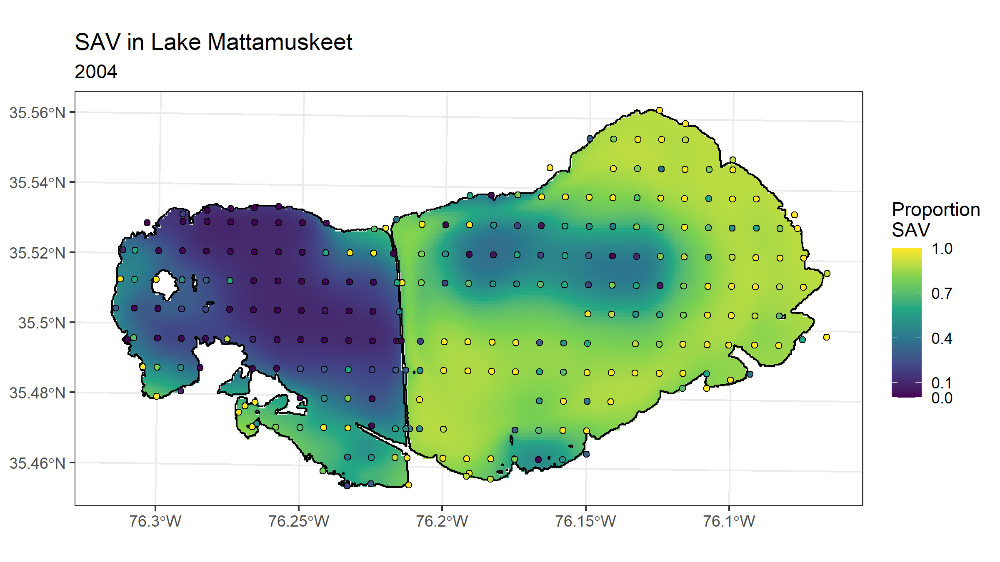]

```{r, echo = FALSE, eval = TRUE, message = FALSE, warning = FALSE}
library(sf); library(ggplot2)
sav_pts <- readRDS("./data/sav_obs.rds")
sav_model_fit <- readRDS("./data/gridded_sav.rds")
LM <- readRDS("./data/LM.rds")
theme_set(theme_gray(base_size = 20))
```

---
.pull-left-60[.smallest[
```{r, echo = TRUE, eval = FALSE}
ggplot(data = sav_model_fit) #<<
```
]]

.pull-right-40[
```{r, echo = FALSE, eval = TRUE, fig.width=8, fig.height=4}
ggplot(data = sav_model_fit)
```
]

---
count: false

.pull-left-60[.smallest[
```{r, echo = TRUE, eval = FALSE}
ggplot(data = sav_model_fit) + 
  geom_raster(aes(x = x, y = y, fill = sav)) #<<
```
]]

.pull-right-40[
```{r, echo = FALSE, eval = TRUE, fig.width=8, fig.height=4}
ggplot(data = sav_model_fit) + 
  geom_raster(aes(x = x, y = y, fill = sav))
```
]

---
count: false

.pull-left-60[.smallest[
```{r, echo = TRUE, eval = FALSE}
ggplot(data = sav_model_fit) + 
  geom_raster(aes(x = x, y = y, fill = sav)) + 
  geom_sf(data = LM, color = "black", fill = NA) #<<
```
]]

.pull-right-40[
```{r, echo = FALSE, eval = TRUE, fig.width=8, fig.height=4}
ggplot(data = sav_model_fit) + 
  geom_raster(aes(x = x, y = y, fill = sav)) + 
  geom_sf(data = LM, color = "black", fill = NA)
```
]

---
count: false

.pull-left-60[.smallest[
```{r, echo = TRUE, eval = FALSE}
ggplot(data = sav_model_fit) + 
  geom_raster(aes(x = x, y = y, fill = sav)) + 
  geom_sf(data = LM, color = "black", fill = NA) +
  geom_point(data = sav_pts, shape = 21, #<< 
             aes(x, y, fill = sav)) #<<
```
]]

.pull-right-40[
```{r, echo = FALSE, eval = TRUE, fig.width=8, fig.height=4}
ggplot(data = sav_model_fit) + 
  geom_raster(aes(x = x, y = y, fill = sav)) + 
  geom_sf(data = LM, color = "black", fill = NA) +
  geom_point(data = sav_pts, shape = 21, 
             aes(x, y, fill = sav))
```
]

---
count: false

.pull-left-60[.smallest[
```{r, echo = TRUE, eval = FALSE}
ggplot(data = sav_model_fit) + 
  geom_raster(aes(x = x, y = y, fill = sav)) + 
  geom_sf(data = LM, color = "black", fill = NA) +
  geom_point(data = sav_pts, shape = 21, 
             aes(x, y, fill = sav)) + 
  scale_fill_viridis_c("Proportion\nSAV", #<< 
                     breaks = c(0,0.1,0.4,0.7,1), #<<
                     limits = c(0,1)) #<<
```
]]

.pull-right-40[
```{r, echo = FALSE, eval = TRUE, fig.width=8, fig.height=4}
ggplot(data = sav_model_fit) + 
  geom_raster(aes(x = x, y = y, fill = sav)) + 
  geom_sf(data = LM, color = "black", fill = NA) +
  geom_point(data = sav_pts, shape = 21, 
             aes(x, y, fill = sav)) + 
  scale_fill_viridis_c("Proportion\nSAV", 
                     breaks = c(0,0.1,0.4,0.7,1), 
                     limits = c(0,1))
```
]

---
count: false

.pull-left-60[.smallest[
```{r, echo = TRUE, eval = FALSE}
ggplot(data = sav_model_fit) + 
  geom_raster(aes(x = x, y = y, fill = sav)) + 
  geom_sf(data = LM, color = "black", fill = NA) +
  geom_point(data = sav_pts, shape = 21, 
             aes(x, y, fill = sav)) + 
  scale_fill_viridis_c("Proportion\nSAV", 
                     breaks = c(0,0.1,0.4,0.7,1), 
                     limits = c(0,1)) +
  coord_sf() #<<
```
]]

.pull-right-40[
```{r, echo = FALSE, eval = TRUE, fig.width=8, fig.height=4}
ggplot(data = sav_model_fit) + 
  geom_raster(aes(x = x, y = y, fill = sav)) + 
  geom_sf(data = LM, color = "black", fill = NA) +
  geom_point(data = sav_pts, shape = 21, 
             aes(x, y, fill = sav)) + 
  scale_fill_viridis_c("Proportion\nSAV", 
                     breaks = c(0,0.1,0.4,0.7,1), 
                     limits = c(0,1)) +
  coord_sf()
```
]

---
count: false

.pull-left-60[.smallest[
```{r, echo = TRUE, eval = FALSE}
ggplot(data = sav_model_fit) + 
  geom_raster(aes(x = x, y = y, fill = sav)) + 
  geom_sf(data = LM, color = "black", fill = NA) +
  geom_point(data = sav_pts, shape = 21, 
             aes(x, y, fill = sav)) + 
  scale_fill_viridis_c("Proportion\nSAV", 
                     breaks = c(0,0.1,0.4,0.7,1), 
                     limits = c(0,1)) +
  coord_sf() +
  labs(title = "SAV in Lake Mattamuskeet", #<<
       subtitle = "2004", #<<
       x = NULL, y = NULL) #<<
```
]]

.pull-right-40[
```{r, echo = FALSE, eval = TRUE, fig.width=8, fig.height=4}
ggplot(data = sav_model_fit) + 
  geom_raster(aes(x = x, y = y, fill = sav)) + 
  geom_sf(data = LM, color = "black", fill = NA) +
  geom_point(data = sav_pts, shape = 21, 
             aes(x, y, fill = sav)) + 
  scale_fill_viridis_c("Proportion\nSAV", 
                     breaks = c(0,0.1,0.4,0.7,1), 
                     limits = c(0,1)) +
  coord_sf() +
  labs(title = "SAV in Lake Mattamuskeet",
       subtitle = "2004",
       x = NULL, y = NULL)
```
]

---
count: false

.pull-left-60[.smallest[
```{r, echo = TRUE, eval = FALSE}
ggplot(data = sav_model_fit) + 
  geom_raster(aes(x = x, y = y, fill = sav)) + 
  geom_sf(data = LM, color = "black", fill = NA) +
  geom_point(data = sav_pts, shape = 21, 
             aes(x, y, fill = sav)) + 
  scale_fill_viridis_c("Proportion\nSAV", 
                     breaks = c(0,0.1,0.4,0.7,1), 
                     limits = c(0,1)) +
  coord_sf() +
  labs(title = "SAV in Lake Mattamuskeet",
       subtitle = "2004",
       x = NULL, y = NULL) +
  theme_bw() #<<
```
]]

.pull-right-40[
```{r, echo = FALSE, eval = TRUE, fig.width=8, fig.height=4}
ggplot(data = sav_model_fit) + 
  geom_raster(aes(x = x, y = y, fill = sav)) + 
  geom_sf(data = LM, color = "black", fill = NA) +
  geom_point(data = sav_pts, shape = 21, 
             aes(x, y, fill = sav)) + 
  scale_fill_viridis_c("Proportion\nSAV", 
                     breaks = c(0,0.1,0.4,0.7,1), 
                     limits = c(0,1)) +
  coord_sf() +
  labs(title = "SAV in Lake Mattamuskeet",
       subtitle = "2004",
       x = NULL, y = NULL) +
  theme_bw(base_size = 20)
```
]

```{css, echo = FALSE}
.box{
  text-align: center;
  float:left;
  margin-right:20px;
}
.clear{
    clear:both;
}
```

--

.pull-left[.right[<iframe width="356" height="200" src="https://www.youtube.com/embed/h29g21z0a68" frameborder="0" allowfullscreen></iframe>]]
.pull-right[.left[<iframe width="356" height="200" src="https://www.youtube.com/embed/0m4yywqNPVY" frameborder="0" allowfullscreen></iframe>]]

---
<br><br>
.center[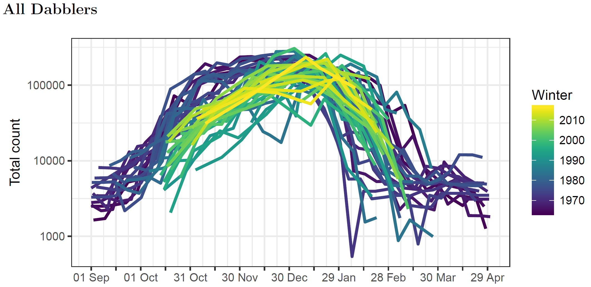]

---
count:false

.center[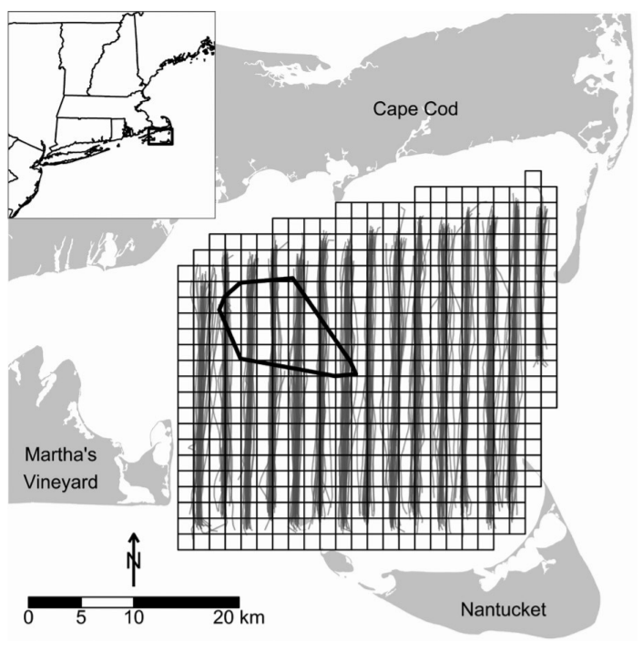]

---
count: false

.center[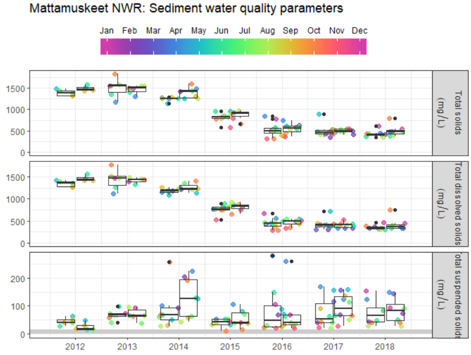]

---
count: false

.center[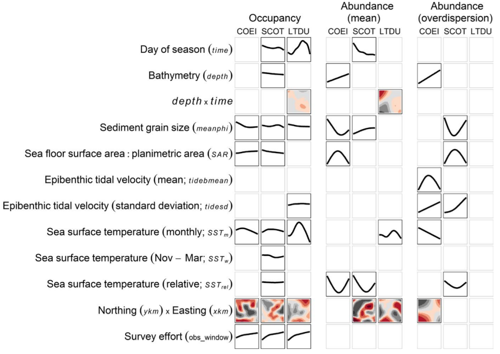]

---
count: false

.center[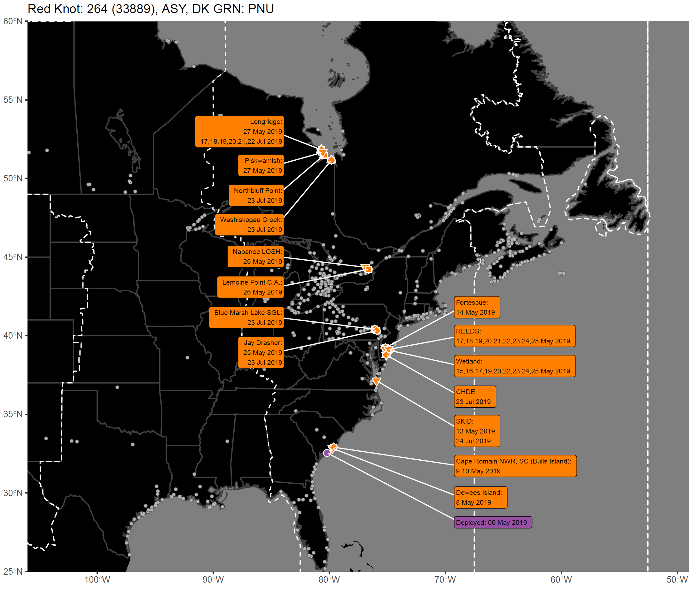]

---
class: inverse, center, middle, hide-logo

# Analyze

???

We've made to analysis. We now have some idea of the modelling approach we want to take. ANd that's probably different for every person wathcih. So instead of picking favorites, we'll focus on a few good resources to lead you down the right code-based path in R for whatever analysis you're looking for. The good news is that, if it can be done, there's likely R resources available.

---
# CRAN task views

- relevant R packages for ~ 40 topics

- emphasize packages, not methodologies 

- not endorsements

---
# Animal tracking example

```{r, echo = FALSE, fig.width=15}
include_url("https://cran.r-project.org/web/views/Tracking.html")
```

---
# Diverse topics

.scroll-output-tall[
<table summary="CRAN Task Views">
  <tbody><tr valign="top">
    <td><a href="https://cran.r-project.org/web/views/Bayesian.html">Bayesian</a></td>
    <td>Bayesian Inference</td>
  </tr>
  <tr valign="top">
    <td><a href="https://cran.r-project.org/web/views/ChemPhys.html">ChemPhys</a></td>
    <td>Chemometrics and Computational Physics</td>
  </tr>
  <tr valign="top">
    <td><a href="https://cran.r-project.org/web/views/ClinicalTrials.html">ClinicalTrials</a></td>
    <td>Clinical Trial Design, Monitoring, and Analysis</td>
  </tr>
  <tr valign="top">
    <td><a href="https://cran.r-project.org/web/views/Cluster.html">Cluster</a></td>
    <td>Cluster Analysis &amp; Finite Mixture Models</td>
  </tr>
  <tr valign="top">
    <td><a href="https://cran.r-project.org/web/views/Databases.html">Databases</a></td>
    <td>Databases with R</td>
  </tr>
  <tr valign="top">
    <td><a href="https://cran.r-project.org/web/views/DifferentialEquations.html">DifferentialEquations</a></td>
    <td>Differential Equations</td>
  </tr>
  <tr valign="top">
    <td><a href="https://cran.r-project.org/web/views/Distributions.html">Distributions</a></td>
    <td>Probability Distributions</td>
  </tr>
  <tr valign="top">
    <td><a href="https://cran.r-project.org/web/views/Econometrics.html">Econometrics</a></td>
    <td>Econometrics</td>
  </tr>
  <tr valign="top">
    <td><a href="https://cran.r-project.org/web/views/Environmetrics.html">Environmetrics</a></td>
    <td>Analysis of Ecological and Environmental Data</td>
  </tr>
  <tr valign="top">
    <td><a href="https://cran.r-project.org/web/views/ExperimentalDesign.html">ExperimentalDesign</a></td>
    <td>Design of Experiments (DoE) &amp; Analysis of Experimental Data</td>
  </tr>
  <tr valign="top">
    <td><a href="https://cran.r-project.org/web/views/ExtremeValue.html">ExtremeValue</a></td>
    <td>Extreme Value Analysis</td>
  </tr>
  <tr valign="top">
    <td><a href="https://cran.r-project.org/web/views/Finance.html">Finance</a></td>
    <td>Empirical Finance</td>
  </tr>
  <tr valign="top">
    <td><a href="https://cran.r-project.org/web/views/FunctionalData.html">FunctionalData</a></td>
    <td>Functional Data Analysis</td>
  </tr>
  <tr valign="top">
    <td><a href="https://cran.r-project.org/web/views/Genetics.html">Genetics</a></td>
    <td>Statistical Genetics</td>
  </tr>
  <tr valign="top">
    <td><a href="https://cran.r-project.org/web/views/Graphics.html">Graphics</a></td>
    <td>Graphic Displays &amp; Dynamic Graphics &amp; Graphic Devices &amp; Visualization</td>
  </tr>
  <tr valign="top">
    <td><a href="https://cran.r-project.org/web/views/HighPerformanceComputing.html">HighPerformanceComputing</a></td>
    <td>High-Performance and Parallel Computing with R</td>
  </tr>
  <tr valign="top">
    <td><a href="https://cran.r-project.org/web/views/Hydrology.html">Hydrology</a></td>
    <td>Hydrological Data and Modeling</td>
  </tr>
  <tr valign="top">
    <td><a href="https://cran.r-project.org/web/views/MachineLearning.html">MachineLearning</a></td>
    <td>Machine Learning &amp; Statistical Learning</td>
  </tr>
  <tr valign="top">
    <td><a href="https://cran.r-project.org/web/views/MedicalImaging.html">MedicalImaging</a></td>
    <td>Medical Image Analysis</td>
  </tr>
  <tr valign="top">
    <td><a href="https://cran.r-project.org/web/views/MetaAnalysis.html">MetaAnalysis</a></td>
    <td>Meta-Analysis</td>
  </tr>
  <tr valign="top">
    <td><a href="https://cran.r-project.org/web/views/MissingData.html">MissingData</a></td>
    <td>Missing Data</td>
  </tr>
  <tr valign="top">
    <td><a href="https://cran.r-project.org/web/views/ModelDeployment.html">ModelDeployment</a></td>
    <td>Model Deployment with R</td>
  </tr>
  <tr valign="top">
    <td><a href="https://cran.r-project.org/web/views/Multivariate.html">Multivariate</a></td>
    <td>Multivariate Statistics</td>
  </tr>
  <tr valign="top">
    <td><a href="https://cran.r-project.org/web/views/NaturalLanguageProcessing.html">NaturalLanguageProcessing</a></td>
    <td>Natural Language Processing</td>
  </tr>
  <tr valign="top">
    <td><a href="https://cran.r-project.org/web/views/NumericalMathematics.html">NumericalMathematics</a></td>
    <td>Numerical Mathematics</td>
  </tr>
  <tr valign="top">
    <td><a href="https://cran.r-project.org/web/views/OfficialStatistics.html">OfficialStatistics</a></td>
    <td>Official Statistics &amp; Survey Methodology</td>
  </tr>
  <tr valign="top">
    <td><a href="https://cran.r-project.org/web/views/Optimization.html">Optimization</a></td>
    <td>Optimization and Mathematical Programming</td>
  </tr>
  <tr valign="top">
    <td><a href="https://cran.r-project.org/web/views/Pharmacokinetics.html">Pharmacokinetics</a></td>
    <td>Analysis of Pharmacokinetic Data</td>
  </tr>
  <tr valign="top">
    <td><a href="https://cran.r-project.org/web/views/Phylogenetics.html">Phylogenetics</a></td>
    <td>Phylogenetics, Especially Comparative Methods</td>
  </tr>
  <tr valign="top">
    <td><a href="https://cran.r-project.org/web/views/Psychometrics.html">Psychometrics</a></td>
    <td>Psychometric Models and Methods</td>
  </tr>
  <tr valign="top">
    <td><a href="https://cran.r-project.org/web/views/ReproducibleResearch.html">ReproducibleResearch</a></td>
    <td>Reproducible Research</td>
  </tr>
  <tr valign="top">
    <td><a href="https://cran.r-project.org/web/views/Robust.html">Robust</a></td>
    <td>Robust Statistical Methods</td>
  </tr>
  <tr valign="top">
    <td><a href="https://cran.r-project.org/web/views/SocialSciences.html">SocialSciences</a></td>
    <td>Statistics for the Social Sciences</td>
  </tr>
  <tr valign="top">
    <td><a href="https://cran.r-project.org/web/views/Spatial.html">Spatial</a></td>
    <td>Analysis of Spatial Data</td>
  </tr>
  <tr valign="top">
    <td><a href="https://cran.r-project.org/web/views/SpatioTemporal.html">SpatioTemporal</a></td>
    <td>Handling and Analyzing Spatio-Temporal Data</td>
  </tr>
  <tr valign="top">
    <td><a href="https://cran.r-project.org/web/views/Survival.html">Survival</a></td>
    <td>Survival Analysis</td>
  </tr>
  <tr valign="top">
    <td><a href="https://cran.r-project.org/web/views/TeachingStatistics.html">TeachingStatistics</a></td>
    <td>Teaching Statistics</td>
  </tr>
  <tr valign="top">
    <td><a href="https://cran.r-project.org/web/views/TimeSeries.html">TimeSeries</a></td>
    <td>Time Series Analysis</td>
  </tr>
  <tr valign="top">
    <td><a href="https://cran.r-project.org/web/views/Tracking.html">Tracking</a></td>
    <td>Processing and Analysis of Tracking Data</td>
  </tr>
  <tr valign="top">
    <td><a href="https://cran.r-project.org/web/views/WebTechnologies.html">WebTechnologies</a></td>
    <td>Web Technologies and Services</td>
  </tr>
  <tr valign="top">
    <td><a href="https://cran.r-project.org/web/views/gR.html">gR</a></td>
    <td>gRaphical Models in R</td>
  </tr>
</tbody></table>
]

---
# When all else fails...

.center[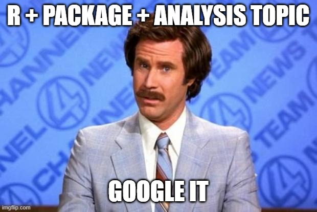]

---
## Case study: Mobile Acoustical Bat Monitoring

.pull-left[
- 86 survey routes at 63 FWS field stations
  - ~ 40 participate annually

- Data life cycle bottlenecks
  1. process raw identification and GPS data for database import
  2. generate annual reports for each station
]

.pull-right[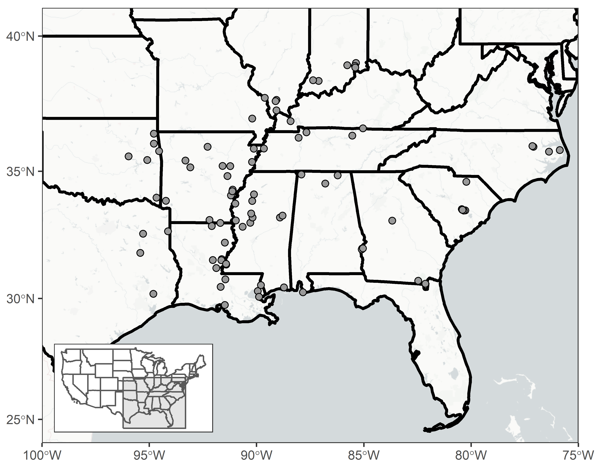]

???

With the cooperation of the computer and internet gods, let's have a brief look at a case study that hopefully illustrates some of the perks of a code-based workflow. Our example is a regional mobile acoustical bat monitoring project in my home regions of 2 and 4, with a little bit of participation in adjacent regions. We lovingly call the program "MABM". In a nutshell, we have 60+ field stations (mostly NWRs) that operate one or more driving transects during the summer to log acoustic detections of bats. About 40 of those stations participate each year. This involves the data acquisition from acoustic recorders and a GPS device attached to the vehicles as they drive their ~ 20 mile long transects. That raw acoustic data is then passed by one of our regional ecologists through a bat call classification software. Here's what that software output looks like - an Excel file that you'll notice is not tidy at all. This data needs cross-referenced with the GPS locational data, stored in another untidy text file. At this point, we've not been able to incorporate anything up to this point in the data life cycle into a code-based workflow. But now we hit a couple of very important bottlenecks in the efficiency of our workflow.

First, those untidy classification data and GPS data need tidied, linked so that the bat calls are georeferenced, and parsed such that we can import them smoothly into the relational database for the project. Currently, that's a Microsoft Access database, but we'll soon be transitioning to AGOL because Access. In any case, that process is a time-eater if you have to do it manually, not to mention documenting how to do it... Once we successfully import the data into our database, the second bottleneck is turning around annual reports of that year's bat detections, with context of their previous work at that station, for each of the 40 or so stations.

So we've chosen to move these bottlenecks into a code-based workflow by creating an R package for each bottleneck. Let me give you a brief demo of what that looks like.