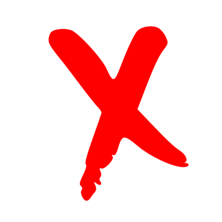
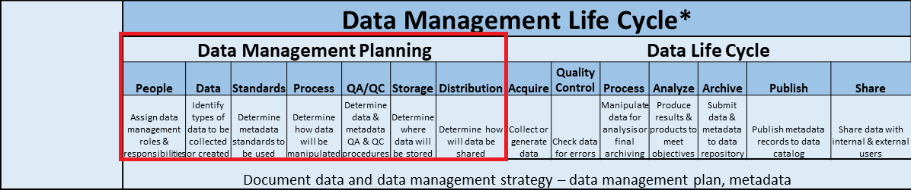
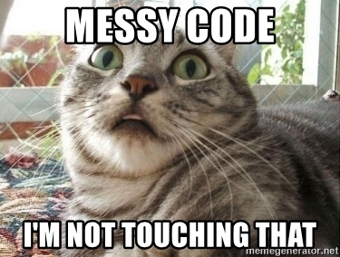
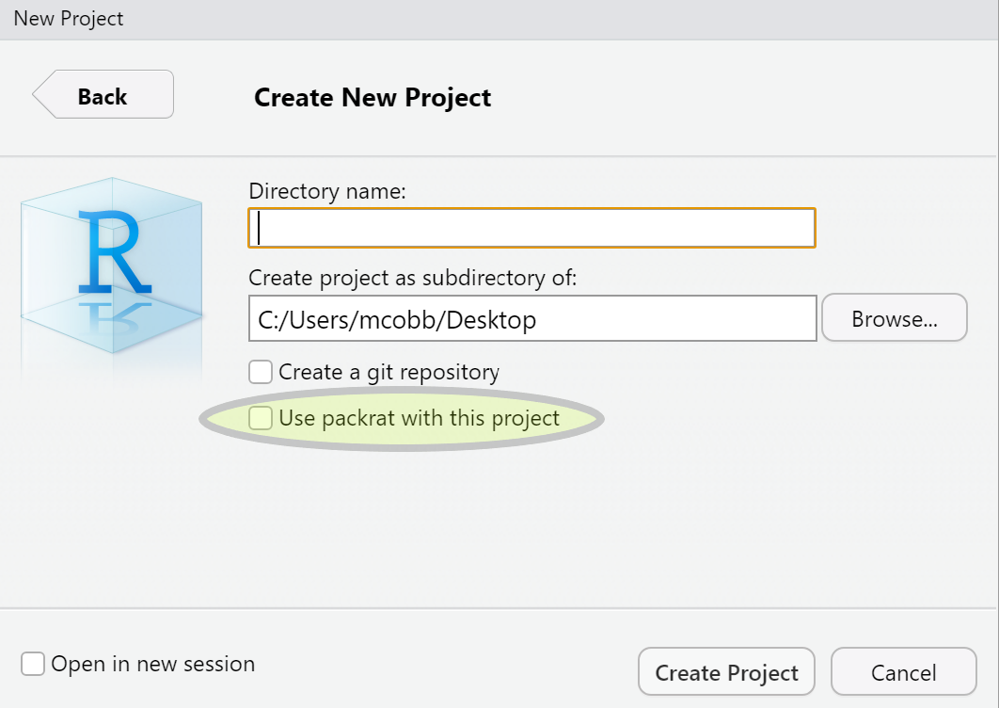
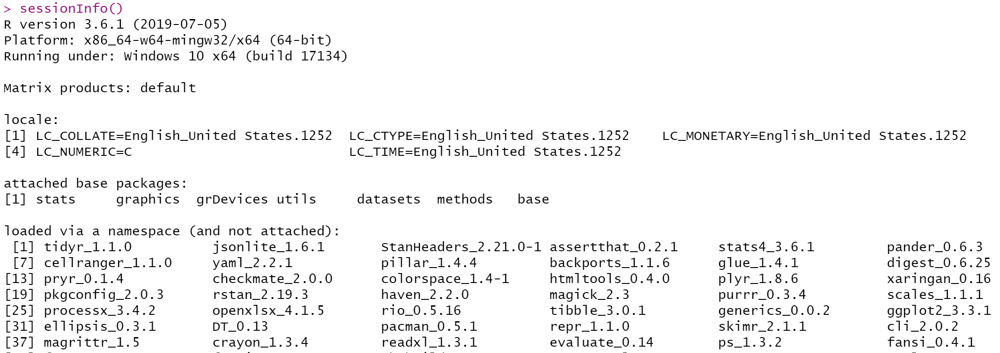
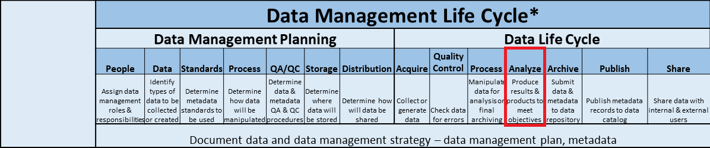
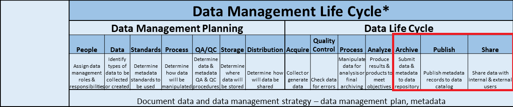
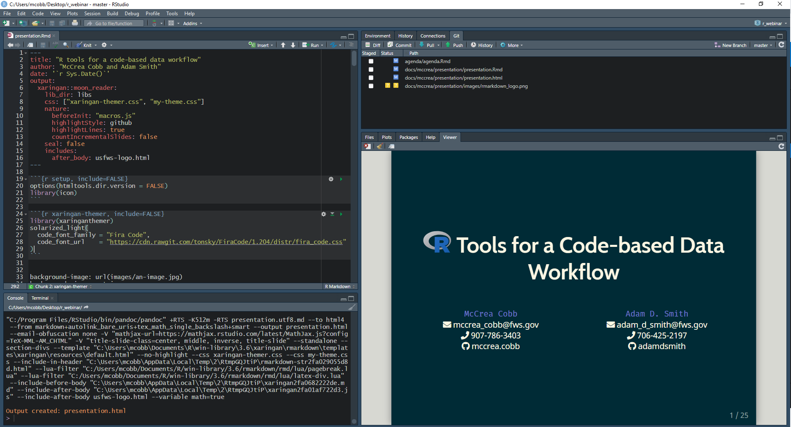
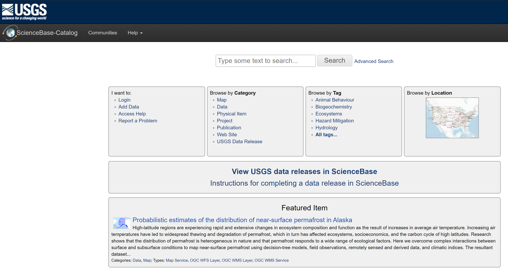

```{r setup, include=FALSE}
knitr::opts_chunk$set(warning = FALSE, message = FALSE, 
                      fig.retina = 3, fig.align = "center")
options(htmltools.dir.version = FALSE)
if (!requireNamespace("pacman")) install.packages("pacman")

# Load all required packages, installing if necessary
pacman::p_load(knitr, icon, tidyverse, crayon, flair, sbtools, mapview, kableExtra,
               leaflet, ggplot2, sf, DT, xaringanthemer, styler)
```

```{r xaringan-themer, include=FALSE, eval=TRUE}
mono_light(code_font_family = "Fira Code",
  code_font_url    = "https://cdn.rawgit.com/tonsky/FiraCode/1.204/distr/fira_code.css",
  base_font_size = "22px",
  outfile = "css/xaringan-themer.css"
)
```

class: hide-logo, center, middle, inverse
#  Tools for a Code-based Data Workflow

<br>

.pull-left[
.large[McCrea Cobb]  
`r icon::fa("envelope")` mccrea_cobb@fws.gov  
`r icon::fa("phone")` 907-786-3403  
`r icon::fa("github")` mccrea.cobb  
]

.pull-right[
.large[Adam D. Smith]  
`r icon::fa("envelope")` adam_d_smith@fws.gov  
`r icon::fa("phone")` 706-425-2197  
`r icon::fa("github")` adamdsmith  
]

<br>

`r icon::fa("github")` usfws.github.io/data-mgt-with-r


???
Hello and welcome to "R Tools for a Code-based Data Workflow"! 

As mentioned, my name is McCrea Cobb. I am a biometrician for the Inventory and Monitoring Program within the National Wildlife Refuge Sytem, and I am located in Anchorage, Alaska. I am co-presenting with Adam Smith, who is quantitative ecologist with the I&M program based in Athens, Georgia.

At the bottom of this slide, you can find a link to our GitHub repository that contains this presentation and more R resources.


---
class: inverse, center, middle, hide-logo
# Outline


???
Ok, what will we be covering today?


---
class: inverse, center, hide-logo

<br>
<br>
<br>
<br>

# Outline

#### Review the data life cycle and data workflow


???
First, we will **review** the data and project life cycles introduced earlier today by Jared and Maren and then discuss how these models fit into a scientific data workflows. We will **compare** what we're calling the **traditional** workflow that involves manually manipulating data using propritary software, to a **code-based** data workflow using R, a programming language for statistical computing and graphics.


---
class: inverse, center, hide-logo

<br>
<br>
<br>
<br>

# Outline

<span style="color:gray">Review the data life cycle and data workflow</span>

#### Present tools in  for efficiently and effectively working with data along the life cycle


???
Next, we will follow the steps of a data life cycle, from Planning to Archiving, as a guide to **introduce** tools and tips for developing a data workflow in R.


---
class: inverse, center, hide-logo

<br>
<br>
<br>
<br>

# Outline

<span style="color:gray">Review the data life cycle and data workflow</span>

<span style="color:gray">Present some tools in  for efficiently and effectively  working with data along the life cycle</span>

#### Demonstrate a data workflow in  with a case study


???
Finally, we will **demonstrate** how these tools can be applied to real-world data, with a FWS case study focused on mobile acoustical bat monitoring.

Our focus today is on **scientific data** but the tools and tips that we cover apply to a wide range of data.


---
background-image: url(images/draw_owl-kosher.jpg)
background-size: contain
class: hide-logo

???
Before starting though, we should include a **disclaimer**. It can be **frustrating** trying to learn a new language like R. Much like learning to draw well, you cannot learn R in a hour and a half. If we tried to do this today, it might come across like **this**. 

**Be warned** that this webinar is not an "Introduction to R" or a "How to get your data into R" or "Learn the Tidyverse". We have included links in the slides to additional resources and we encourage you to visit our github site where there are many more additional resources listed. If you are interested in learning R, there are many courses that cover these materials, from online courses from DataCamp or in-person courses through NCTC courses (CSP1004 Data Wrangling in R)

Our **message** is simply: it is possible to use a scripting languaging like R to complete a scientific data workflow that largely mirrors the data life cycle. We believe that this approach is often more efficient and reproducible, and less error prone than the traditional point and click approach to managing data.


---
# Project and data life cycles

.center[]


???
As I mentioned, the project and data life cycles that Jared and Maren introduced in the previous webinar on data management will be our guide for introducing R tools. 

As you can see here, both the data and project life cycles start with a **Planning** step, and so we will start with recommended actions that we think should be considered during the planning step, and cover some associated tools in R.


---
background-image: url(images/life_cycles-data.png)
background-size: 90%
class: hide-logo


???
After that, we will progress through th rest of the data life cycle: starting with the Acquire step, and moving through the Process, Analyze, Share and Achive steps. We will also cover documenting in R.


---
class: hide-logo
# `r icon::fa("times", color = "red")` Traditional data workflow


???
Ok. So how are these steps typically accomplished? Let's first walk through the traditional data workflow that is probably familiar to everybody here.


---
background-image: url(images/traditional_workflow_1.png)
background-size: 90%
class: hide-logo
# `r icon::fa("times", color = "red")` Traditional data workflow


???
First, you start with data. These could be paper datasheets, maybe some data that were collected using a mobile app like Collector or Survey123, or data that you found in a online repository like ServCat or data.gov. 


---
background-image: url(images/traditional_workflow_2.png)
background-size: 90%
class: hide-logo
# `r icon::fa("times", color = "red")` Traditional data workflow


???
The first step is to acquire these data. This is generally done by digitizing paper data into Excel, Access or ArcGIS; and downloading data from a repository by navigating to their webpage in your browser. 


---
background-image: url(images/traditional_workflow_3.png)
background-size: 90%
class: hide-logo
# `r icon::fa("times", color = "red")` Traditional data workflow


???
Next, these data are processed and quality-checked using these same software. Occasionally, data might be imported into R for processing, and then exported as the clean dataset with a new name like "data_clean.csv" for version control and to differentiate it from the raw data.


---
background-image: url(images/traditional_workflow_4.png)
background-size: 90%
class: hide-logo
# `r icon::fa("times", color = "red")` Traditional data workflow


???
Data are then analyzed using a suite of software. For spatial data, this step is often done in ArcGIS. For exploratory data analysis of non-spatial data, this might be a accomplished using Excel or Access. More complex analyses might require the user to convert the data to a csv, load it into R, run from models, and write CSV tables of results. 


---
background-image: url(images/traditional_workflow_6.png)
background-size: 90%
class: hide-logo
# `r icon::fa("times", color = "red")` Traditional data workflow `r icon::fa("frown-open")`


???
Producing a report and presentation of these results requires the user to write text in a Word or Powerpoint files. Then, ArcGIS, Excel, Powerpoint, and R are used to create figures and tables that are often saved as JPG files.

To merge the text with the figures and tables, the user is required to manually copy and paste the images into the Word or Powerpoint document.


---
class: center, middle, hide-logo
background-image: url("images/workflow_criteria.png")
background-size: contain

???
So is this is a "good" data workflow? To evaluate this, we need criteria from which to measure success. Luckily, we have some criteria that Jared and Maren introduced earlier today. Let's evaluate the traditional data workflow using these criteria. 
 
- First, is it is reproducible? Not really. If someone else were attempting to reproduce this effort, they might not know which data were used to generate the figures and tables, and without that, they are unlikely to be able to consistently produce the same output. 

- Is it replicable? Unlikely. Even the person that completed the workflow might have trouble replicating the same steps for the next year's annual report.

- Is it documented? Perhaps if there was a complete record of all the steps, but it is unlikely. I can tell you that never did that.

- Is it efficient? No, it is heavily relient on manual repetive tasks. Humans are much slower than computers. 

- Is it robust to error? Not really. Each manual step introduced the potential for human-caused errors. Any potential software updates compound this problem.

- Is it scalable? No. Every time that new data are generated or the original data change, then the workflow breaks and needs to be restarted, often from the Acquire step. 
    
    
---
class: center, middle, hide-logo
background-image: url("images/workflow_criteria.png")
background-size: contain




???
So based on these criteria, this workflow does not appear to do well.

Ok, so is there a better way??


---
background-image: url(images/workflow.gif)
background-size: contain
class: hide-logo


???
- What we need is a seamless and integated workflow like this guy's breakfast, where data effortlessly move from hand to mouth.

I think you know where I'm going with this...


---
class: hide-logo
# `r icon::fa("check", color = "green")`  data workflow 


???
This is where R comes in. Let's take a look at a code-based workflow in R.


---
background-image: url(images/r_workflow_1.png)
background-size: 90%
class: hide-logo
# `r icon::fa("check", color = "green")`  data workflow 


???
To start, the input data are often the same, although eliminating paper datasheets can eliminate transcription error and, as we will touch on later, allows us to acquire data in R directly through web services.


---
background-image: url(images/r_workflow_3.png)
background-size: 90%
class: hide-logo
# `r icon::fa("check", color = "green")`  data workflow


???
As we will show, R can directly import data from a variety of sources. This is now easier than ever thanks to a number of R package that provide flexible data import functions, including functions for spatial data.


---
background-image: url(images/r_workflow_5.png) 
background-size: 90%
class: hide-logo
# `r icon::fa("check", color = "green")`  data workflow


???
R offers a number of tools for quality control, including both passive data profiling and active assertive programming approaches. 

More to come on that. 

Where R starts to really shine is tidying up messy data, and there are a whole suite of packages called the "tidyverse" that address this need.


---
background-image: url(images/r_workflow_6.png)
background-size: 90%
class: hide-logo
# `r icon::fa("check", color = "green")`  data workflow


???
R was originally developed as a statistical software, and there are now too many packages to even start listing, which allow for an ever growing number of analytical approaches.


---
background-image: url(images/r_workflow_8.png)
background-size: 90%
class: hide-logo
# `r icon::fa("check", color = "green")`  data workflow


???
Maybe less known is the ability to generate reports using a mixture of text and R code. Let me repeat that: **you can now produce reports and presentations from R** without needing Word or Powerpoint. Recently, a number of packages have been developed to address this need that we will touch on.


---
background-image: url(images/r_workflow_9.png)
background-size: 90%
class: hide-logo
# `r icon::fa("check", color = "green")`  data workflow


???
These code-based reports can be saved in variety of file format; including html, PDF and Word files. Even more importantly, it is possible to archive these data and data products back to repositories from R, thereby pleasing your data managers and **closing the data life cycle loop**. 


---
background-image: url(images/r_workflow_10.png)
background-size: 90%
class: hide-logo
# `r icon::fa("check", color = "green")`  data workflow `r icon::fa("grin-stars")`


???
Last but not least, by coding these steps all within an R environment, it is possible to wrap up these steps into a reusable R package that that is fully documented. 


---
background-image: url(images/Rlogo.svg)
class: hide-logo, middle
background-size: 40%
background-position: 80% 50%

.pull-left[
.large[
.left[
- Free

- Flexible

- Nice integrated development environment (RStudio)

- Large and active community of users
  - Over 15,000 packages
]
]
]


???
This presentation obviously focused on R and RStudio, which is a integrated development environment (IDE) for R to develop and share work.

But why R? Here's a few reasons:

R is:
- Free
- Relatively easy to learn (compared to other programming languages)
- Flexible and allows for:
  - statistical analyses
  - graphics
  - reporting
- Has a nice integrated development environment (RStudio) that integrates well with GitHub
- Popular (2+ millions users)
    - Active community of users
    -  Users have created over 15,000 packages that provide functions for just about any task that you can think ofp
- GitHub integration


---
class: center, middle, inverse

# Planning



???
Ok. Let's get started with the first step: Planning 


---
# Organizing an  project 

### `r icon::fa("sitemap")` Chose a standardized working directory structure

.pull-left[
Provides consistent relative directory paths for your scripts

R packages provide functions to create a standard file directory:

- [`MakeProject::MakeProject()`](https://cran.r-project.org/web/packages/makeProject/index.html)
- [`rrtools::use_analysis()`](https://www.rdocumentation.org/packages/rrtools/versions/0.1.0)
- [`refugetools::create.dir()`](https://github.com/USFWS/refugetools)
- [`prodigenr::setup_project()`](https://cran.r-project.org/web/packages/prodigenr/readme/README.html)
]

.pull-right[.tiny[
```{r, eval=FALSE}
project_name/
  admin/
  code/ #<<
    functions/
  data/ #<<
    derived_data/
    raw_data/
  incoming/
  metadata/
  output/
    figures/
    raw_analysis/
    tables/
  products/
  resources/ #<<
    data/ 
    publications/
    reports/
```
]
]


???
There are many decision that need to be made when starting a project that involves data. One of the first of these is how to organize your work. While not necessarily a data management issue, having a standardized project directory has advantages when using a code-based workflow.

Project-oriented workflows are self-contained workflows enabling reproducibility. Ideally a collaborator or the next biologists should be able to rerun a project without changing any code or files. File paths should be workstation-independent. 

R has options for enabling project-oriented workflows in their coding environments, and RStudio projects allow for analyses to be contained in a single working directory that can be given to a collaborator and run without changing file directory paths. 

The figure on the right shows an example of a working directory file structure. Notice that data produced by the project are stored in a folder called data. Centralizing data like this makes the file paths in R consistent, and it also makes it straightforward when it comes to documenting and archiving these data. Additionally, all R code are stored in a `code` folder. Therefore the relative paths between the code and the data is consistent. Using this standardized approach allows you to more easily reuse code that rely on relative paths.

There are tools in R that can produce a standardized directory structure. Unfortunately, we don't have time today to explore these, but I've included links here to resources where you can learn more about them.


---
# Organizing an  project 

### `r icon::fa("file-signature")` Decide on a standardized file naming convention

.pull-left[
- Call files what they are
- Keep names short
- Avoid spaces and $pec!@l characters
- ISO 8601 for dates

Programmically filter files:
.tiny[
```{r, eval=FALSE}
# Exclude files with 2016 or 2017 in their names
f <- list.files(path = "./filepath", 
                pattern = "[^2016|2017].csv$") #<<

# Load these files
dat <- lapply(f, read.csv)
```
]
]

.pull-right[

]


???
You might hear your data manager tell you that it **doesn't matter** what you name your files, as long as they are full documented and securely archived. This is true. Although descriptive file names might not be **required** for data management, there are **advantages** to having a standardized file naming convention for R project management. Descriptive file names are an important part of **organizing, sharing, and keeping track** of data files.

Generally, you should strive to call files what they are, keep file names short, avoid spaces and special characters (which might not play well with some software), and use a standard for dates such as ISO 8601. 

Settling on a standard and sticking to it for your work is good practice. The figure on the right shows a few common naming standards, such as camel case and snake case.

Sticking to a standard allows you to do things in R that would be difficult otherwise, such as programmically filtering files, as shown at the bottom left. The code imports a list of data files but excluded those containing 2016 or 2017. Without standardized file names, these types of functions would be more challenging.
 

---
# Organizing an  project 

### `r icon::fa("book")` Consult a style guide

*"Good coding style is like correct punctuation: you can manage without it, butitsuremakesthingseasiertoread"*  
*-[Hadley Wickham](https://style.tidyverse.org/index.html)*

.pull-left[
- Strive for consistent and meaningful names

- Review existing style guides:
  - [tidyverse style guide](https://style.tidyverse.org/)
  - [Advanced R style guide](http://adv-r.had.co.nz/Style.html)
  - [Google's R style guide](https://google.github.io/styleguide/Rguide.html)

- Helpful R packages: [`styler`](https://www.tidyverse.org/blog/2017/12/styler-1.0.0/) and [`lintr`](https://cran.r-project.org/web/packages/lintr/index.html)
]

.pull-right[
```{r, eval=FALSE, results='markup'}
# R code readability

if(readability()) {
  be_happy()
} else {
  rewrite_code()
}
```
]

???

In addition to deciding on a standardized file naming convention, we use the planning stage to settle on a **consistent coding syntax**. Again, this is not a requirement for good data management, and you can probably go through life without it, but it **sure makes things easier to read**. Do it for your **future self** and anyone else who has to suffer through your code!

If you are newer to R, we recommend consulting a **style guide**. There are a number of them out there, and I list a few of the more popular ones for R here. 

If you are **past the planning stage** and are struggling to make sense of ugly code, you're in luck! There is an R package called `styler` that has functions to read through and clean up code to a standard of your choosing. Another package called `lintr` will perform on the fly checking to confirm that you are conforming to the style guide. Links to more information about these packages are included here.

Let's take a closer look at the `styler` package. 
 
 
---
# [`styler`](https://github.com/r-lib/styler) package

.pull-left[
Some messy code `r icon::fa("flushed", color = "grey")`

.small[
```{r messy1, include=FALSE, eval=FALSE, message=FALSE, warning=FALSE}
p =dat%>%#a comment
select(refuge ,lat, long) %>%filter(refuge!='kodiak ')%>%
  ggplot(data,aes(x =lat,y= long,group=refuge))%>%  geom_line()#comment without space"
```

```{r, echo=FALSE}
decorate("messy2", eval=FALSE) %>%
  flair("styler") %>%
  flair("select", background = "pink") %>%
  flair("filter", background = "pink") %>%
  flair("ggplot", background = "pink") %>%
  flair("geom_line", background = "pink") %>%
  flair("a comment", color="blue") %>%
  flair("comment without space", color = "blue")
```
]
.center[]
]


???
Here we see some **messy** code. The line spacing is irregular, there are equals signs for assignments, and there are excessively long lines that make it difficult to follow what the function is doing. What a mess!


---
# [`styler`](https://github.com/r-lib/styler) package

.pull-left[
Some messy code `r icon::fa("flushed", color = "grey")`

.small[
```{r messy2, include=FALSE, eval=FALSE, message=FALSE, warning=FALSE}
p =dat%>%#a comment
select(refuge ,lat, long) %>%filter(refuge!='kodiak ')%>%
  ggplot(data,aes(x =lat,y= long,group=refuge))%>%  geom_line()#comment without space"
```

```{r, echo=FALSE}
decorate("messy2", eval=FALSE) %>%
  flair("styler") %>%
  flair("select", background = "pink") %>%
  flair("filter", background = "pink") %>%
  flair("ggplot", background = "pink") %>%
  flair("geom_line", background = "pink") %>%
  flair("a comment", color="blue") %>%
  flair("comment without space", color = "blue")
```
]
]

.pull-right[
The `style_text()` function cleans it up! `r icon::fa("smile-beam", color = "grey")`
.small[
```{r cleaned, include=FALSE, message=FALSE, warning=FALSE, comment=""}
style_text("p =dat%>%#a comment
select(refuge ,lat, long) %>%filter(refuge!='kodiak ')%>%
  ggplot(data,aes(x =lat,y= long,group=refuge))%>%  geom_line()#comment without space") 
```

```{r, echo=FALSE}
decorate("cleaned", eval=TRUE) %>%
  flair("styler") %>%
  flair("select", background = "pink") %>%
  flair("filter", background = "pink") %>%
  flair("ggplot", background = "pink") %>%
  flair("geom_line", background = "pink") %>%
  flair("a comment", color="blue") %>%
  flair("comment without space", color = "blue")
```
]
]

???
After loading the `styler` package, we can run the `style_text` function to clean things up. The code at the bottom right now includes the commonly used **left arrow** for assignment, consistent spacing, and each of the piped functions are on their own lines. Much better!

I should note that `styler` also includes a Rstudio Add-in that allows you to use a drop down menu to access these functions as well.


---
# `r icon::fa("people-carry")` Project dependencies

### [Maintaining dependencies can be frustrating!](https://en.wikipedia.org/wiki/Dependency_hell)

.pull-left-30[
An R project should be: 

1. **Isolated**
2. **Portable**
3. **Reproducible**

There are R tools to help with this:
- [`packrat`](https://rstudio.github.io/packrat/) package
- [`rocker` package](https://www.rocker-project.org/)
]

.pull-right-70[

]


???
Let's talk about about dependencies.. Ideally, a data project should totally independent, meaning that it is **isolated, portable and reproducible**. By addressing potential sources of dependencies during the planning step, you will save your future self and the next biologists a lot of heartache later on. 

By **"isolated"**, I mean that installing a new or updated package for one project won’t break other projects, and vice versa. 

**Portability** refers to the ease of transporting projects from one computer to another, even across different platforms. 

To be **reproducible** means that it is clear to everybody which software versions are required to successfully rerun code. When new versions come out, they might not be backward compatible and certain functions might no longer be available. 

There are a couple of R packages that address project dependency. One is called `packrat`, and I will cover that one in more detail here in a minute. 

Another is called `rocker`, which interfaces R with **Docker**. Docker is a program that allows you to launch multiple virtual operating environments (called **containers**) on your machine. By doing this, you can **run older versions of a package** for a specific task, while still keeping the package on your machine up-to-date.


---
#  `Packrat`

.pull-left[
**Option 1**: Add to a new project


]

.pull-right[
**Option 2**: Add to an existing project

.tiny[
```{r packrat1, include=FALSE, eval=FALSE}
# Install packrat
install.packages('packrat')

# Set up your project to use packrat
packrat::init()
```

```{r, echo=FALSE}
decorate("packrat1", eval=FALSE) %>%
  flair("init()") %>%
  flair("install.packages('packrat')", background = "pink")
```
]

.tiny[
```{r packrat2, include=FALSE, eval=FALSE}
# Install required packages
install.packages('tidyverse')

# Take a snapshot to save the changes to packrat
packrat::snapshot()
```

```{r, echo=FALSE}
decorate("packrat2", eval=FALSE) %>%
  flair("snapshot()")
```
]
]

???
Packrat is an R package that allows you to store your package dependencies in your working directory, instead of relying on your personal R library that is generally buried elsewhere on your computer. Therefore, when you share your project, you are also sharing all the required packages that your project depends on. This makes your project isolated and portable. Packrat also records the exact package versions you depend on, and therefore ensures those exact versions are the ones that get installed wherever you go.

There are two ways to start using packrat. If you are in the planning stage and just starting a new project, and are using RStudio (sorry eMac fans), it is as simple as checking the box at the bottom of the window to "Use packrat with this project". 

Alternatively, if you want to add packrat to an existing project, you need to install and load packrat, and then run the `init` function, as shown on the right. To add a package to packrat, you install the package as your normally would, but instead it installs into your working directory. You can then save your changes using the `snapshot` function.


---
background-image: url("images/version_control.png")
background-size: 55%
background-position: 95% 70%
# `r icon::fa("code-branch")` Version control 

.pull-left-30[
<br>
<br>
.center[
.large[Consider how you will manage versions when ***planning*** your project!]
]
]


???
Version control is the processes and tools designed to keep track of multiple different versions of data, including data products. It can be as **simple** as renaming the updated files to as **complex** as a distributed version control system like Git. Whatever the level of complexity, it is **important** to consider what version control system that a project will be using during the *planning stage* of your project.  


---
# `r icon::fa("code-branch")` Version control 

.pull-left[
- Benefits of GitHub
    - Collaboration
    - Storing versions
    - Restoring versions
    - Understanding what happened
    - Backup files

- RStudio makes version control with Git and GitHub easier

- Check out:
  - Resources to learn git [(link)](https://try.github.io/)
  - Using git from RStudio [(link)](https://nceas.github.io/oss-lessons/version-control/4-getting-started-with-git-in-RStudio.html)
  - GitHub and R: An Intro for FWS Biologists [(link)](https://mccrea-cobb.github.io/r-github-presentation/#1)
]

.pull-right[

.center[]
.center[]
]


???
You are welcome to use whatever version control system work best for you. That said, there are a number of advantages to using a distributed version control system like Git in combination with the associated website called GitHub. I've listed some of them here. 

If you are using RStudio, using Git and GitHub is relatively straightforward. Unfortunately, I don't have time to run through the steps, but I've included some references to get you started. One of these is a presentation that I recently gave to the Great Lakes R Working Group that introduced Git and GitHub for FWS biologists.


---
class: inverse, center, middle, hide-logo

# Document


???
Ok. I will now turn it over to Adam, who will cover the Documenting, Processing and Analyzing steps.


Before we dig into data acquisition, processing, and analysis, we need to have 
"THE TALK". Yep, we need to talk about documentation. 


---

# Why document our code?

.pull-left[
.large[**Reproducibility**]

Make it reproducible for:
- colleagues
- future **you**!
]

.pull-right[
.left[[](https://m.xkcd.com/1421/)]
]

???

Why should we document our code? There are plenty of good reasons to document our code, but we'll focus on one --- reproducibility. It's one of criteria McCrea mentioned that we should strive for in the data management life cycle. To put it simply, if you and I start with the same set of data, and a road map for data manipulation and analysis, we should at the very least be able to arrive at the same analytical or graphical results. Arguments about whether our particular analytical road map was "correct" are independent of reproducibility. Reproducibility makes sure we can start those arguments from the same place. McCrea and I are asserting that reproducibility it much easier in a code-based workflow. What does that have to do with documentation? Well, code is written for computers. Documentation helps turn the "computer-speak" of code into human readable content so we can better understand our mutual starting point for discussion/argument. Those humans will often be your colleagues, but are more than likely to be you, some time into the future. And good documentation discourages the self-loathing that often accompanies the experience or revisiting your code 6 months after you started it...

---

# Documenting basics

- [Wilson et al. 2014](https://journals.plos.org/plosbiology/article?id=10.1371/journal.pbio.1001745) *Best practices for scientific computing*

- [Wison et al. 2017](https://journals.plos.org/ploscompbiol/article?id=10.1371/journal.pcbi.1005510) *Good enough practices in scientific computing*

- [Lee 2018](https://doi.org/10.1371/journal.pcbi.1006561) *Ten simple rules for documenting scientific software*

???

Most of the documentation "basics" we cover are described well in these three sources, along with more rigorous documentation techniques. So we simply leave these references here for posterity. But they are worthy reads once you start down the slippery slope of a code-based workflow. 
---
class: despaced

# Documenting basics

.pull-left-60[
<br>
.center[]]

.pull-right-40[
<br>
- Comment code as you go

- Name objects informatively

- Write modular code

- Include a project README

- Make dependencies explicit

- Record working environment

- Follow a style guide

- Version control

]


???

Let me hit you with all of these "basics" of documentation at once, as we'll take each in turn. But it's worth pointing out there's nothing R-specific about this list. They apply equally to your forays into Python, C++, Matlab, or any other coding program. But since this *is* a presentation about R, we'll see a brief example or two of how these basics "look" in R as we work our way through them.

---

# Comment code as you write it

.pull-left[
- "Lab notebook" for code

- Write for people, not computers

- Bare minimum documentation
]
.pull-right[.right[]]

???

Our first stop on the documentation train is adding comments to the code you write. COmments give you the opportunity to integrate a "lab notebook" into your code. Code is written for computer understanding, comments are written for human understanding. Consider commenting your code as the bare minimum requirement of documenting your code. 

---

# Commenting R code

- Comment marker in : `#` (number sign/hash)

```{r echo = TRUE, eval = FALSE}
# This is a comment

x <- 2 # This is also a comment
```

--

- <ins>Barest minimum</ins>: brief explanatory description at top of file

.large[
```{r echo = TRUE, eval = FALSE}
# This code retrieves historical METAR weather from NOAA 
# buoys; see http://www.ndbc.noaa.gov/. This function 
# wraps rnoaa::buoy() to allow multiple year queries
```
]

---

# Comment code as you write it

- <ins>Better</ins>: comment **succintly** throughout code

- Focus on your intentions, not mechanics: **"why"** not "what" nor "how"

.center[[](https://abstrusegoose.com/432)]

???

But if you want to be the star student, or at least not hate yourself later, a better approach is to provide thoughtful comments throughout the code that informs the reader, *succintly*, of your intentions. This isn't play-by-play. We don't need to rehash "what" we're doing with the code ("loading in my data"), or "how" the code is doing it ("looping over individuals"), but rather "why" we wrote any particular piece of code. What is that code intending to accomplish?

---

# Comment code as you write it

**LESS HELPFUL**

```{r echo = TRUE, eval = FALSE}
# Import data
df <- rio::import("survey_data.xlsx")

# Define new variable
df <- mutate(df, above_water = above / (above + below))
```

--

**BETTER**

```{r echo = TRUE, eval = FALSE}
# Import manatee aerial survey data
df <- rio::import("survey_data.xlsx")

# Calculate proportion of manatees above water surface at each location
df <- mutate(df, above_water = above / (above + below))
```

---

# Name objects informatively

.pull-left[

**LESS HELPFUL**

```{r echo = TRUE, eval = FALSE}
# Data object naming
df <- rio::import("birds.csv")
df2 <- rio::import("veg.csv")

# Variable naming
r <- 100
a <- pi * r ^ 2

# Function naming
my_fun <- function(r) {
  pi * r ^ 2
}
```

]

.pull-right[

**BETTER**

```{r echo = TRUE, eval = FALSE}
# Data object naming
bird_counts <- rio::import("birds.csv")
veg_data <- rio::import("veg.csv")

# Variable naming
survey_radius <- 100
survey_area <- pi * survey_radius ^ 2

# Function naming
calc_circle_area <- function(radius) {
  pi * radius ^ 2
}
```

]

???

Comments are one very useful way to help translate the code written for computers into human-readable content. Another important way to integrate human-readable language into our code, without really impacting our software's ability to interpret that code, is to give informative names to the objects we create.

On the left...

---

# Modularize your code

- Separate scripts for separate tasks

- Execute or load the functionality with the `source` function

```{r echo = TRUE, eval = FALSE}
source("code/00_load_dependencies.R")
source("code/01_import_data.R")
source("code/02_tidy_data.R")
source("code/03_fit_regression_models.R")
source("code/04_generate_figures.R")
source("code/05_generate_report.R")
```

???

Even the best commenting and object naming in the world isn't going to make it eash to reading through a single, epic script that proceeds all the way from data import to report generation. It's much easier to navigate through code that has been divided into multiple scripts that perform a focused, specific purpose. This is compared to, say, generating a single script that sequentially proceeds through much of the data management lifecycle. 

In R, we can execute the code, or load the functionality of the code, in these separate, modular scripts with the `source` function.

---

# Turn repeated code tasks into functions

### Function structure in 

```{r functions, include = FALSE, echo = FALSE}
# General usage
functionName <- function(argument1, argument2, ...) {
  # Do stuff
}

# Example
createAwesomePlot <- function(data, 
                              outpath = "plot.png") {
  # Make awesome plot
}
```

```{r, echo = FALSE}
decorate("functions") %>%
  flair_rx("functionName|createAwesomePlot", background = "#CBB5FF") %>%
  flair_rx("argument1|argument2|\\.\\.\\.|data|outpath", background = "#FFDFD1")
```

???

Regardless of whether we modularize our code, there are almost certainly going to be repetitive sections of code. Often we want to perform similar actions, make similar data transformations, generate similar plots, or repeat analyses. Well, in the spirit of avoiding long scripts, and breaking your code up into more manageable, modular chunks, consider turning those sections of repetitive code into functions.

A function is simply a chunk of code that can accept inputs and returns to us a output. We call the inputs arguments. And in R, the general structure of functions look like...

---
count: false

```{r, eval = FALSE}
source("code/functions/createAwesomePlot.R")
figure_2 <- createAwesomePlot(data = bird_counts, outpath = "output/birds_plot.png")
figure_3 <- createAwesomePlot(data = veg_data, output = "output/veg_plot.png")
```

.center[]

???

It's extremely satisfying to write a stand-alone function, `source`ing that functionality into R, and then performing some task with a line of code. It's easier to troubleshoot too...

---

# Documentation for (nearly) free!

.pull-left[
- [`roxygen2`](https://cran.r-project.org/web/packages/roxygen2/vignettes/roxygen2.html)

  - specialized comments (`#'`)
  
  - translated into documentation
]

.pull-right[]

???

While we're on the topic of turning repetitive code into functions, let's bring up another perk beside easier maintenance and the satisfaction of calling your own functions - automated documentation tools

Since you'd be commenting your functions anyway (right?), R has a handy package (roxygen2) that allows you turn basically turn your comments into standardized, human readable, html documentation. You accomplish this through the use of a special comment character (roxygen comment) and a few special tags (e.g., to identify the parameters, product, and examples, etc. of your function)

---

# `roxygen2` example

.center[]

---
count: false

# `roxygen2` example

.center[]

---

# Include a README file

- Briefly introduce your project to users before they access the code

### General Structure

1. What your code is/does (with context)

2. Demonstrate how to use your code (install, configure, find help)

3. What your code looks like in action (examples)

4. Other relevant details (license, acknowledgments, working environment)

???
If you're feeling really ambitious and motivated at this point, you can take commenting to another level and compose a README file for your project. Unlike comments, that are embedded in the code, a README is a separate standalone file for you to introduce the project before your used even gets into the code. Here's an example general structure to follow...
---
# Include a README file

### Handy templates available

- e.g., [`usethis::use_readme_rmd`](https://usethis.r-lib.org/reference/use_readme_rmd.html)

### Bonus points: create a [vignette](http://r-pkgs.had.co.nz/vignettes.html)

???

There are some useful templates available from within R or online. The full power of the README is unleashed in a vignette, which is even more in-depth, but I'll leave that discovery to you...

---
# Make dependencies explicit

### Package dependencies of code

- Load required packages at beginning of script

```{r load-packages, echo=FALSE, tidy=FALSE}
decorate('
# General usage
library(package)

# Example
library(dplyr)
', eval = FALSE) %>%
  flair_rx("package|dplyr", background = "#CBB5FF") %>%
  knit_print.with_flair()  
```

???

McCrea already went into more depth on the final four documentation "basics", so I'll only reiterate them as we breeze through. 

The first is to urge you to make it explicit in your code what packages need to be loaded for it to function properly. In almost all cases you're going to use functions in R packages outside of base R (the functions installed automatically with R itself). Ao make these dependencies clear, right at the front of your code so it's obvious.

---
# Make dependencies explicit

### Function dependencies (package source)

- Identify the package source of used functions
- Avoids conflicts when multiple packages share function names 

```{r explicit-dependency, echo=FALSE, tidy=FALSE}
decorate('
# General usage
package::function()

# Examples
rio::import()
dplyr::mutate()
', eval = FALSE) %>%
  flair_rx("package|rio|dplyr", background = "#CBB5FF") %>%
  flair_rx("function|import|mutate", background = "#FFDFD1") %>% 
  knit_print.with_flair()
```

???

Following up on that it doesn't hurt to make it explicit where the functions you're using come from...that is, what package (if not base R). This is especially important if you happen to use packages that contain functions with the same name. 

You do this in R with the PACKAGE :: FUNCTION notation. A bit annoying, maybe, but potentially helpful for troubleshooting.
---

# Record working environment

- Version info for , the OS, and packages

- `sessionInfo()` or `devtools::session_info()`

.center[]

???

When you finish a project it's also a good practice to record your working environment. Things like differences in operating system and package version differences can something cause issues... 

McCrea mention a couple of ways to wrap all your dependencies up into a single package earlier, which help avoid these issues

---

# Follow (or at least read) a style guide

.center[[](https://xkcd.com/1513/)]

???

Consider this a friendly reminder to at least read a style guide. 

We link several in the repository associated with this presentation. What style you choose matters MUCH less than being consistent. Consistent code style dramatically improves the readability of your code, making your intentions that much easier to follow.

---

# Put documentation under version control

.center[]


???

Not much to add here. You're already putting the code under version control... right? You should include the documentation as well.

---
class: inverse, center, middle, hide-logo

# Acquire


???

In our current context of a code-based workflow, we're not referring to the actual collection of data, say, as a part of field work in a biological monitoring program.(REFERENCE EARLIER WEBINAR RE DIGITATL DATA COLLECTION?) We're referring in this case to the act of retrieving the data that you've toiled to collect and bringing it into R so we can process it, quality control it, visualize it, analyze it, report on it, and share and archive it. 

---

# Data sources

.pull-left[
- Flat file database
  - e.g., `csv`, `xls`, `tsv`, `txt`, etc.

- Relational database
  - e.g., Access, SQL, etc.

- web API (open or internal)
    - AGOL, ServCat, IRMA, ...
]

.pull-right[
<br>
]

???

We distinguish generally between three sources of the data that you might reasonably want to bring into R: flat file databases (things like csvs, Excel and Google spreadsheets, fixed width), relational databases (e.g., Microsoft Access, SQL Server, etc), or data that sitting behind a web API (either open or secured). For flat files and relational databases, R doesn't generally care if that file is sitting on your machine or on a server somewhere as long as ou can construct a path to it.

We simply don't have time to tackle these in depth, so we'll focus on a handy R package for getting data in flat files into R as well as demonstrate that one can pull directly from ArcGIS online into R.

---

# Acquiring data in flat files

.pull-left-60[
- [`rio`](https://cran.r-project.org/web/packages/rio/index.html) 

- [Opinionated defaults](https://github.com/leeper/rio#package-philosophy) simplify data I/O

- `import`, `export`, and `convert` functionality
]

.pull-right-40[.left[]]

???

There's no shortage of different flat file formats, and there's pretty much an R package to get any flat file into R. But rather than bewilder you with those different packages, we focus on a single package that attempts to import and export the vast majority of them. The rio package does this by making some pretty reasonable assumptions about how you want the data, and then using the appropriate R package behind the scenes to get your data in and out of R.

---

# [Supported `rio` file formats](https://github.com/leeper/rio#supported-file-formats)

```{r rio-formats, echo = FALSE}
rio_file_types <- rio::import("./data/rio_formats.csv")
DT::datatable(rio_file_types, options = list(pageLength = 8, dom = 'tip'), rownames = FALSE)
```

???

Really a Swiss army knife of data I/O
---

#`rio` example - local file or web URL

```{r flat-file, eval = FALSE}
species <- rio::import("data/species.csv")
species <- rio::import("https://motus.org/data/downloads/api-proxy/species")
```

```{r flat-output, echo = FALSE}
rio::import("https://motus.org/data/downloads/api-proxy/species") %>% 
  select(english, scientific) %>%
  filter(grepl("Red Knot|Painted Bunting|Ruddy Turnston|Saltmarsh", english, TRUE)) %>%
  kable()
```

---

# Acquiring data in relational databases

.pull-left-70[
- [several database architectures supported](https://db.rstudio.com/databases)

- SQL-related options supported generally

  - can execute queries prior to import (`dplyr`)

- Communication with MS Access is problematic
  
  - export flat files (e.g., `csv`, `xlsx`) for `rio`
]

.pull-right-30[
<br>
<br>
.center[]]

???

As for relational databases, there is flexibility. In general, SQL-based options are well-supported. And with the `dplyr` r package that we'll see again later, there's functionality to perform SQL actions in place prior to pulling the data into memory. Getting data directly from Access is an issue, so the best option there is generally to export flat files from Access and work with those...

---

# Acquiring data behind web APIs

- Dedicated  packages

   - [ScienceBase](https://www.usgs.gov/centers/cdi/science/sbtools-r-package-sciencebase?qt-science_center_objects=0#qt-science_center_objects), [eBird](https://cran.r-project.org/web/packages/auk/index.html), [iNaturalist](https://github.com/ropensci/rinat), [FishBase](https://www.fishbase.in/search.php), [NOAA](https://cran.r-project.org/web/packages/rnoaa/index.html), [GBIF](https://cran.r-project.org/web/packages/rgbif/index.html), [BISON](https://cran.r-project.org/web/packages/rbison/index.html), [ITIS](https://cran.rstudio.com/web/packages/ritis/)

.center[      ]
.center[    ]

???

Another useful way for us to access data is though a web API service. Put simply, this is interface to access features or data from some application or service that sits on the web. And we typically access it with HTTP protocols. Hosting and archiving data behind web APIs is becoming more commonplace... Too much to cover, so we focus on a couple of points. 

FIrst, some web APIs we're likely to find useful have existing dedicated R packages. Services like USGS's ScienceBase (which McCrea will illustrate later), eBird, iNaturalist, FishBase, online biodiversity repositories like GBIF and BISON, as well as ITIS, our taxonomic information system. 

---
count: false

# Acquiring data behind web APIs

- Some APIs already have dedicated  packages

   - [ScienceBase](https://www.usgs.gov/centers/cdi/science/sbtools-r-package-sciencebase?qt-science_center_objects=0#qt-science_center_objects), [eBird](https://cran.r-project.org/web/packages/auk/index.html), [GBIF](https://cran.r-project.org/web/packages/rgbif/index.html), [BISON](https://cran.r-project.org/web/packages/rbison/index.html), [iNaturalist](https://github.com/ropensci/rinat), [ITIS](https://cran.rstudio.com/web/packages/ritis/)

.pull-left-70[
- Do-It-Yourself

  - AGOL, ServCat, IRMA, PRIMR, data.gov
  
  - [`httr`](https://cran.r-project.org/web/packages/httr/index.html) and [`crul`](https://cran.r-project.org/web/packages/crul/index.html) packages
]

.pull-right-30[]

???

But there are plenty of other APIs we're likely to find useful that don't have existing R packages, and we may be interested in setting up access on our own. Services like AGOL...

A couple handy R packages exist to help pass HTTP requests, like the `httr` and `crul` packages. `crul` aimed more at developers than casual users.

One complication is that while most web APIs use the same HTTP requests (so most can be accessed using the `httr` package, for example), the format of those requests varies from API to API, and some are more complicated than others. But the rewards for getting it to work can be substantial to a complete code-based workflows. Let's take ArcGIS Online as an example, which the FWS is using increasingly for digital data collection, storage, and archiving of wildlife survey and monitoring data.

---
background-image: url(images/rcw-agol.png)
background-size: contain

<br>

--

.pull-left[.right[]]

--

.pull-right[.left[]]

---
count: false
background-image: url(images/rcw-agol.png)
background-size: contain


.center[]

???

Behind a secure web service API, but we can access it...

Compare to going to web browser, navigating to project and specific survey, exporting to a flat file locally, and then reading into R.

---
```{r pull-rcw, include = FALSE, echo = FALSE, eval = FALSE}
pull_rcw_cluster_survey <- function() {

  # Do some stuff...
  
  # Connect and pull content of RCW cluster status feature on USFWS AGOL
  url <- "https://services.arcgis.com/...path_RCW_cluster_feature_server"
  token <- "wouldnt_you_like_to_know"
  outFields <- "*"
  where = "1=1"
  layerInfo <- jsonlite::fromJSON(
    httr::content(httr::POST(url, 
                             query = list(f = "json", token = token), 
                             encode = "form",
                             config = httr::config(ssl_verifypeer = FALSE)), 
                  as = "text"))
  
  # Do some more stuff...
  
}
```

```{r, echo = FALSE}
decorate("pull-rcw") %>%
  flair_rx("httr::content|httr::POST|httr::config", background = "#CBB5FF")
```

---
```{r, echo = FALSE}
rcw_clusters <- readRDS("data/rcw_clusters.rds")
```

```{r rcw-agol, eval = FALSE}
rcw_clusters <- pull_rcw_cluster_survey()
```

.scroll-output-tall[
```{r rcw-data, echo = FALSE}
rcw_clusters %>%
  select(-globalid, -FK_cluster_ID) %>%
  kable()
```
]

---
.center[
```{r rcw-plot, echo = FALSE, fig.width=15, fig.height=8}
mapview(rcw_clusters, map.types = "OpenStreetMap")@map %>%
  fitBounds(-93, 30, -78, 36)
```
]

---
class: inverse, center, middle, hide-logo

# Process


???
One way or the other, we've pulled our data into R. Now it's time to process that raw data into something fit for visualization and analysis. You'll notice I include quality control in this stage...

---
# Data processing

- Reshaping
- Manipulating, transforming, cleaning
- Quality control
- Exploratory data analysis

.center[]

???

Data processing is a "catch-all" for tasks lie data reshaping, manipulation, cleaning, and quality control. McCrea and I spend more time on these tasks than you'd probably be comfortable with. But it's a fact of life, and I like to think this is where we start the process of spinning the raw material of our data collection toils into golden thread...

---
# Data reshaping

.center[[](https://www.garrickadenbuie.com/project/tidyexplain/)]

???
In the vast majority of cases, we're working on tabular data. It may be spatially referenced, but there's still likely underlying tabular data association with it. We need to get comfortable moving that tabular data between two distinct presentations---wide and long.

In 'wide' format, each sample/individual occupies a row of the table, and each variable that we've measured on those samples occupies a column. This can be a useful format for recording data, and it's typically the format we need for analyzing data.

In 'long' format, that 'wide' data is pivoted such that all those variables of interest end up in a single column that provides the context for another column that contains the values of that variable. So each sample or individual is represented by multiple rows. While it may see strange, this can be a useful format for summarizing and visualizing data.

So an important data processing task is to reshape data from one form to the other.

---
# Moving from wide to long

.pull-left[
- [`tidyr::pivot_*`](https://tidyr.tidyverse.org/articles/pivot.html) functions (example)
- [`data.table`](https://cran.r-project.org/web/packages/data.table/vignettes/datatable-reshape.html)
]

.pull-right[
.center[]
]

???

The most convenient way to perform this action in R is with the `pivot_longer` and `pivot_wider` functions from the tidyr package, though the `data.table` package possess similar functionality.

---
# "Tidy" data

- Not "clean", but organized such that:
  - each observation gets its own row
  - each variable gets its own column
  - each value gets its own cell
  
.center[[](https://r4ds.had.co.nz/tidy-data.html)]

???

Somewhat related to wide data is the concept of tidy data.

These three criteria capture all the information available. There's no information encoded in color, or bold font, etc...

Tidy data is our goal as we head towards analysis, though we'll almost certainly have to wrangle the data to get there. FOrtunately, there are R tools for that...

---
# Data manipulation and wrangling

.pull-left[
- Transform variables
- Create new variables
- Filter 
- Sort
- Group and summarize
- Wrangle (clean)
  - factors
  - strings
  - dates
  - times
]

.pull-right[.left[]]

???
Just as data "processing" meant several things, data manipulation and wrangling cover a variety of tasks, from data transformation and creation to wrangling unruly data types like text strings, dates, and times. And we can do all of these kinds of things with base R, without need of additional packages. But we feel there are several packages that make this process more intuitive and consistent, so we'll point out a few of our favorites without getting into the weeds of actually doing any data manipulations.
---
# Data manipulation/wrangling R packages

.pull-left[
### [Tidyverse](https://www.tidyverse.org/)
- [`tidyr`](https://cran.r-project.org/web/packages/tidyr/index.html) (pivoting, split/unite)
- [`dplyr`](https://cran.r-project.org/web/packages/dplyr/index.html) (data manipulation)
- [`lubridate`](https://cran.r-project.org/web/packages/lubridate/index.html) (dates, times)
- [`forcats`](https://cran.r-project.org/web/packages/forcats/index.html) (factors)
- [`stringr`](https://cran.r-project.org/web/packages/stringr/index.html) (strings)
- facilitates ["piped" workflow](https://r4ds.had.co.nz/pipes.html#pipes)
]

.pull-right[
### Alternative API
- [`data.table`](https://cran.r-project.org/web/packages/data.table/index.html) (pivoting, manipulation)
]

???
The first of these is a constellation of packages called the tidyverse. So the approach with these packages is to create separate packages that handle one or a few of the common data manipulation challenges and focus on them. For example, ...

A alternative approach is the excellent data.table package, which rather capture many of the manipulation tasks you might do in a single package. But the interface is dramatically different from that of the tidyverse packages. I don't think you can go wrong either way, but we'll take the tidyverse path here because it introduces us to what's known as a "piped" workflow, which is worth knowing about. A comparison of a tradition non-piped workflow is probably the easiest way to explain...

---
# Piped workflow

### Traditional (no pipes)
```{r, eval = FALSE}
raw_data <- rio::import("survey_data.xlsx")
mod_data <- dplyr::mutate(raw_data, new_var = var_one + var_two)
mod_data <- dplyr::filter(mod_data, new_var < 100)
mod_data <- dplyr::arrange(mod_data, sort_var)
```

---
count: false

# Piped workflow

- Pipe operator: `%>%` 

### Piped

```{r piped, include = FALSE, eval = FALSE}
raw_data <- rio::import("survey_data.xlsx")
mod_data <- raw_data %>%
  dplyr::mutate(new_var = var_one + var_two) %>%
  dplyr::filter(new_var < 100) %>%
  dplyr::arrange(sort_var)
```

```{r, echo = FALSE}
decorate("piped", eval = FALSE) %>%
  flair("%>%", background = "#CBB5FF")
```
---
# Quality control

.pull-left[
- Passive: <ins>**data profiling**</ins>
- Active: <ins>**assertive programming**</ins>
]

.pull-right[.left[]]

<br><br><br><br><br><br><br><br><br>

Small mammal trapping data set from [Portal Project Teaching Database](https://figshare.com/articles/Portal_Project_Teaching_Database/1314459)

```{r, eval = FALSE}
mammals <- rio::import("https://ndownloader.figshare.com/files/10717177")
```

???
So we've decided to include quality control in the data processing section as they often mesh together naturally. 

We think about two approaches to quality control---one is a more passive, ad hoc approach (data profiling), and the second is more explicit and intentional (assertive programming. )

Data profiling is passive in that it doesn't involve testing any specific aspects of the data, but rather uses informative summaries to help you identify or flag potential issues like questionable data entries, extreme/unlikely values, and patterns of missing data

On the other hand, assertive programming turns your knowledge of the data into explicit tests to make sure the data meets your requirements

---
# Data profiling functions

### `str` & `summary` (base )

```{r, echo=FALSE}
mammals <- rio::import("data/small_mammals.csv")
```

```{r}
str(mammals)
```

???

We'll start with the more passive data profiling approach first, and in particular a couple of standard base R functions that are good for a first look at your data once it's in R - the structure (str) and summary functions

---
```{r, get-summary, include=FALSE}
summary(mammals)
```

.scroll-output-full[.smaller[
```{r, echo = FALSE}
decorate("get-summary")
```
]]
---
## `summarytools::dfSummary`

```{r, eval = FALSE}
summarytools::view(summarytools::dfSummary(mammals))
```

.scroll-output-tall[.smaller[
```{r, echo = FALSE}
print(summarytools::dfSummary(mammals, valid.col = FALSE, graph.magnif = 0.75), method = "render")
```
]]

???

Three additional functions we've found useful give us a fairly robust profile of our data without much work. I'll speed through them a bit since they contain similar types of information with some variation in how the summaries are presented. The first is the `dfSummary` function from the `summarytools` package.

---
## `skimr::skim`

.scroll-output-tall[.smallest[
```{r, fig.width = 15}
skimr::skim(mammals)
```
]]

---
## `DataExplorer::create_report`

```{r, eval = FALSE}
# An .html file is output to your current working directory and opens in browser
DataExplorer::create_report(mammals, 
                            output_file = "mammal_data_profile.html")
```

---
.scroll-output-full[.smallest[
```{r, echo = FALSE}
htmltools::includeHTML("rmd/mammal_report.html")
```
]]  

???

More graphical presentation, plus some additional looks at covariation among your data. Each of these last three functions have additional functionality (for example, exploring data profiles by groups), so I encourage to dig a little deeper with these functions that give you a fair bit of useful information for very little overhead...

---
# Assertive programming

- [`assertr`](https://cran.r-project.org/web/packages/assertr/index.html) ([vignette](https://cran.r-project.org/web/packages/assertr/vignettes/assertr.html))

.pull-left-70[
```{r, eval = FALSE}
# Expect maximum weight
mammals %>% 
  assertr::verify(weight < 100)

# Alternative, giving weight range
mammals %>% 
  assertr::assert(assertr::within_bounds(15, 100), weight)

# Confirm expected format of sex variable
mammals %>% 
  assertr::assert(assertr::in_set(c("M", "F")), sex)
```
]

.pull-right-30[
]

???
That handful of functions is a good way to take a general pulse check of your data. But more than likely we're very familiar with the data we've collected. So we should have some pretty strong intuitions or ideas of what the data *should* look like. In those cases, we can go on the quality control offensive, and be more explicit and assertive to detect problematic records as soon as possible in the processing workflow. 

The `assertr` package gives us a suite of functions designed to help us test and verify our intuitions and assumptions about the data. I only illustrate three very simple examples, such as checking that are small mammal weights meet a couple of criteria, or that we recorded sex in a consistent format. But there are many, many more possibilities, so we encourage you to check out the linked vignette.

---
# Exploratory data analysis

.pull-left[
- Aims for understanding
  - variation, missing values, covariation

- Iterative (questions -> answers -> questions)

- Visualization is key
]

.pull-right[
]

???
Once we've wrangled the data to our liking, and finished our QC due diligence, we can be more thoughtful and intentional with our data, and attempt to start understanding it with exploratory data analysis. EDA is often an iterative process of asking questions and seeking answers from your data, and it often involves a lot of visualization. So that's were we focus this abbreviated coverage---with a quick look at the most popular visualization framework in R---ggplot2

---
# Visualization framework

.pull-left[
- [`ggplot2`](https://cran.r-project.org/web/packages/ggplot2/index.html)	
  
  - "grammar of graphics"
  
  - flexible, consistent
]  
.pull-right[]

???
Graphics are built by layering independent elements, such as:
  - data
  - aesthetic mapping (position, color, fill, shape, size, linetype, etc.)
  - geometric object (points, lines, bars, rasters, etc.)
  - scales
  - faceting (separate graphics by groups)
  - coordinate systems
  - labels
  - themes
...among others 

There are alternative visualization tools in R, but we appreciate the flexibility and intuitiveness of ggplot, and how quickly you can go from data to publication quality figures. Couple that with the relative ease of turning ggplot-based figures into animations and interactive graphics, and you've got a useful tool. I'll hope a quick demonstration of plot building illustrates the idea of building a plot in layers, point you to a good resource to learn more, and show you a few figures created by ggplot to illustrate the range of possibilities. 

---


### Target: *Submerged aquatic vegetation - Mattamuskeet NWR*

.center[]

```{r, echo = FALSE, eval = TRUE, message = FALSE, warning = FALSE}
sav_pts <- readRDS("./data/sav_obs.rds")
sav_model_fit <- readRDS("./data/gridded_sav.rds")
LM <- readRDS("./data/LM.rds")
theme_set(theme_gray(base_size = 20))
```

---
.pull-left-60[.smallest[
```{r, echo = TRUE, eval = FALSE}
ggplot(data = sav_model_fit) #<<
```
]]

.pull-right-40[
```{r, echo = FALSE, eval = TRUE, fig.width=8, fig.height=4}
ggplot(data = sav_model_fit)
```
]

---
count: false

.pull-left-60[.smallest[
```{r, echo = TRUE, eval = FALSE}
ggplot(data = sav_model_fit) + 
  geom_raster(aes(x = x, y = y, fill = sav)) #<<
```
]]

.pull-right-40[
```{r, echo = FALSE, eval = TRUE, fig.width=8, fig.height=4}
ggplot(data = sav_model_fit) + 
  geom_raster(aes(x = x, y = y, fill = sav))
```
]

---
count: false

.pull-left-60[.smallest[
```{r, echo = TRUE, eval = FALSE}
ggplot(data = sav_model_fit) + 
  geom_raster(aes(x = x, y = y, fill = sav)) + 
  geom_sf(data = LM, color = "black", fill = NA) #<<
```
]]

.pull-right-40[
```{r, echo = FALSE, eval = TRUE, fig.width=8, fig.height=4}
ggplot(data = sav_model_fit) + 
  geom_raster(aes(x = x, y = y, fill = sav)) + 
  geom_sf(data = LM, color = "black", fill = NA)
```
]

---
count: false

.pull-left-60[.smallest[
```{r, echo = TRUE, eval = FALSE}
ggplot(data = sav_model_fit) + 
  geom_raster(aes(x = x, y = y, fill = sav)) + 
  geom_sf(data = LM, color = "black", fill = NA) +
  geom_point(data = sav_pts, shape = 21, #<< 
             aes(x, y, fill = sav)) #<<
```
]]

.pull-right-40[
```{r, echo = FALSE, eval = TRUE, fig.width=8, fig.height=4}
ggplot(data = sav_model_fit) + 
  geom_raster(aes(x = x, y = y, fill = sav)) + 
  geom_sf(data = LM, color = "black", fill = NA) +
  geom_point(data = sav_pts, shape = 21, 
             aes(x, y, fill = sav))
```
]

---
count: false

.pull-left-60[.smallest[
```{r, echo = TRUE, eval = FALSE}
ggplot(data = sav_model_fit) + 
  geom_raster(aes(x = x, y = y, fill = sav)) + 
  geom_sf(data = LM, color = "black", fill = NA) +
  geom_point(data = sav_pts, shape = 21, 
             aes(x, y, fill = sav)) + 
  scale_fill_viridis_c("Proportion\nSAV", #<< 
                     breaks = c(0,0.1,0.4,0.7,1), #<<
                     limits = c(0,1)) #<<
```
]]

.pull-right-40[
```{r, echo = FALSE, eval = TRUE, fig.width=8, fig.height=4}
ggplot(data = sav_model_fit) + 
  geom_raster(aes(x = x, y = y, fill = sav)) + 
  geom_sf(data = LM, color = "black", fill = NA) +
  geom_point(data = sav_pts, shape = 21, 
             aes(x, y, fill = sav)) + 
  scale_fill_viridis_c("Proportion\nSAV", 
                     breaks = c(0,0.1,0.4,0.7,1), 
                     limits = c(0,1))
```
]

---
count: false

.pull-left-60[.smallest[
```{r, echo = TRUE, eval = FALSE}
ggplot(data = sav_model_fit) + 
  geom_raster(aes(x = x, y = y, fill = sav)) + 
  geom_sf(data = LM, color = "black", fill = NA) +
  geom_point(data = sav_pts, shape = 21, 
             aes(x, y, fill = sav)) + 
  scale_fill_viridis_c("Proportion\nSAV", 
                     breaks = c(0,0.1,0.4,0.7,1), 
                     limits = c(0,1)) +
  coord_sf() #<<
```
]]

.pull-right-40[
```{r, echo = FALSE, eval = TRUE, fig.width=8, fig.height=4}
ggplot(data = sav_model_fit) + 
  geom_raster(aes(x = x, y = y, fill = sav)) + 
  geom_sf(data = LM, color = "black", fill = NA) +
  geom_point(data = sav_pts, shape = 21, 
             aes(x, y, fill = sav)) + 
  scale_fill_viridis_c("Proportion\nSAV", 
                     breaks = c(0,0.1,0.4,0.7,1), 
                     limits = c(0,1)) +
  coord_sf()
```
]

---
count: false

.pull-left-60[.smallest[
```{r, echo = TRUE, eval = FALSE}
ggplot(data = sav_model_fit) + 
  geom_raster(aes(x = x, y = y, fill = sav)) + 
  geom_sf(data = LM, color = "black", fill = NA) +
  geom_point(data = sav_pts, shape = 21, 
             aes(x, y, fill = sav)) + 
  scale_fill_viridis_c("Proportion\nSAV", 
                     breaks = c(0,0.1,0.4,0.7,1), 
                     limits = c(0,1)) +
  coord_sf() +
  labs(title = "SAV in Lake Mattamuskeet", #<<
       subtitle = "2004", #<<
       x = NULL, y = NULL) #<<
```
]]

.pull-right-40[
```{r, echo = FALSE, eval = TRUE, fig.width=8, fig.height=4}
ggplot(data = sav_model_fit) + 
  geom_raster(aes(x = x, y = y, fill = sav)) + 
  geom_sf(data = LM, color = "black", fill = NA) +
  geom_point(data = sav_pts, shape = 21, 
             aes(x, y, fill = sav)) + 
  scale_fill_viridis_c("Proportion\nSAV", 
                     breaks = c(0,0.1,0.4,0.7,1), 
                     limits = c(0,1)) +
  coord_sf() +
  labs(title = "SAV in Lake Mattamuskeet",
       subtitle = "2004",
       x = NULL, y = NULL)
```
]

---
count: false

.pull-left-60[.smallest[
```{r, echo = TRUE, eval = FALSE}
ggplot(data = sav_model_fit) + 
  geom_raster(aes(x = x, y = y, fill = sav)) + 
  geom_sf(data = LM, color = "black", fill = NA) +
  geom_point(data = sav_pts, shape = 21, 
             aes(x, y, fill = sav)) + 
  scale_fill_viridis_c("Proportion\nSAV", 
                     breaks = c(0,0.1,0.4,0.7,1), 
                     limits = c(0,1)) +
  coord_sf() +
  labs(title = "SAV in Lake Mattamuskeet",
       subtitle = "2004",
       x = NULL, y = NULL) +
  theme_bw() #<<
```
]]

.pull-right-40[
```{r, echo = FALSE, eval = TRUE, fig.width=8, fig.height=4}
ggplot(data = sav_model_fit) + 
  geom_raster(aes(x = x, y = y, fill = sav)) + 
  geom_sf(data = LM, color = "black", fill = NA) +
  geom_point(data = sav_pts, shape = 21, 
             aes(x, y, fill = sav)) + 
  scale_fill_viridis_c("Proportion\nSAV", 
                     breaks = c(0,0.1,0.4,0.7,1), 
                     limits = c(0,1)) +
  coord_sf() +
  labs(title = "SAV in Lake Mattamuskeet",
       subtitle = "2004",
       x = NULL, y = NULL) +
  theme_bw(base_size = 20)
```
]

```{css, echo = FALSE}
.box{
  text-align: center;
  float:left;
  margin-right:20px;
}
.clear{
    clear:both;
}
```

--

.pull-left[.right[<iframe width="356" height="200" src="https://www.youtube.com/embed/h29g21z0a68" frameborder="0" allowfullscreen></iframe>]]
.pull-right[.left[<iframe width="356" height="200" src="https://www.youtube.com/embed/0m4yywqNPVY" frameborder="0" allowfullscreen></iframe>]]

---
<br><br>
.center[]

---
count:false

.center[]

---
count: false

.center[]

---
count: false

.center[]

---
count: false

.center[]

---
class: inverse, center, middle, hide-logo

# Analyze


???

We've made to analysis. We now have some idea of the modelling approach we want to take. ANd that's probably different for every person wathcih. So instead of picking favorites, we'll focus on a few good resources to lead you down the right code-based path in R for whatever analysis you're looking for. The good news is that, if it can be done, there's likely R resources available.

---
# CRAN task views

- relevant R packages for ~ 40 topics

- emphasize packages, not methodologies 

- not endorsements

---
# Animal tracking example

```{r, echo = FALSE, fig.width=15}
include_url("https://cran.r-project.org/web/views/Tracking.html")
```

---
# Diverse topics

.scroll-output-tall[
<table summary="CRAN Task Views">
  <tbody><tr valign="top">
    <td><a href="https://cran.r-project.org/web/views/Bayesian.html">Bayesian</a></td>
    <td>Bayesian Inference</td>
  </tr>
  <tr valign="top">
    <td><a href="https://cran.r-project.org/web/views/ChemPhys.html">ChemPhys</a></td>
    <td>Chemometrics and Computational Physics</td>
  </tr>
  <tr valign="top">
    <td><a href="https://cran.r-project.org/web/views/ClinicalTrials.html">ClinicalTrials</a></td>
    <td>Clinical Trial Design, Monitoring, and Analysis</td>
  </tr>
  <tr valign="top">
    <td><a href="https://cran.r-project.org/web/views/Cluster.html">Cluster</a></td>
    <td>Cluster Analysis &amp; Finite Mixture Models</td>
  </tr>
  <tr valign="top">
    <td><a href="https://cran.r-project.org/web/views/Databases.html">Databases</a></td>
    <td>Databases with R</td>
  </tr>
  <tr valign="top">
    <td><a href="https://cran.r-project.org/web/views/DifferentialEquations.html">DifferentialEquations</a></td>
    <td>Differential Equations</td>
  </tr>
  <tr valign="top">
    <td><a href="https://cran.r-project.org/web/views/Distributions.html">Distributions</a></td>
    <td>Probability Distributions</td>
  </tr>
  <tr valign="top">
    <td><a href="https://cran.r-project.org/web/views/Econometrics.html">Econometrics</a></td>
    <td>Econometrics</td>
  </tr>
  <tr valign="top">
    <td><a href="https://cran.r-project.org/web/views/Environmetrics.html">Environmetrics</a></td>
    <td>Analysis of Ecological and Environmental Data</td>
  </tr>
  <tr valign="top">
    <td><a href="https://cran.r-project.org/web/views/ExperimentalDesign.html">ExperimentalDesign</a></td>
    <td>Design of Experiments (DoE) &amp; Analysis of Experimental Data</td>
  </tr>
  <tr valign="top">
    <td><a href="https://cran.r-project.org/web/views/ExtremeValue.html">ExtremeValue</a></td>
    <td>Extreme Value Analysis</td>
  </tr>
  <tr valign="top">
    <td><a href="https://cran.r-project.org/web/views/Finance.html">Finance</a></td>
    <td>Empirical Finance</td>
  </tr>
  <tr valign="top">
    <td><a href="https://cran.r-project.org/web/views/FunctionalData.html">FunctionalData</a></td>
    <td>Functional Data Analysis</td>
  </tr>
  <tr valign="top">
    <td><a href="https://cran.r-project.org/web/views/Genetics.html">Genetics</a></td>
    <td>Statistical Genetics</td>
  </tr>
  <tr valign="top">
    <td><a href="https://cran.r-project.org/web/views/Graphics.html">Graphics</a></td>
    <td>Graphic Displays &amp; Dynamic Graphics &amp; Graphic Devices &amp; Visualization</td>
  </tr>
  <tr valign="top">
    <td><a href="https://cran.r-project.org/web/views/HighPerformanceComputing.html">HighPerformanceComputing</a></td>
    <td>High-Performance and Parallel Computing with R</td>
  </tr>
  <tr valign="top">
    <td><a href="https://cran.r-project.org/web/views/Hydrology.html">Hydrology</a></td>
    <td>Hydrological Data and Modeling</td>
  </tr>
  <tr valign="top">
    <td><a href="https://cran.r-project.org/web/views/MachineLearning.html">MachineLearning</a></td>
    <td>Machine Learning &amp; Statistical Learning</td>
  </tr>
  <tr valign="top">
    <td><a href="https://cran.r-project.org/web/views/MedicalImaging.html">MedicalImaging</a></td>
    <td>Medical Image Analysis</td>
  </tr>
  <tr valign="top">
    <td><a href="https://cran.r-project.org/web/views/MetaAnalysis.html">MetaAnalysis</a></td>
    <td>Meta-Analysis</td>
  </tr>
  <tr valign="top">
    <td><a href="https://cran.r-project.org/web/views/MissingData.html">MissingData</a></td>
    <td>Missing Data</td>
  </tr>
  <tr valign="top">
    <td><a href="https://cran.r-project.org/web/views/ModelDeployment.html">ModelDeployment</a></td>
    <td>Model Deployment with R</td>
  </tr>
  <tr valign="top">
    <td><a href="https://cran.r-project.org/web/views/Multivariate.html">Multivariate</a></td>
    <td>Multivariate Statistics</td>
  </tr>
  <tr valign="top">
    <td><a href="https://cran.r-project.org/web/views/NaturalLanguageProcessing.html">NaturalLanguageProcessing</a></td>
    <td>Natural Language Processing</td>
  </tr>
  <tr valign="top">
    <td><a href="https://cran.r-project.org/web/views/NumericalMathematics.html">NumericalMathematics</a></td>
    <td>Numerical Mathematics</td>
  </tr>
  <tr valign="top">
    <td><a href="https://cran.r-project.org/web/views/OfficialStatistics.html">OfficialStatistics</a></td>
    <td>Official Statistics &amp; Survey Methodology</td>
  </tr>
  <tr valign="top">
    <td><a href="https://cran.r-project.org/web/views/Optimization.html">Optimization</a></td>
    <td>Optimization and Mathematical Programming</td>
  </tr>
  <tr valign="top">
    <td><a href="https://cran.r-project.org/web/views/Pharmacokinetics.html">Pharmacokinetics</a></td>
    <td>Analysis of Pharmacokinetic Data</td>
  </tr>
  <tr valign="top">
    <td><a href="https://cran.r-project.org/web/views/Phylogenetics.html">Phylogenetics</a></td>
    <td>Phylogenetics, Especially Comparative Methods</td>
  </tr>
  <tr valign="top">
    <td><a href="https://cran.r-project.org/web/views/Psychometrics.html">Psychometrics</a></td>
    <td>Psychometric Models and Methods</td>
  </tr>
  <tr valign="top">
    <td><a href="https://cran.r-project.org/web/views/ReproducibleResearch.html">ReproducibleResearch</a></td>
    <td>Reproducible Research</td>
  </tr>
  <tr valign="top">
    <td><a href="https://cran.r-project.org/web/views/Robust.html">Robust</a></td>
    <td>Robust Statistical Methods</td>
  </tr>
  <tr valign="top">
    <td><a href="https://cran.r-project.org/web/views/SocialSciences.html">SocialSciences</a></td>
    <td>Statistics for the Social Sciences</td>
  </tr>
  <tr valign="top">
    <td><a href="https://cran.r-project.org/web/views/Spatial.html">Spatial</a></td>
    <td>Analysis of Spatial Data</td>
  </tr>
  <tr valign="top">
    <td><a href="https://cran.r-project.org/web/views/SpatioTemporal.html">SpatioTemporal</a></td>
    <td>Handling and Analyzing Spatio-Temporal Data</td>
  </tr>
  <tr valign="top">
    <td><a href="https://cran.r-project.org/web/views/Survival.html">Survival</a></td>
    <td>Survival Analysis</td>
  </tr>
  <tr valign="top">
    <td><a href="https://cran.r-project.org/web/views/TeachingStatistics.html">TeachingStatistics</a></td>
    <td>Teaching Statistics</td>
  </tr>
  <tr valign="top">
    <td><a href="https://cran.r-project.org/web/views/TimeSeries.html">TimeSeries</a></td>
    <td>Time Series Analysis</td>
  </tr>
  <tr valign="top">
    <td><a href="https://cran.r-project.org/web/views/Tracking.html">Tracking</a></td>
    <td>Processing and Analysis of Tracking Data</td>
  </tr>
  <tr valign="top">
    <td><a href="https://cran.r-project.org/web/views/WebTechnologies.html">WebTechnologies</a></td>
    <td>Web Technologies and Services</td>
  </tr>
  <tr valign="top">
    <td><a href="https://cran.r-project.org/web/views/gR.html">gR</a></td>
    <td>gRaphical Models in R</td>
  </tr>
</tbody></table>
]

---
# When all else fails...

.center[]


---
class: center, middle, inverse, hide-logo
# Sharing and Archiving




???
Ok. We're on the final stretch folks! 

Last but not least, I will cover the sharing and archiving steps of the data life cycle.


---
class: center, middle, hide-logo
background-image: url("images/report_about_reporting.jpg")
background-size: contain


???
Or, in other words, I will attempt to **report about reporting**...


---
background-image: url("images/rmarkdown_logo.png")
background-position: 90% 60%
background-size: 30%

# Literate programming

.large[You can generate reports *directly from R!*]

.pull-left-70[
**Allows for:**
- Code to be directly inserted into document
- Multiple outputs
- Easy to use
- Increased reproducibility
- Fewer sources of errors
]


???
As I touched on earlier, scientific writing and coding were traditionally separate activities. As such, a scientist who wanted to use code to generate a figure for her report would have the code for generating that figure in **one** file, and the document itself in **another**. This presents a challenge for **reproducibility**, and keeping track of where each piece of data came from and whether it's up-to-date. 

**“Literate programming”** provides an alternative approach, whereby code and text are interspersed within a single file. This file can be processed by software to produce documents with the output of the code (e.g. figures, tables, and summary statistics) automatically interwoven with the document’s body text. The most common literate programming file format in R is call RMarkdown.

Unlike cumbersome word processing applications, text written in Markdown can be easily shared between computers, mobile phones, and people. It’s quickly becoming the writing standard for academics and scientists. This approach has several additional advantages. For one, the code output of a literate programming document is by definition guaranteed to be consistent with the code in the document’s source. At the same time, literate programming can make it easier to develop analyses by reducing the separation between writing and coding.


---
class: middle, center
background-image: url("images/rmarkdown_wizards.png")
background-size: contain


???
That's all well and good, but how does it work? 

Well, unless you really want to get into the weeds...given our time constrainst today, let's just say that it's works like magic! 

As shown here, an Rmarkdown document is created by adding text and what's called "chunks" of code. You then run the **`knit`** function on the file. Magic happens and you can celebrate the percieved wizardy. A document is output in the file format that you specified, which is generally an html, Word, or PDF file.


---
#  The YAML header

````{r, eval=FALSE}
---
title: "My report"
author: "McCrea Cobb"
date: "6/24/2020"
output: pdf_document
---
````


???
Ok ok. Let's get under the hood a little bit more. So what does an RMarkdown file contain? There are two required sections: a header and the main body. As shown here, a simple header (written in YAML- Yet Another Markup Language) generally contains some metadata and the desired file output. 


---
#  A more complex header

.smaller[
````{r complex_header, eval=FALSE, include=FALSE}
---
title: |
    | {width=5cm}
    | 
    | \LARGE Region 4 Inventory and Monitoring Branch 
subtitle: |
    | \Large Mobile Acoustical Bat Monitoring
    | \Large Annual Summary Report
author: '`r params$year`'
date: '`r params$station`'
output:
  pdf_document:
    includes:
      in_header: MABM_report_preamble.tex
urlcolor: blue
params:
  year: 0 # placeholder 
  station: placeholder
  stn_start_yr: 0 # placeholder
  route_path: placeholder
  survey_path: placeholder
  bat_path: placeholder
  spp_path: placeholder
  out_dir: placeholder
  goog_API_key: placeholder
---

````

```{r, echo=FALSE}
decorate("complex_header", eval=FALSE) %>%
  flair("params")
```
]

???
Headers can get more complex as the documents gets more customized. For example, this one includes input parameters **(`params`)** that allow the user to customize the content of the report based on their input values. In this report, the user can select the year of data and refuge station on which to generate a report.


---
.pull-left[
.tiny[
`####` Some Rmarkdown code

This is an `**`R Markdown`**` document. You can write inline code like this: 1 + 1 = `` `r
1 + 1` ``.

You can embed an R code chunk like this:

    ```{r eval=TRUE, echo=FALSE}`r ''`
    DT::datatable(iris[1:3], 
                  rownames = FALSE,
                  options = list(pageLength = 3))
    ```

`####` Including Figures

You can also embed figures, for example:

    ```{r, eval=TRUE, echo=FALSE}`r ''`
    library(leaflet)

    leaflet() %>%
      addTiles() %>%
      addMarkers(lng = 174.768, 
                 lat = -36.852, 
                 popup = "The birthplace of R")
    ```

]
]


???
The meat of the report happens in the main body of an RMarkdown document. As I mentioned earlier, the main body, as shown here, is a combination of text written in markdown format and embedded R code that are either included as distinct chunks surrounded by three backticks or in-line surrounded by one backtick. 


---
.pull-left[
.tiny[
`####` Some Rmarkdown code

This is an `**`R Markdown`**` document. You can write inline code like this: 1 + 1 = `` `r
1 + 1` ``.

You can embed an R code chunk like this:

    ```{r eval=TRUE, echo=FALSE}`r ''`
    DT::datatable(iris[1:3], 
                  rownames = FALSE,
                  options = list(pageLength = 3))
    ```

`####` Including Figures

You can also embed figures, for example:

    ```{r, eval=TRUE, echo=FALSE}`r ''`
    library(leaflet)

    leaflet() %>%
      addTiles() %>%
      addMarkers(lng = 174.768, 
                 lat = -36.852, 
                 popup = "The birthplace of R")
    ```

]
]

.pull-right[
.small[
#### Some Rmarkdown code
This is an **R Markdown** document. You can write inline code like this: 1 + 1 = `r 1+1`.

You can embed an R code chunk like this:
]

.smaller[
```{r, echo=FALSE}
DT::datatable(iris[1:3], 
              rownames = FALSE,
              options = list(pageLength = 3))
```
]

.small[
#### Including Figures

You can also embed figures, for example:

```{r pressure, echo=FALSE, fig.width=6, fig.height=2, warning=FALSE}
library(leaflet)

leaflet() %>%
  addTiles() %>%
  addMarkers(lng=174.768, lat=-36.852, popup="The birthplace of R")

```
]
]


???
When the file is knitted, the result is a document that includes the text and the output of the R code. In this example, the R code chunk produced a table and a map. The in-line code calculated a value (1 + 1).


---

```{r, echo=FALSE, out.width="100%", out.height="100%"}
knitr::include_graphics("images/rmarkdown_report.pdf")
```


???
Here's an example of an RMarkdown PDF report that is automatically generated to summarize GPS collar data for quality control. As data regularly upload from the collars to the satellites to servers, the tables and figures in the report are also updated. In-line code also updated summary statistics in the body of the document. The report is over 500 pages and, if done manually, would take a lot of time. Using R, we can update this report simply by rerun a function.


---
#  Presentations 

.center[]

???
As mentioned earlier, Rmarkdown documents can be rendered into multiple different formats.
You can even create presentations, such as the one that you are looking at right now! The slides you are looking at now were created using the xaringan package, that allows for additional css customization.


---
background-image: url("images/shiny.png")
background-position: 90% 50%
background-size: 40%
# Web applications 

<br>
.pull-left[
.large[
- Build interactive web apps from R

- Host standalone apps online

- Embed them in RMarkdown docs
]
]

???
You can share your data from R using interactive content, such as websites and dashboards. The Shiny package allows for these. Shiny is an R package that provides a framework for building interactive applications using R, without needing to know much about HTML, CSS, or JavaScript. You can host standalone Shiny apps as webpages, or you can also embed them in RMarkdown documents.


---
class: center, middle, hide-logo

<video controls autoplay width="1200">
  <source src="images/collar_viewer.mp4" type="video/mp4">
</video>


???
Here's an example of a Shiny app in action. In this example, the user is pulling the Shiny app from GitHub and running it locally. After being provided data, the app maps GPS collar data, in this case from lynx in Alaska. The user can than select a subset of GPS collars based on age and sex, create home ranges, and do other thing that you could typically do in a GIS like measure distances.


---
class: hide-logo, center, middle

```{r, echo=FALSE, fig.width=15}
knitr::include_app("https://vac-lshtm.shinyapps.io/ncov_tracker/", height="600px")
```


???
Here's another example of a Shiny app. This one was develop to visualize the spread of COVID19 globally. The app acquires data from Johns Hopkins data repository, which are updated daily. Shiny apps like this allow you to interact with the data to address your question.


---
background-image:url("images/cher_data.jpg")
background-position: 50% 80%
# `r icon::fa("file-archive")` Archiving 


???
Ok, now for the final and arguably the most important step that is often overlooked in the data life cycle: archiving. For a typical FWS data project, this step usually entails uploading your raw data, the code required to reproduce your results, and your data products to a secure repository.

Typically the process to do this is to visit a repository website, log in with your credentials, create a new record, and then manually upload data and metadata to that record. We all know that this is the right thing to do, but isn't it a pain! Wouldn't it be nice to be able to do this using some additional lines of code?


---
background-image:url("images/cher_data.jpg")
background-position: 50% 80%
# `r icon::fa("file-archive")` Archiving 

.center[]


???
Well, I'm here to tell you that **it is possible** to do all of this programmically in R!

Just as Adam discussed about R's ability to *acquire* data from remote repositories, the opposite is also true; R code can also be used to *archive* your data and products to a remote secure repository.

I will admit though that although it is *possible* to use web services to get, put and delete data in a remote repository, this is often *not as straightforward* as some of the others steps that we've covers today. For many repository, this involves using R to interact with web services. If your not familiar with the terms "REST" and "API", you might be in for a wild ride! We will not be covering these topics today.

Because of this barrier, developers have built *custom R packages* that make it much easier to transfer data to and from scientific data repositories.


---

# Accessing web services in R 
```{r, echo = FALSE, fig.width=15}
knitr::include_url("https://cran.r-project.org/web/views/WebTechnologies.html",
                   height = "420px")
```
.right[.smallest[source: https://cran.r-project.org/web/views/WebTechnologies.html]]


???
Here's a list of R packages that assist with interfacing with web services. As you can see, there are many resources, everything from web scrapping packages to accessing data from Facebook and your fitBit watch. Again, feel free to revisit this list to learn more about whether there is a package for interacting with your repository of interest.


---
class: center, middle

[](https://github.com/karthik/zenodo) 
[](https://github.com/ropensci/rfigshare)

???
There are many R package that include functions to **acquire** data from repositories. Unfortunately though, there are much fewer R packages that include functions to **archive** data. 

Some of the more notable for which R packages can **fully interface** with repositories are:

**Zenodo**. Zenodo is an open repository for scientific data based at CERN in Swizerland. A nice bonus is that Zenodo also mints DOIs. Their API allows for uploading, searching and downloading files. The R package is also named `zenodo`. 

**FigShare**. FigShare is online open-access repository where researchers can preserve and share their research outputs; including figures, datasets, images, and videos. The R package that interfaces with FigShare is called, not too surprisingly, `rfigshare`.

Clicking on these images will direct you to more information about these packages.


---
#  [`sbtools`](https://journal.r-project.org/archive/2016-1/winslow-chamberlain-appling-etal.pdf) 

.pull-left[
- Allows complete access to the USGS ScienceBase API from R. 
- Supports the creation, editing and access of data/metadata:


]


???
Ok, let's take a look at how you can use an R package to archive data. We will use the `sbtools` package as our example. `sbtools` enables access to data functionality provided by ScienceBase, the USGS's data repository. More specifically, the package provides R functions to manage metadata and data files, to search the catalog for datasets, and to view and modify data in formats familiar to R users.


---
#  [`sbtools`](https://journal.r-project.org/archive/2016-1/winslow-chamberlain-appling-etal.pdf) 

.pull-left[
- Allows complete access to the USGS ScienceBase API from R. 
- Supports the creation, editing and access of data/metadata:


]

.pull-right[
Create a record:
.smaller[
```{r, echo=FALSE}
decorate('
library(sbtools)

# Log in
authenticate_sb(username = "username@usgs.gov",
                password = password)

# Create new item (record), by default under "My Items" parent
new_item <- item_create(title = "new test item")
', eval=FALSE) %>%
  flair("authenticate_sb") %>%
  flair("item_create") %>%
  flair("sbtools", background="pink")
```
]
]


???
To get started, you first install and load the `sbtools` package. To create a new record in ScienceBase, you first need to log-in as an authenticated user. You do this with the `authenticate_sb` function.

Once logged in, you then create a new record by running the `item_create` function, highlighted here. In this example, we creating a new record called `new test item` and assigning it as an object in R called `new_item`.


---
#  [`sbtools`](https://journal.r-project.org/archive/2016-1/winslow-chamberlain-appling-etal.pdf) 

.pull-left[
- Allows complete access to the USGS ScienceBase API from R. 
- Supports the creation, editing and access of data/metadata:


]

.pull-right[
Create a record:
.smaller[
```{r, echo=FALSE}
decorate('
library(sbtools)

# Log in
authenticate_sb(username = "username@usgs.gov",
                password = password)

# Create new item (record), by default under "My Items" parent
new_item <- item_create(title = "new test item")
', eval=FALSE) %>%
  flair("authenticate_sb") %>%
  flair("item_create") %>%
  flair("sbtools", background="pink")
```
]

Edit a record:
.smaller[
```{r, echo=FALSE}
decorate('
# Give the item a new title
edited_item <-  item_update(new_item, list(title = "new updated item"))

# Append data to the item
item_append_files(edited_item, "test.dat")
', eval=FALSE) %>%
  flair("item_update") %>%
  flair("item_append_files")
```
]
]


???
We can update the metadata associated with the record using the `item_update` function.

We can then append data to the record using the `item_append_files` function. In this example, we are archiving a file called `test.dat`.


---

#  [`sbtools`](https://journal.r-project.org/archive/2016-1/winslow-chamberlain-appling-etal.pdf): Accessing data

```{r, echo=FALSE}
decorate('
# Access the record
test_item <- item_get("572a2a7fe4b0b13d391a0f6c")

# Take a look at the citation
test_item
', comment = "") %>%
  flair("item_get")
```


???
Ok. So that's the quick and dirty overview on how to archive data in ScienceBase from R. To complete the data life cycle loop, let's look at how the package can then be used to access data. 

To do this, we can access a record using the `item_get` function and take a look at what's in it. In this example, our record contains metadata about a moose survey at Tetlin Refuge in Alaska.


---

<style>
.leaflet {
    margin: auto;
}
</style>

.small[
```{r map_moose, include=FALSE, warning=FALSE, fig.height=5, fig.width= 10, fig.align='center'}
library(leaflet)

# Get study area boundaries
study_area <- item_get_wfs(test_item)

# Map it
leaflet() %>%
  addPolygons(data = study_area@polygons[[1]], 
              label = "Game Management Unit 12") %>%
  addTiles()
```


```{r, echo=FALSE, warning=FALSE}
decorate("map_moose") %>%
  flair("item_get_wfs") %>%
  flair("(leaflet)", background="pink")
```
]

???
Finally, once we have accessed a record in ScienceBase, it is pretty straightforward to take a look at the data. In this example, I was interested in looking the spatial extent of the survey. The `item_get_wfs` function allows us to download a spatial data layer using ScienceBase's Web Feature Service. I can then view the resulting spatial polygon dataframe using R's `leaflet` package. From this, we can see that the study area encompasses a large area in eastern Alaska that extends beyond the boundary of Tetlin Refuge. It is in fact the boundary of a state game management unit.


---
class: center, middle, hide-logo, inverse

.larger[`r icon::fa("github")` github.com/USFWS/data-mgt-with-r]


???
Ok. That concludes our presentation on R tools for a code-based workflow! We hope that we were successful in demonstrating that features and packages in R allow for a contained data workflow that closely follows a data life cycle model. 

Of course, we barely scratched the surface! For more information, check out the many links in our slides that can be found on our GitHub repository. The site also include some bonus content!


---
class: center, middle, hide-logo
background-image: url("images/demo_thinking.jpg")
background-size: cover


???
I will now pass it back to Adam, who will demonstate how the concepts and tools that we've covered can be applied to a real-word case study focused on mobile acoustical bat monitoring.

Back to you Adam.


---
## Case study: Mobile Acoustical Bat Monitoring

.pull-left[
- 86 survey routes at 63 FWS field stations
  - ~ 40 participate annually

- Data life cycle bottlenecks
  1. process raw identification and GPS data for database import
  2. generate annual reports for each station
]

.pull-right[]

???

Let's have a brief look at a case study that hopefully illustrates some of the perks of a code-based workflow. Our example is a regional mobile acoustical bat monitoring project in my home regions of 2 and 4, with a little bit of participation in adjacent regions. We lovingly call the program "MABM". In a nutshell, we have 60+ field stations (mostly NWRs) that operate one or more driving transects during the summer to log acoustic detections of bats. About 40 of those stations participate each year. This involves the data acquisition from acoustic recorders and a GPS device attached to the vehicles as they drive their ~ 20 mile long transects. That raw acoustic data is then passed by one of our regional ecologists through a bat call classification software. Here's what that software output looks like - an Excel file that you'll notice is not tidy at all. This data needs cross-referenced with the GPS locational data, stored in another untidy text file. And up to this point in the data lifecycle, we've not managed to escape the traditional, manual workflow. The ecologist does all the work to this point manually. But now we hit a couple of very important bottlenecks in the efficiency of our workflow.

First, those untidy classification data and GPS data need tidied, linked so that the bat calls are georeferenced, and parsed such that we can import them smoothly into the relational database for the project. Currently, that's a Microsoft Access database, but we'll soon be transitioning to AGOL because Access. In any case, that process is a time-eater if you have to do it manually, not to mention documenting how to do it... 

Once we successfully import the data into our database, the second bottleneck is turning around annual reports of that year's bat detections, with context of their previous work at that station, for each of the 40 or so stations.

So we've chosen to move these bottlenecks into a code-based workflow by creating an R package for each bottleneck. Let me give you a brief demo of what that looks like.