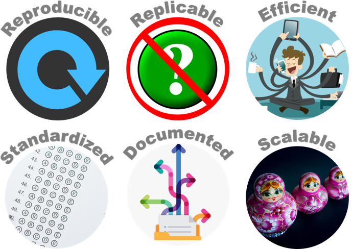
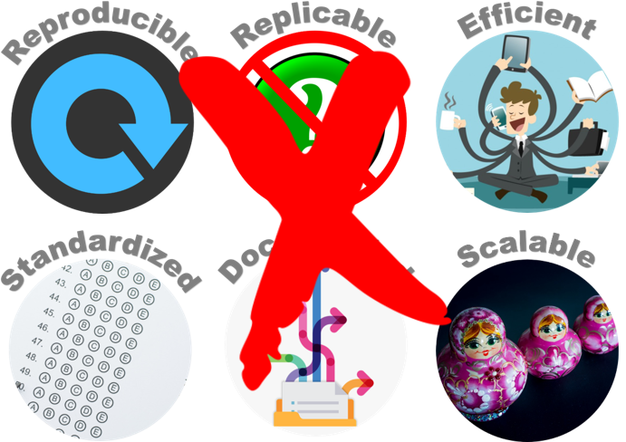
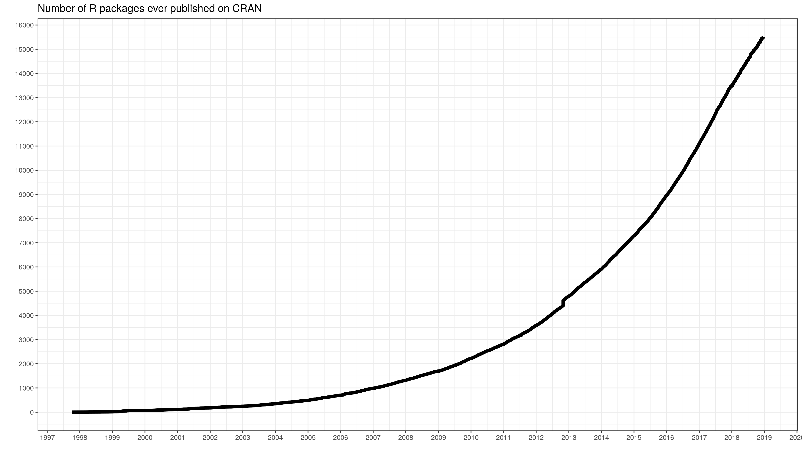

```{r setup, include=FALSE}
options(htmltools.dir.version = FALSE)
library(icon)
library(tidyverse)
library(crayon)
library(flair)
library(sbtools)
```

```{r xaringan-themer, include=FALSE, eval=FALSE}
library(xaringanthemer)
mono_light(
  code_font_family = "Fira Code",
  code_font_url    = "https://cdn.rawgit.com/tonsky/FiraCode/1.204/distr/fira_code.css"
)
```


background-image: url(images/an-image.jpg)
background-size: contain
class: hide-logo, center, middle, inverse
#  Tools for a Code-based Data Workflow

.pull-left[
`McCrea Cobb`  
`r icon::fa("envelope")` mccrea_cobb@fws.gov  
`r icon::fa("phone")` 907-786-3403  
`r icon::fa("github")` mccrea.cobb  
]

.pull-right[
`Adam D. Smith`  
`r icon::fa("envelope")` adam_d_smith@fws.gov  
`r icon::fa("phone")` 706-425-2197  
`r icon::fa("github")` adamdsmith  
]

<br>

`r icon::fa("github")` usfws.github.io/data-mgt-with-r/


???
Hello and welcome to Tools for a Code-based Data Workflow. 

My name is McCrea Cobb. I work in the Inventory and Monitoring Program within the National Wildlife Refuge Sytem, and I am located in Anchorage, Alaska. I am co-presenting with Adam Smith, who is also with the I&M program and based in Athens, Georgia.

Our presentation slides can be found by following the link at the bottom.


---
class: inverse, center, middle, hide-logo
# Outline


???
I'll start out by providing a brief outline of what we will be covering today.


---
class: inverse, center, middle, hide-logo
# Outline

.left[.pull-right-70[
#### Review the data life cycle and data workflow
]
]


??
First, we will review some of the concepts introduced earlier today by Jared and Maren. We will provide a cursory review of the data and project life cycles and how these fit into a typical scientific data workflow. We will compare the traditional "point and click" data workflow to a code-based data workflow in R, and provide some reasons why we are advocating for the code-based data workflow.


---
class: inverse, center, middle, hide-logo
# Outline

.left[.pull-right-70[

<span style="color:gray">Review the data life cycle and data workflow</span>

#### Present tools in R for efficiently and effectively working with data along the life cycle
]
]


???
Next, following the steps of a data life cycle, we will present tool in R for efficiently and effectively working with data.


---
class: inverse, center, middle, hide-logo
# Outline

.left[.pull-right-70[
<span style="color:gray">Review the data life cycle and data workflow</span>

<span style="color:gray">Present some tools in R for efficiently and effectively working with data along the life cycle</span>

#### Demonstrate a data workflow in R using an example project
]
]

???
Finally, we will walk through a demonstration of how these tools and concepts can be applied to a real-world FWS scientific survey.

In general, the focus of this webinar is on scientific data, but the tools that we cover could be applied to other types of data.


---
background-image: url(images/draw_owl-kosher.jpg)
background-size: contain
class: hide-logo

???
Before starting though, we wanted to include a disclaimer. 
  - This webinar is not an "Introduction to R", and "How to get your data into R", or "Learn the Tidyverse".
  - If you are interested in learning R, there are many courses that cover these materials, from online courses from DataCamp or in-person courses through NCTC courses (CSP1004 Data Wrangling in R)
- Our take home message is simply: It is possible to use a scripting languaging like R to complete your data workflow that follows the data life cycle. Doing this is more efficient and less error prone than a traditional data workflow that is commonly used.


---
# Project and data life cycles

.center[]


???
- As I mentioned, we will roughly follow the project and data life cycles that Jared and Maren introduced in the previous webinar on data management. 
- Both the data and project life cycles start with a **Planning** step, and so we will start with recommended steps that we think should be considered during the planning step and cover some associated R tools.


---
background-image: url(images/life_cycles-data.png)
background-size: 90%
class: hide-logo


???
- Next, we will progress through data life cycle: starting with the Acquire step, and moving through the Process, Analyze, Share and Achive steps.


---
class: middle, center
background-image: url("images/allison_horst_workflow.png")
background-size: contain


???
Here's another way to look at the same workflow. The typical FWS scientific project starts with acquiring data, by collecting the data and importing existing data that have been archived. Next there is a Processing step to tidy the data for analysis, the following step. The next step is to share the data and results through presentations and reports. Finally, missing from this figure, these data and products are archived so that others can build upon them.


---
class: hide-logo
# `r icon::fa("times", color = "red")` Traditional data workflow


???
Ok. So how are these steps typically accomplished? Let's first walk through the traditional data workflow that is probably familiar to everybody here.


---
background-image: url(images/traditional_workflow_1.png)
background-size: 90%
class: hide-logo
# `r icon::fa("times", color = "red")` Traditional data workflow


???
First, you start with data. These could be paper datasheets, maybe some data that were collected using a mobile app like Collector or Survey123, or data that you found in a repository like ServCat or data.gov. 


---
background-image: url(images/traditional_workflow_2.png)
background-size: 90%
class: hide-logo
# `r icon::fa("times", color = "red")` Traditional data workflow


???
The first step is to acquire these data. This is generally done by digitizing paper data into Excel,  Access or ArcGIS, and downloading data from a repository by navigating to a webpage in Chrome and clicking on button. 


---
background-image: url(images/traditional_workflow_3.png)
background-size: 90%
class: hide-logo
# `r icon::fa("times", color = "red")` Traditional data workflow


???
Next, these data are process and quality checked in these same software. Occasionally, people might load data into R (convert to a csv first!), process the data in R and then export the clean data back into a csv, giving it a new name like "data_clean" to differentiate it from the raw data.


---
background-image: url(images/traditional_workflow_4.png)
background-size: 90%
class: hide-logo
# `r icon::fa("times", color = "red")` Traditional data workflow


???
The third step is data analysis. For spatial data, this is often done in ArcGIS. For exploratory data analysis of non-spatial data, this might be a accomplished using Excel or Access. More complex analyses might require the user to convert the data to a csv, load it into R, run from models, and write CSV table of results. 


---
background-image: url(images/traditional_workflow_5.png)
background-size: 90%
class: hide-logo
# `r icon::fa("times", color = "red")` Traditional data workflow


???
Reporting these results requires the user to write summary text in a Word document or in Powerpoint slides. ArcGIS, Excel, and and R are used to create figures that are often saved as JPGs. 


---
background-image: url(images/traditional_workflow_6.png)
background-size: 90%
class: hide-logo
# `r icon::fa("times", color = "red")` Traditional data workflow `r icon::fa("frown-open")`


???
Finally, to complete the report or presentation slides, the user is required to manually copy and paste the JPG figures into Word or Powerpoint.


---
class: center, middle, hide-logo




???
How do you evaludate whether a data workflow is a "good" one. To do this, you need some criteria from which to measure success. You can probably imagine a list of these, but for this webinar, we focus just on these six.

A good data workflow should maximize the criteria listed here. Let's evaluate the traditional data workflow using these criteria. 
 
- First, is it is reproducible? Not really. If someone else were attempting to reproduce this effort, they might not know which data were used to generate the figures and tables and they are even less likely to be able to replicate all the steps in the workflow. 

- Is it replicable by the person that completed the workflow? Unlikely. The person that completed the workflow might have trouble replicating the steps for the next year's annual report.

- Is it efficient? Perhaps for a single one-off project, but not for any long-term data collection effort. Almost all these steps have to be repeated to reproduce the results with new data.

- Is it standardized? No, even small details like the sizes of figures is likely differ between analyses.

- Is it scalable. No. Every time that new data are generated or the original data change, then the workflow breaks and needs to be restarted, sometimes from scratch. 
    
    
---
class: center, middle, hide-logo




???
boo..


---
background-image: url(images/workflow.gif)
background-size: contain
class: hide-logo


???
- What we need is a seamless workflow like this, where the data go from acquiring (i.e. hand) to process (and archiving).
- Your code should be the soruce of your products (report, etc). Based on your code. 


---
class: hide-logo
# `r icon::fa("check", color = "green")`  data workflow 


???


---
background-image: url(images/r_workflow_1.png)
background-size: 90%
class: hide-logo
# `r icon::fa("check", color = "green")`  data workflow 


???


---
background-image: url(images/r_workflow_2.png)
background-size: 90%
class: hide-logo
# `r icon::fa("check", color = "green")`  data workflow


???


---
background-image: url(images/r_workflow_3.png)
background-size: 90%
class: hide-logo
# `r icon::fa("check", color = "green")`  data workflow


???


---
background-image: url(images/r_workflow_4.png)
background-size: 90%
class: hide-logo
# `r icon::fa("check", color = "green")`  data workflow


???


---
background-image: url(images/r_workflow_5.png) 
background-size: 90%
class: hide-logo
# `r icon::fa("check", color = "green")`  data workflow


???


---
background-image: url(images/r_workflow_6.png)
background-size: 90%
class: hide-logo
# `r icon::fa("check", color = "green")`  data workflow


???


---
background-image: url(images/r_workflow_7.png)
background-size: 90%
class: hide-logo
# `r icon::fa("check", color = "green")`  data workflow


???

---
background-image: url(images/r_workflow_8.png)
background-size: 90%
class: hide-logo
# `r icon::fa("check", color = "green")`  data workflow


???

---
background-image: url(images/r_workflow_9.png)
background-size: 90%
class: hide-logo
# `r icon::fa("check", color = "green")`  data workflow


???

---
background-image: url(images/r_workflow_10.png)
background-size: 90%
class: hide-logo
# `r icon::fa("check", color = "green")`  data workflow `r icon::fa("grin-stars")`


???


---
background-image: url(images/Rlogo.svg)
class: hide-logo, middle, right
background-size: 40%
background-position: 10% 50%


???
What is R? R is a programming language for statistical computing and graphics.

What is RStudio? RStudio is a integrated development environment (IDE) for R (software) to develop and share work.

- Why should you use R?
  - Free for everybody
  - Relatively easy to learn (compared to other programming languages)
  - Popular (2 millions users)
  - Powerful
  - Flexible
    - statistical analyses
    - graphics
    - reporting
  - Nice free integrated development environment (RStudio)
  
  
---




???
- Active community of users
  - stackoverflow
  - package development - currently over 15,000 packages
  - GitHub integration


---
class: center, middle, inverse

# Planning


???


---
# Organizing an  project 

### `r icon::fa("sitemap")` Chose a  standardized project directory structure

.pull-left[
Provides consistent relative directory paths for your scripts

- R packages provide functions to create a standard file directory:
    - [`MakeProject::MakeProject()`](https://cran.r-project.org/web/packages/makeProject/index.html)
    - [`rrtools::use_analysis()`](https://www.rdocumentation.org/packages/rrtools/versions/0.1.0)
    - [`refugetools::create.dir()`](https://github.com/USFWS/refugetools)
    - [`prodigenr::setup_project()`](https://cran.r-project.org/web/packages/prodigenr/readme/README.html)

  
]

.pull-right[
An example file directory:
```{r, eval=FALSE}
project_name/
  admin/
  code/ #<<
    functions/
  data/ #<<
    derived_data/
    raw_data/
  incoming/
  metadata/
  output/
    figures/
    raw_analysis/
    tables/
  products/
  resources/
    data/ #<<
    publications/
    reports/
```
]


???
- Project-oriented workflows are self-contained workflows enabling reproducibility and navigability when used in conjunction with organized project structures for ecological forecasting projects. Ideally a collaborator should be able to run the entire project without changing any code or files (e.g. file paths should be workstation-independent). R and Python both have options for enabling self-contained workflows in their coding environments. 
    – RStudio projects allow for analyses to be contained in a single working directory that can be given to a collaborator and run without changing file directory paths. 
- There are packages that produce a standardized directory structure
    - Examples: 
        - SppDistMonProj:: dir_create()


---
# Organizing an  project 

### `r icon::fa("file-signature")` Decide on a standardized file naming convention

.pull-left[
- Call files what they are
- Keep names short
- Avoid spaces
- If dates are used, use YYYYMMDD
- Decide on a standard

Allows you to programmatically filter files:
```{r, eval=FALSE}
# Exclude files with 2016 or 2017 in their names
f <- list.files(path = "./filepath", 
                pattern = "[^2016|2017].csv$") #<<

# Load these files
dat <- lapply(f, read.csv)
```
]

.pull-right[

]


???


---
# Organizing an  project 

### `r icon::fa("book")` Consult a style guide

*"Good coding style is like correct punctuation: you can manage without it, butitsuremakesthingseasiertoread"*  
*-[Hadley Wickham](https://style.tidyverse.org/index.html)*

.pull-left[
- Strive for consistent and meaningful names

- Review existing style guides:
  - [tidyverse style guide](https://style.tidyverse.org/)
  - [Advanced R style guide](http://adv-r.had.co.nz/Style.html)
  - [Google's R style guide](https://google.github.io/styleguide/Rguide.html)

- Helpful R packages:
  - `styler` 
  - `lintr`
]

.pull-right[
```{r, eval=FALSE, results='markup'}
# R code readability

if(readability()) {
  be_happy()
} else {
  rewrite_code()
}
```
]

???

- Strive for consistent and meaningful names
  - file names
  - syntax
    - object names, spacing, long lines, assignments, comments
  - functions
    - naming, return()
    
- Google style guide
- Hadley Wickham's style guide

Two R packages support this style guide:

styler allows you to interactively restyle selected text, files, or entire projects. It includes an RStudio add-in, the easiest way to re-style existing code.

lintr performs automated checks to confirm that you conform to the style guide.


---
# [`styler`](https://github.com/r-lib/styler) package

Can be used to format R code to a specific style 

Flexible for user to specific their own style

```{r, eval=FALSE, message=FALSE, warning=FALSE}
# Some messy code with irregular spacing, etc.
some_data =data_frame(small= 2 ,
                      medium =4,#comment without space
                      large=6   )
```


```{r, message=FALSE, warning=FALSE}
# :) After applying style_text()
some_data <- data_frame(
  small = 2,
  medium = 4, # comment without space
  large = 6)
```

???


---
# `r icon::fa("people-carry")` Project portability


.pull-left[
Maintaining dependencies can be frustrating!

An R project should be: 

1. **Isolated**
2. **Portable**
3. **Reproducible**

There are R tools to help with this:
- [`packrat`](https://rstudio.github.io/packrat/) package
- `rocker` package
]

.pull-right[

]


???
- Isolated: 
  - Installing a new or updated package for one project won’t break your other projects, and vice versa. That’s because packrat gives each project its own private package library.
- Portable: 
  - Easily transport your projects from one computer to another, even across different platforms. Packrat makes it easy to install the packages your project depends on.
- Reproducible:
  - Packrat records the exact package versions you depend on, and ensures those exact versions are the ones that get installed wherever you go.

- Available tools:
  - packrat
  - rocker
    - Docker is a program that allows to manipulate (launch and stop) multiple operating systems (called containers) on your machine (your machine will be called the host).
    - you can use older versions of a package for a specific task, while still keeping the package on your machine up-to-date.


---
# 

.pull-left[
```{r, eval=FALSE}
# Install packrat
install.packages("packrat")

# Set up your project to use packrat
packrat::init()
```

```{r, eval=FALSE}
# Install required packages into your project's private package library
install.packages("tidyverse")

# Take a snapshot to save the changes to packrat
packrat::snapshot()
```
]

.pull-right[


]


???


---
# `r icon::fa("code-branch")` Version control 

.pull-left[
Consider how you will control versions **during the planning step**.

References
- Resources to learn git [(link)](https://try.github.io/)
- Using git from RStudio [(link)](https://nceas.github.io/oss-lessons/version-control/4-getting-started-with-git-in-RStudio.html)
]

.pull-right[

]

---
# `r icon::fa("code-branch")` Version control 


.pull-right[
.center[]
.center[]
]


???


---
class: center, middle, hide-logo

<video controls autoplay width="1200">
  <source src="images/clone_repo.mp4" type="video/mp4">
</video>

???
- Version control is.. 
- You should consider how you will be managing the version history of your work during the planning stage.
- Git is a popular version control software and GitHub is a companion website.
  - Allows for collaboration as well.
- GitHub is popular with R users because it interfaces with package development


---
class: center, middle, inverse, hide-logo
# Documenting


---
# Documenting R object

(image of commented header)
(image of Roxygen header)

???
- This is the metadata for your scripts

- In the simplest case, add a commented header to your R scripts
- For reusable functions, consider inserting an Roxygen header (Ctl-Alt-Shift-R)
    - one less step when bundling your functions into a package.


---
# Roxygen comments

- Metadata for functions
  - Describes the purpose of the function, parameter values (`@params`), what is returned (`@return`), and how to use it (`@example`)


.small[
```{r, eval=FALSE}
#' Calculate estimated proportion of sites at which a species occurs
#'
#' @param topmod object of class \code{unmarkedFitOccu} for single-species 
#' occupancy model
#' @param stat statistic (\code{mean} or \code{median}) used to 
#' summarize posterior distribution
#' @param n number of sites surveyed
#'
#' @return vector containing posterior mean or median and upper and lower 95% 
#' confidence limits
#'
#' @export
#'
#' @example calc.pao(topmod, stat = "mean", n = 30)

calc.pao <- function(topmod, stat = "mode", n){
    re = unmarked::ranef(topmod)
    EBUP = unmarked::bup(re, stat = stat)
    CI = confint(re, level = 0.95)
    PAO = c(Estimate = sum(EBUP), colSums(CI))
    PAO / n
}
```
]


---
class: center, middle, inverse, hide-logo
# Acquiring


???


---
class: center, middle, inverse, hide-logo
# Processing and Analyzing


???


---
class: center, middle, inverse, hide-logo
# Sharing and Archiving


???

Unlike cumbersome word processing applications, text written in Markdown can be easily shared between computers, mobile phones, and people. It’s quickly becoming the writing standard for academics, scientists, writers, and many more. Websites like GitHub and reddit use Markdown to style their comments.

Formatting text in Markdown has a very gentle learning curve. It doesn’t do anything fancy like change the font size, color, or type. All you have control over is the display of the text—stuff like making things bold, creating headers, and organizing lists.

- RMarkdown
  - Types of output
    - html
    - pdf
    - dashboards
    - websites
  - Examples
    - Bat reporting for mobile aucistics
    - COVID 19 example
    

---
class: center, middle, hide-logo
background-image: url("images/report_about_reporting.jpg")
background-size: contain


???


---
#  Rmarkdown
You can generate reports directly from RStudio!

.pull-left-30[
**Allows for:**
- Code to be directly inserted into document

- Multiple outputs

- Easy to use

- Increased reproducibility

- Fewer sources of errors

]

.pull-right-70[
.center[]
]


???
Literate Programming
Traditionally, scientific writing and coding are separate activities—for example, a researcher who wants to use code to generate a figure for her paper will have the code for generating that figure in one file and the document itself in another. This is a challenge for reproducibility and provenance tracking because both criteria have to be maintained for multiple files simultaneously. “Literate programming” provides an alternative approach, whereby code and text are interleaved within a single file; these files can be processed by special literate programming software to produce documents with the output of the code (e.g. figures, tables, and summary statistics) automatically interspersed with the document’s body text. This approach has several advantages. For one, the code output of a literate programming document is by definition guaranteed to be consistent with the code in the document’s source. At the same time, literate programming can make it easier to develop analyses by reducing the separation between writing and coding; for instance, interactive literate programming software can be used to keep “digital lab notebooks” where analyses are developed and described in the same file. In the context of ecological forecasting, literate programming techniques can be particularly useful for writing forecast software documentation, and can even be used for creating automatically-updating documents and reports describing forecast output.


---
class: middle, center
background-image: url("images/rmarkdown_wizards.png")
background-size: contain


???


---
#  Simple YAML header

````{r, eval=FALSE}
---
title: "My report"
author: "McCrea Cobb"
date: "6/24/2020"
output: pdf_document
---
````


???


---
#  More complex YAML header

````{r, eval=FALSE}
---
title: |
    | {width=5cm}
    | 
    | \LARGE Region 4 Inventory and Monitoring Branch 
subtitle: |
    | \Large Mobile Acoustical Bat Monitoring
    | \Large Annual Summary Report
author: '`r params$year`'
date: '`r params$station`'
output:
  pdf_document:
    includes:
      in_header: MABM_report_preamble.tex
urlcolor: blue
params:
  year: 0 # placeholder 
  station: placeholder
  stn_start_yr: 0 # placeholder
  route_path: placeholder
  survey_path: placeholder
  bat_path: placeholder
  spp_path: placeholder
  out_dir: placeholder
  goog_API_key: placeholder
---

````


???
Here's an example of how to generate an Rmarkdown document


---
.pull-left[
.small[
`####` Some Rmarkdown code

This is an `**`R Markdown`**` document. You can write inline code like this: 1 + 1 = `` `r
1 + 1` ``.

You can embed an R code chunk like this:

    ```{r eval=TRUE, echo=FALSE}`r ''`
    DT::datatable(iris[1:3], 
                  rownames = FALSE,
                  options = list(pageLength = 3))
    ```

`####` Including Figures

You can also embed figures, for example:

    ```{r, eval=TRUE, echo=FALSE}`r ''`
    library(leaflet)

    leaflet() %>%
      addTiles() %>%
      addMarkers(lng = 174.768, 
                 lat = -36.852, 
                 popup = "The birthplace of R")
    ```

]
]


---
.pull-left[
.small[
`####` Some Rmarkdown code

This is an `**`R Markdown`**` document. You can write inline code like this: 1 + 1 = `` `r
1 + 1` ``.

You can embed an R code chunk like this:

    ```{r eval=TRUE, echo=FALSE}`r ''`
    DT::datatable(iris[1:3], 
                  rownames = FALSE,
                  options = list(pageLength = 3))
    ```

`####` Including Figures

You can also embed figures, for example:

    ```{r, eval=TRUE, echo=FALSE}`r ''`
    library(leaflet)

    leaflet() %>%
      addTiles() %>%
      addMarkers(lng = 174.768, 
                 lat = -36.852, 
                 popup = "The birthplace of R")
    ```

]
]

.pull-right[
.small[
#### Some Rmarkdown code
This is an **R Markdown** document. You can write inline code like this: 1 + 1 = `r 1+1`.

You can embed an R code chunk like this:
]

.smaller[
```{r, echo=FALSE}
DT::datatable(iris[1:3], 
              rownames = FALSE,
              options = list(pageLength = 3))
```
]

.small[
#### Including Figures

You can also embed figures, for example:

```{r pressure, echo=FALSE, fig.width=6, fig.height=2, warning=FALSE}
library(leaflet)

leaflet() %>%
  addTiles() %>%
  addMarkers(lng=174.768, lat=-36.852, popup="The birthplace of R")

```
]
]


???


---
#  Presentations 

.center[]

???
As mentioned earlier, Rmarkdown documents can be rendered into multiple different formats.
You can create presentations, such as this one!


---
#  Shiny applications 


???
You can also generate interactive content from R, such as websites and dashboards. The Shiny package allows for these, which can also be imbedded into Rmarkdown outputs.

Shiny is an R package that provides a framework for building interactive applications using R, without HTML, CSS, or JavaScript knowledge.

You can host standalone apps as webpages, or embed them in rmarkdown documents

---
background-image: url(images/collar_viewer.png)
background-size: contain
class: hide-logo


???
- Shiny apps
    - Examples
      - collarviewer
      - power analysis for butterfly surveys


---
class: center, middle, hide-logo

<video controls autoplay width="1200">
  <source src="images/collar_viewer.mp4" type="video/mp4">
</video>


???


---


```{r, echo=FALSE}
knitr::include_app("https://vac-lshtm.shinyapps.io/ncov_tracker/?_ga=2.142693877.1775727125.1591996474-181506872.1532128536)", height="600px")
```


???

---
background-image:url("images/cher_data.jpg")
background-position: center bottom 4em
# `r icon::fa("file-archive")` Archiving 


???
- A final and arguably the most important step that is often overlooked in the data life cycle is archiving data. For the typical scientific data project, this should the raw data and the code required to reproduce the results.
- For an R project, you can include code to save your data and products in a remote secure repository.
- For example, instead of manually opening ServCat and saving your reports to as a product in a ServCat record, it is possible to use R code to save results to ServCat. 
- This is an active area of development.
- I encourage you to reach out to your data managers and ServCat managers to look into this more.


---
background-image:url("images/cher_data.jpg")
background-position: center bottom 4em
# `r icon::fa("file-archive")` Archiving 

.center[]


???
- A final and arguably the most important step that is often overlooked in the data life cycle is archiving data. For the typical scientific data project, this should the raw data and the code required to reproduce the results.
- For an R project, you can include code to save your data and products in a remote secure repository.
- For example, instead of manually opening ServCat and saving your reports to as a product in a ServCat record, it is possible to use R code to save results to ServCat. 
- This is an active area of development.
- I encourage you to reach out to your data managers and ServCat managers to look into this more.


---
# [`sbtools` package](https://journal.r-project.org/archive/2016-1/winslow-chamberlain-appling-etal.pdf)

A tool to allow complete access to the USGS ScienceBase API from R.

Supports the creation, editing and access of data/metadata:

.small[
```{r, echo=FALSE}
decorate('
library(sbtools)

# Create new item (record), by default under "My Items" parent
new_item <- item_create(title = "new test item")
', eval=FALSE) %>%
  flair("item_create") %>%
  flair("sbtools", background="pink")
```
]

Once an item is created, an authenticated user can edit the metadata or attach data files to that item:

.small[
```{r, echo=FALSE}
decorate('
# Give the item a new title
edited_item <-  item_update(new_item, list(title = "new updated item"))

# Append data to the item
item_list_files(new_item)
', eval=FALSE) %>%
  flair("item_update") %>%
  flair("item_list_files")
```
]


???
`sbtools` enables direct access to the advanced online data functionality provided by ScienceBase, the U.S. Geological Survey’s online scientific data storage platform.
- Provides scripted R access to ScienceBase to manage metadata and data files, to search the catalog of datasets, and to view and modify data in formats familiar to R users.


---
# [`sbtools` package](https://journal.r-project.org/archive/2016-1/winslow-chamberlain-appling-etal.pdf) - Accessing data

```{r, echo=FALSE}
decorate('
# Access the record
test_item <- item_get("572a2a7fe4b0b13d391a0f6c")

# Take a look at the citation
test_item
', comment = "") %>%
  flair("item_get")
```


???


---

<style>
.leaflet {
    margin: auto;
}
</style>

.small[
```{r map_moose, include=FALSE, warning=FALSE, fig.height=5, fig.width= 10, fig.align='center'}
library(leaflet)

# Get study area boundaries
study_area <- item_get_wfs(test_item)

# Map it
leaflet() %>%
  addPolygons(data = study_area@polygons[[1]], 
              label = study_area$PopupInfo) %>%
  addTiles()
```


```{r, echo=FALSE, warning=FALSE}
decorate("map_moose") %>%
  flair("%>%", background="pink") %>%
  flair("item_get_wfs") %>%
  flair("leaflet")
```
]

???


---
class: center, middle, hide-logo
background-image: url("images/demo_thinking.jpg")
background-size: cover


???
Time for the demo.


---
class: center, middle, inverse, hide-logo
# Questions
