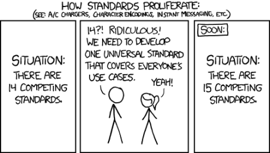

```{r setup, include=FALSE}
options(htmltools.dir.version = FALSE)
```

```{r xaringan-themer, include=FALSE}
library(xaringanthemer)
solarized_light(
  code_font_family = "Fira Code",
  code_font_url    = "https://cdn.rawgit.com/tonsky/FiraCode/1.204/distr/fira_code.css"
)
```


background-image: url(images/draw-owl_kosher.jpg)
background-size: contain


---
class: center, middle
# Introduction


???
- What we will cover

- What we won't cover
    - Intro to R, how to get your data into R, etc
    - There are many free online courses available
        - DataCamp
        - NCTC courses


---
# A data life cycle


???
- Here's some notes


---
# Manual versus scripted data workflow


???
- Here's some notes

+ The manual data workflow
  + Example
  + Limitations
+ The code-based data workflow
  + Advantages
    + Documented
    + Reproducible
    + Replicable
    + More efficient
    + Less error-prone
    
    
---
class: center, middle
# Planning


???
- Add the logo for Planning


---
# File directory structure template

- admin/
- code/
  - functions/
- data/
  - derived_data/
  - raw_data/
- incoming/
- metadata/
- output/
  - figures/
  - raw_analysis/
  - tables/
- products/
- resources/
  - data/
  - publications/
  - reports/


???
- There are packages that produce a standardized directory structure
    - Examples: 
        - SppDistMonProj:: dir_create()


---
# Standards


.center[]


???
- Develop standards within your team
- Advantage
  - ease of coding 
  - ease of interpretability
  - ease of reading

---
# File naming

Within your team, decide on a standardized file naming convention.


???

---
# Style guide

styler package

???
- Google style guide
- Hadley Wickham's style guide


---
# Project portability

### Isolated
### Portable
### Reproducible
(image of packrat)

???

- Isolated: 
  - Installing a new or updated package for one project won’t break your other projects, and vice versa. That’s because packrat gives each project its own private package library.
- Portable: 
  - Easily transport your projects from one computer to another, even across different platforms. Packrat makes it easy to install the packages your project depends on.
- Reproducible:
  - Packrat records the exact package versions you depend on, and ensures those exact versions are the ones that get installed wherever you go.

- Available tools:
  - packrat
  - rocker
    - Docker is a program that allows to manipulate (launch and stop) multiple operating systems (called containers) on your machine (your machine will be called the host).
    - you can use older versions of a package for a specific task, while still keeping the package on your machine up-to-date.


---
# Organizing R files


???
- Here's some notes


---
# Project documentation

(image of commented header)
(image of Roxygen header)

???
- This is the metadata for your scripts

- In the simplest case, add a commented header to your R scripts
- For reusable functions, consider inserting an Roxygen header (Ctl-Alt-Shift-R)
    - one less step when bundling your functions into a package.


---
# Version control


???
- Here's some notes


---
class: center, middle

# Sharing


???


---
# RMarkdown

???
- RMarkdown
  - Types of output
    - html
    - pdf
    - dashboards
    - websites
  - Examples
    - Bat reporting for mobile aucistics
    - COVID 19 example
  

---
# Shiny

Web applications using Shiny


???
- Shiny apps
    - Examples
      - collarviewer
      - power analysis for butterfly surveys


---
# Archiving


???
- Saving results to ServCat or some other data repository


---
class: center, middle

# Demo