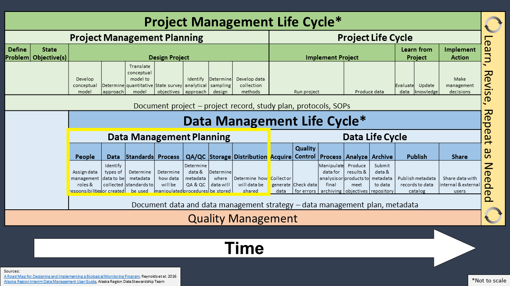

```{r setup, include=FALSE}
options(htmltools.dir.version = FALSE)
library(icon)
library(tidyverse)
```

```{r xaringan-themer, include=FALSE, eval=FALSE}
library(xaringanthemer)
mono_light(
  code_font_family = "Fira Code",
  code_font_url    = "https://cdn.rawgit.com/tonsky/FiraCode/1.204/distr/fira_code.css"
)
```


background-image: url(images/an-image.jpg)
background-size: contain
class: hide-logo, center, middle, inverse

#  Tools for a Code-based Data Workflow

.pull-left[
`McCrea Cobb`  
`r icon::fa("envelope")` mccrea_cobb@fws.gov  
`r icon::fa("phone")` 907-786-3403  
`r icon::fa("github")` mccrea.cobb  
]

.pull-right[
`Adam D. Smith`  
`r icon::fa("envelope")` adam_d_smith@fws.gov  
`r icon::fa("phone")` 706-425-2197  
`r icon::fa("github")` adamdsmith  
]

<br>

`r icon::fa("github")` usfws.github.io/data-mgt-with-r/

---
class: inverse, center, middle, hide-logo

# Outline


---
class: inverse, center, middle, hide-logo

# Outline

*Review the data life cycle and data workflow*


---
class: inverse, center, middle, hide-logo

# Outline

Review the data life cycle and data workflow

*Present some tools in R for efficiently and effectively working with data along the life cycle*


---
class: inverse, center, middle, hide-logo

# Outline

Review the data life cycle and data workflow

Present some tools in R for efficiently and effectively working with data along the life cycle

*Demonstrate a data workflow in R using an example project*


???
- What we will cover
  - Introduce some tools in R that can be used for a data workflow. 
  - We take a scientific data focus, but the tools that we introduce can be used for all types of data.

- Disclaimer: What we won't cover
  - This is not an "Intro to R", how to get your data into R, etc
    - There are many free online courses that cover these materials
      - DataCamp
      - NCTC courses
- Take home message: It is possible to use a scripting languaging like R to complete your data workflow that follows the data life cycle. Doing this is more efficient and less error prone than a manual data workflow commonly used.


---

# Project and data life cycles

.center[]


???
- Here's some notes


---
background-image: url(images/data_life_cycle.png)
background-size: contain
class: hide-logo


???
- There are many versions of the data life cycle


---
background-image: url(images/criteria_grouped3.png)
background-size: contain
class: hide-logo


???
- Here are some criteria that can be used to evaluate your data workflow

+ The manual data workflow
  + Example
  + Limitations
+ The code-based data workflow
  + Advantages
    + Documented
    + Reproducible
    + Replicable
    + More efficient
    + Less error-prone
    

---
background-image: url(images/traditional_workflow_1.png)
background-size: 90%
class: hide-logo

# Traditional data workflow


???


---
background-image: url(images/traditional_workflow_2.png)
background-size: 90%
class: hide-logo

# Traditional data workflow


???


---
background-image: url(images/traditional_workflow_3.png)
background-size: 90%
class: hide-logo

# Traditional data workflow


???


---
background-image: url(images/traditional_workflow_4.png)
background-size: 90%
class: hide-logo

# Traditional data workflow


---
background-image: url(images/traditional_workflow_5.png)
background-size: 90%
class: hide-logo

# Traditional data workflow


???


---
background-image: url(images/traditional_workflow_6.png)
background-size: 90%
class: hide-logo

# Traditional data workflow `r icon::fa("frown-open")`


???
???
---
background-image: url(images/workflow.gif)
background-size: contain
class: hide-logo


???
- The ideal data workflow - seamless.


---
background-image: url(images/r_workflow_1.png)
background-size: 90%
class: hide-logo

#  data workflow 

???


---
background-image: url(images/r_workflow_2.png)
background-size: 90%
class: hide-logo

#  data workflow `r icon::fa("smile")`

???


---
background-image: url(images/r_workflow_3.png)
background-size: 90%
class: hide-logo

#  data workflow `r icon::fa("grin")`

???


---
background-image: url(images/r_workflow_4.png)
background-size: 90%
class: hide-logo

#  data workflow `r icon::fa("grin")`

???


---
background-image: url(images/r_workflow_5.png) 
background-size: 90%
class: hide-logo

#  data workflow `r icon::fa("grin-beam")`

???


---
background-image: url(images/r_workflow_6.png)
background-size: 90%
class: hide-logo

#  data workflow `r icon::fa("grin-beam")`

???


---
background-image: url(images/r_workflow_7.png)
background-size: 90%
class: hide-logo

#  data workflow `r icon::fa("grin-squint")`

???

---
background-image: url(images/r_workflow_8.png)
background-size: 90%
class: hide-logo

#  data workflow `r icon::fa("grin-squint")`

???

---
background-image: url(images/r_workflow_9.png)
background-size: 90%
class: hide-logo

#  data workflow `r icon::fa("grin-stars")`

???

---
background-image: url(images/r_workflow_10.png)
background-size: 90%
class: hide-logo

#  data workflow `r icon::fa("grin-stars")`

???


---
background-image: url(images/Rlogo.svg)
class: hide-logo


???
- Why use R?
  - Free for everybody
  - Relatively easy to learn (compared to other programming languages)
  - Popular
  - Powerful
  - Flexible
    - statistical analyses
    - graphics
    - reporting
  - Active community of users
    - stackoverflow
    - package development
    - GitHub integration
  - Nice free integrated development environment (RStudio)
  

---
background-image: url(images/.svg)
class: hide-logo

---
class: center, middle, inverse

# Planning



???
- Add the logo for Planning


---
#  Organizing an  project 

### 1. Chose a  standardized file directory structure

.pull-left[
- Provides consistent relative directory paths for your scripts.

- R packages provide functions to create a standard file directory
    - [`MakeProject::MakeProject()`](https://cran.r-project.org/web/packages/makeProject/index.html)
    - [`rrtools::use_analysis()`](https://www.rdocumentation.org/packages/rrtools/versions/0.1.0)
    - [`refugetools::create.dir()`](https://github.com/USFWS/refugetools)
    - [`prodigenr::setup_project()`](https://cran.r-project.org/web/packages/prodigenr/readme/README.html)

  
]

.pull-right[
An example file directory:
```{r, eval=FALSE}
project_name/
  admin/
  code/ #<<
    functions/
  data/ #<<
    derived_data/
    raw_data/
  incoming/
  metadata/
  output/
    figures/
    raw_analysis/
    tables/
  products/
  resources/
    data/ #<<
    publications/
    reports/
```
]


???
- There are packages that produce a standardized directory structure
    - Examples: 
        - SppDistMonProj:: dir_create()


---
#  Organizing an  project 

### 2. Decide on a standardized file naming convention

.pull-left[
- Call files what they are
- Keep names short
- Avoid spaces
- If dates are used, use YYYYMMDD
- Decide on a standard
    - e.g., ****camelCase, snake_case, PascelCase, kebab-case***
]

.pull-right[

]

Allow you to programmatically filter files:
```{r, eval=FALSE}
# Exclude files with 2016 or 2017 in their names
f <- list.files(path = "./filepath", 
                pattern = "[^2016|2017].csv$") #<<

# Load these files
dat <- lapply(f, read.csv)
```

???


---
#  Organizing an  project 

### 2. Consult a style guide

"Good coding style is like correct punctuation: you can manage without it, butitsuremakesthingseasiertoread"  -[Hadley Wickham](https://style.tidyverse.org/index.html)

.pull-left[
- Strive for consistent and meaningful names
- Review existing style guides:
  - [tidyverse style guide](https://style.tidyverse.org/)
  - [Advanced R style guide](http://adv-r.had.co.nz/Style.html)
  - [Google's R style guide](https://google.github.io/styleguide/Rguide.html)
- Helpful R packages:
  - `styler` 
  - `lintr`
]

.pull-right[
```{r, eval=FALSE, results='markup'}
# R code readability

if(readability()) {
  be_happy()
} else {
  rewrite_code()
}
```
]

???

- Strive for consistent and meaningful names
  - file names
  - syntax
    - object names, spacing, long lines, assignments, comments
  - functions
    - naming, return()
    
- Google style guide
- Hadley Wickham's style guide

Two R packages support this style guide:

styler allows you to interactively restyle selected text, files, or entire projects. It includes an RStudio add-in, the easiest way to re-style existing code.

lintr performs automated checks to confirm that you conform to the style guide.


---
# [`styler` package](https://github.com/r-lib/styler)

Can be used to format R code to a specific style. 

Flexible for user to specific their own style.

```{r, eval=FALSE, message=FALSE, warning=FALSE}

# Before
some_data =data_frame(small= 2 ,
                      medium =4,#comment without space
                      large=6   
)
```

```{r}
# After style_text(...)

some_data <- data_frame(
  small = 2,
  medium = 4, # comment without space
  large = 6
)
```

???
- 


---
# Project portability


.left-column[
<br>

]

.right-column[
Isolated

Portable

Reproducible
]

???

- Isolated: 
  - Installing a new or updated package for one project won’t break your other projects, and vice versa. That’s because packrat gives each project its own private package library.
- Portable: 
  - Easily transport your projects from one computer to another, even across different platforms. Packrat makes it easy to install the packages your project depends on.
- Reproducible:
  - Packrat records the exact package versions you depend on, and ensures those exact versions are the ones that get installed wherever you go.

- Available tools:
  - packrat
  - rocker
    - Docker is a program that allows to manipulate (launch and stop) multiple operating systems (called containers) on your machine (your machine will be called the host).
    - you can use older versions of a package for a specific task, while still keeping the package on your machine up-to-date.


---
# Version control 

.pull-left[
Consider how you will control versions **before** starting an R projects.
]

.pull-right[
.center[]
.center[]


]


---

<video controls autoplay width="800" height="500" controls>
  <source src="images/clone_repo.mp4" type="video/mp4">
</video>

???
- Version control is.. 
- You should consider how you will be managing the version history of your work during the planning stage.
- Git is a popular version control software and GitHub is a companion website.
  - Allows for collaboration as well.
- GitHub is popular with R users because it interfaces with package development


---
class: center, middle, inverse, hide-logo

# Documenting


---
# Documenting R object

(image of commented header)
(image of Roxygen header)

???
- This is the metadata for your scripts

- In the simplest case, add a commented header to your R scripts
- For reusable functions, consider inserting an Roxygen header (Ctl-Alt-Shift-R)
    - one less step when bundling your functions into a package.


---
# Roxygen comments

- Metadata for functions
  - Describes the purpose of the function, parameter values (`@params`), what is returned (`@return`), and how to use it (`@example`)


.small[
```{r, eval=FALSE}
#' Calculate estimated proportion of sites at which a species occurs
#'
#' @param topmod object of class \code{unmarkedFitOccu} for single-species 
#' occupancy model
#' @param stat statistic (\code{mean} or \code{median}) used to 
#' summarize posterior distribution
#' @param n number of sites surveyed
#'
#' @return vector containing posterior mean or median and upper and lower 95% 
#' confidence limits
#'
#' @export
#'
#' @example calc.pao(topmod, stat = "mean", n = 30)

calc.pao <- function(topmod, stat = "mode", n){
    re = unmarked::ranef(topmod)
    EBUP = unmarked::bup(re, stat = stat)
    CI = confint(re, level = 0.95)
    PAO = c(Estimate = sum(EBUP), colSums(CI))
    PAO / n
}
```
]


---
class: center, middle, inverse, hide-logo

# Acquiring


---
class: center, middle, inverse, hide-logo

# Processing and Analyzing


---
class: center, middle, inverse, hide-logo

# Sharing


???


---
#  Reports


.pull-left[
[Dynamic reports]  
[Interactive reports]
]

.pull-right[

]


???
- RMarkdown
  - Types of output
    - html
    - pdf
    - dashboards
    - websites
  - Examples
    - Bat reporting for mobile aucistics
    - COVID 19 example

  
---
#  Presentations 

???


---
background-image: url(images/rmarkdown_presentation.png)
background-size: contain
class: hide-logo


???


---
#  Web applications 


---
background-image: url(images/collar_viewer.png)
background-size: contain
class: hide-logo


???
- Shiny apps
    - Examples
      - collarviewer
      - power analysis for butterfly surveys


---
class: center, middle, inverse, hide-logo

# Archiving


???
- Saving results to ServCat or some other data repository


---
class: center, middle, inverse, hide-logo

# Demo


???


---
class: center, middle, inverse, hide-logo

# Questions