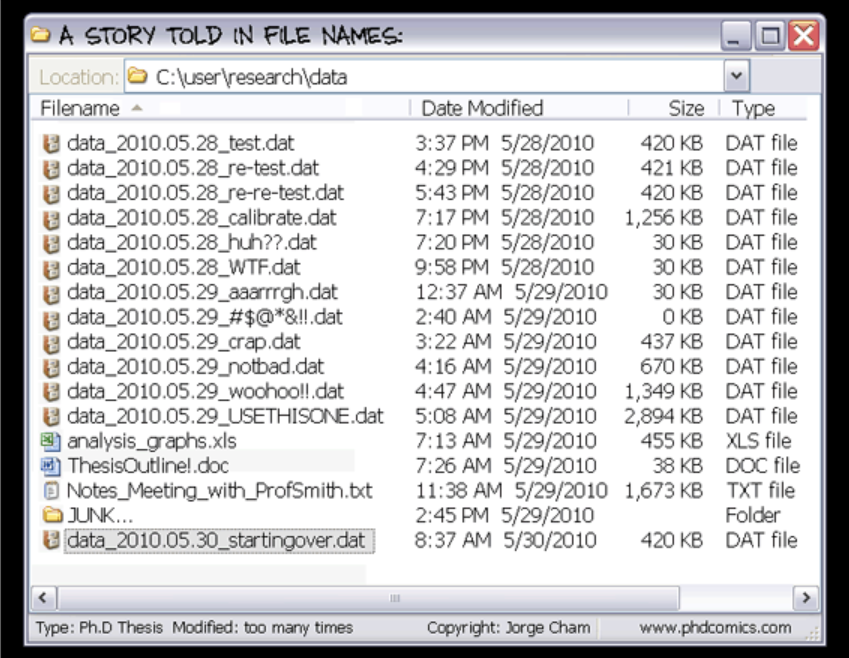

```{r setup, include=FALSE}
options(htmltools.dir.version = FALSE)
library(icon)
```

```{r xaringan-themer, include=FALSE}
library(xaringanthemer)
solarized_light(
  code_font_family = "Fira Code",
  code_font_url    = "https://cdn.rawgit.com/tonsky/FiraCode/1.204/distr/fira_code.css"
)
```


background-image: url(images/an-image.jpg)
background-size: contain
class: hide-logo, center, middle, inverse

# R Tools for a Code-based Data Workflow

.pull-left[
`McCrea Cobb`  
`r icon::fa("envelope")` mccrea_cobb@fws.gov  
`r icon::fa("phone")` 907-786-3403  
`r icon::fa("github")` mccrea.cobb  
]

.pull-right[
`Adam D. Smith`  
`r icon::fa("envelope")` adam_d_smith@fws.gov  
`r icon::fa("phone")` 706-425-2197  
`r icon::fa("github")` adamdsmith  
]

---

# Outline

.pull-left[
1. Review the data life cycle and data workflow
]

---

# Outline

.pull-left[
1. Review the data life cycle and data workflow

2. Presenting tools in R that allow one to efficiently and effectively 
]

---

# Outline

.pull-left[
1. Review the data life cycle and data workflow

2. Presenting tools in R that allow one to efficiently and effectively 

3. Demonstrate an example of data workflow using some of the tools in R
]


???
- What we will cover
  - Introduce some tools in R that can be used for a data workflow. 
  - We take a scientific data focus, but the tools that we introduce can be used for all types of data.

- Disclaimer: What we won't cover
  - This is not an "Intro to R", how to get your data into R, etc
    - There are many free online courses that cover these materials
      - DataCamp
      - NCTC courses
- Take home message: It is possible to use a scripting languaging like R to complete your data workflow that follows the data life cycle. Doing this is more efficient and less error prone than a manual data workflow commonly used.


---

# Data life cycle

.center[]


???
- Here's some notes


---
background-image: url(images/data_life_cycle.png)
background-size: contain
class: hide-logo


???


---
background-image: url(images/workflow.gif)
background-size: contain
class: hide-logo


???
- The ideal data workflow - seamless.


---
background-image: url(images/criteria_grouped3.png)
background-size: contain
class: hide-logo


---
# Manual versus scripted data workflow


???
- Here's some notes

+ The manual data workflow
  + Example
  + Limitations
+ The code-based data workflow
  + Advantages
    + Documented
    + Reproducible
    + Replicable
    + More efficient
    + Less error-prone
    

---
background-image: url(images/Rlogo.svg)
class: hide-logo


???
- Why use R?
  - Free for everybody
  - Relatively easy to learn (compared to other programming languages)
  - Popular
  - Powerful
  - Flexible
    - statistical analyses
    - graphics
    - reporting
  - Active community of users
    - stackoverflow
    - package development
    - GitHub integration
  - Nice free integrated development environment (RStudio)
  

---
class: center, middle
# Planning


???
- Add the logo for Planning


---
# File directory structure template

.pull-left[

- Choose a standard file directory for your R projects

- Provides consistent relative directory paths for your scripts.

- There are R packages that provide functions that create a file directory.
    - `MakeProject::MakeProject()`
    - `rrtools::use_analysis()`
    - `refugetools::dir_create()`

  
]

.pull-right[

An example file directory:
```{}
project_name/
  admin/
  code/
    functions/
  data/
    derived_data/
    raw_data/
  incoming/
  metadata/
  output/
    figures/
    raw_analysis/
    tables/
  products/
  resources/
    data/
    publications/
    reports/
```
]


???
- There are packages that produce a standardized directory structure
    - Examples: 
        - SppDistMonProj:: dir_create()


---
# Standards: style guide

.pull-left[
[why do we need standards]

[what are some of the R standards]

[Tools to maintain standards (e.g., `Styler` package)]

Run through an example

]


.pull-right[
]


???
- Develop standards within your team
- Advantage
  - ease of coding 
  - ease of interpretability
  - ease of reading


???
- Google style guide
- Hadley Wickham's style guide


---
# Standards: file naming

Within your team, decide on a standardized file naming convention.

.center[]


???


---
# Project portability


.left-column[
<br>

]

.right-column[

### Isolated
### Portable
### Reproducible
]

???

- Isolated: 
  - Installing a new or updated package for one project won’t break your other projects, and vice versa. That’s because packrat gives each project its own private package library.
- Portable: 
  - Easily transport your projects from one computer to another, even across different platforms. Packrat makes it easy to install the packages your project depends on.
- Reproducible:
  - Packrat records the exact package versions you depend on, and ensures those exact versions are the ones that get installed wherever you go.

- Available tools:
  - packrat
  - rocker
    - Docker is a program that allows to manipulate (launch and stop) multiple operating systems (called containers) on your machine (your machine will be called the host).
    - you can use older versions of a package for a specific task, while still keeping the package on your machine up-to-date.


---
# Organizing R files


???
- Here's some notes


---
# Project documentation

(image of commented header)
(image of Roxygen header)

???
- This is the metadata for your scripts

- In the simplest case, add a commented header to your R scripts
- For reusable functions, consider inserting an Roxygen header (Ctl-Alt-Shift-R)
    - one less step when bundling your functions into a package.


---

# Version control

.pull-left[
[Some text about version control]

]

.pull-right[
.center[]
.center[]


]


???
- Here's some notes


---
class: center, middle

# Sharing


???


---
background-image: url(images/rmarkdown.png)
background-size: contain
class: hide-logo


???
- RMarkdown
  - Types of output
    - html
    - pdf
    - dashboards
    - websites
  - Examples
    - Bat reporting for mobile aucistics
    - COVID 19 example
  

---
background-image: url(images/shiny.png)
background-size: contain
class: hide-logo


???
- Shiny apps
    - Examples
      - collarviewer
      - power analysis for butterfly surveys


---
# Archiving


???
- Saving results to ServCat or some other data repository


---
class: center, middle

# Demo


???


---
class: center, middle

# Questions