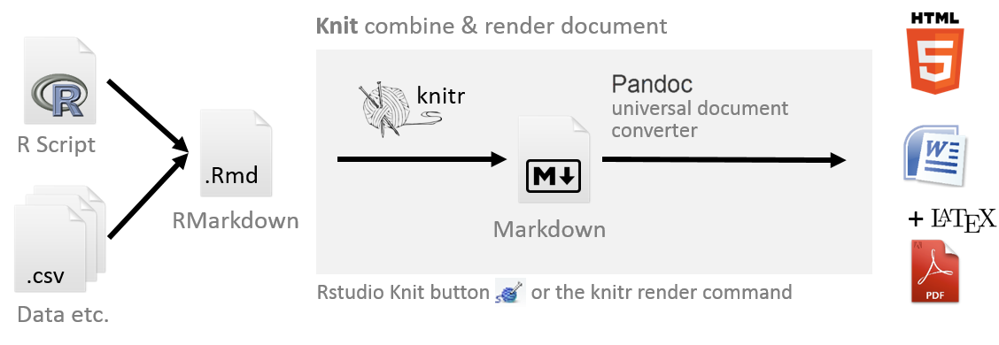

```{r setup, include=FALSE}
options(htmltools.dir.version = FALSE)
library(icon)
library(tidyverse)
library(crayon)
```

```{r xaringan-themer, include=FALSE, eval=FALSE}
library(xaringanthemer)
mono_light(
  code_font_family = "Fira Code",
  code_font_url    = "https://cdn.rawgit.com/tonsky/FiraCode/1.204/distr/fira_code.css"
)
```


background-image: url(images/an-image.jpg)
background-size: contain
class: hide-logo, center, middle, inverse
#  Tools for a Code-based Data Workflow

.pull-left[
`McCrea Cobb`  
`r icon::fa("envelope")` mccrea_cobb@fws.gov  
`r icon::fa("phone")` 907-786-3403  
`r icon::fa("github")` mccrea.cobb  
]

.pull-right[
`Adam D. Smith`  
`r icon::fa("envelope")` adam_d_smith@fws.gov  
`r icon::fa("phone")` 706-425-2197  
`r icon::fa("github")` adamdsmith  
]

<br>

`r icon::fa("github")` usfws.github.io/data-mgt-with-r/

---
class: inverse, center, middle, hide-logo
# Outline


---
class: inverse, center, middle, hide-logo
# Outline

*Review the data life cycle and data workflow*


---
class: inverse, center, middle, hide-logo
# Outline

Review the data life cycle and data workflow

*Present some tools in R for efficiently and effectively working with data along the life cycle*


---
class: inverse, center, middle, hide-logo
# Outline

Review the data life cycle and data workflow

Present some tools in R for efficiently and effectively working with data along the life cycle

*Demonstrate a data workflow in R using an example project*


???
- What we will cover
  - Introduce some tools in R that can be used for a data workflow. 
  - We take a scientific data focus, but the tools that we introduce can be used for all types of data.

- Disclaimer: What we won't cover
  - This is not an "Intro to R", how to get your data into R, etc
    - There are many free online courses that cover these materials
      - DataCamp
      - NCTC courses
- Take home message: It is possible to use a scripting languaging like R to complete your data workflow that follows the data life cycle. Doing this is more efficient and less error prone than a manual data workflow commonly used.


---
background-image: url(images/draw_owl-kosher.jpg)
background-size: contain
class: hide-logo

???


---
# Project and data life cycles

.center[]


???
- Here's some notes


---
background-image: url(images/life_cycles-data.png)
background-size: 90%
class: hide-logo


???
- There are many versions of the data life cycle


---
background-image: url(images/criteria_grouped3.png)
background-size: 70%
class: hide-logo


???
- Here are some criteria that can be used to evaluate your data workflow

+ The manual data workflow
  + Example
  + Limitations
+ The code-based data workflow
  + Advantages
    + Documented
    + Reproducible
    + Replicable
    + More efficient
    + Less error-prone
    

---
background-image: url(images/traditional_workflow_1.png)
background-size: 90%
class: hide-logo
# `r icon::fa("times", color = "red")` Traditional data workflow


???


---
background-image: url(images/traditional_workflow_2.png)
background-size: 90%
class: hide-logo
# `r icon::fa("times", color = "red")` Traditional data workflow


???


---
background-image: url(images/traditional_workflow_3.png)
background-size: 90%
class: hide-logo
# `r icon::fa("times", color = "red")` Traditional data workflow


???


---
background-image: url(images/traditional_workflow_4.png)
background-size: 90%
class: hide-logo
# `r icon::fa("times", color = "red")` Traditional data workflow


???


---
background-image: url(images/traditional_workflow_5.png)
background-size: 90%
class: hide-logo
# `r icon::fa("times", color = "red")` Traditional data workflow


???


---
background-image: url(images/traditional_workflow_6.png)
background-size: 90%
class: hide-logo
# `r icon::fa("times", color = "red")` Traditional data workflow `r icon::fa("frown-open")`


???
Disadvantages  
- Not reproducible
- They are seperate from the code that you used to create your analysis and figures.
- They are time-consuming to create and difficult to maintain.

---
background-image: url(images/workflow.gif)
background-size: contain
class: hide-logo


???
- What we need is a seamless workflow like this, where the data go from acquiring to process (and archiving).
- Your code should be the soruce of your products (report, etc). Based on your code. 


---
background-image: url(images/r_workflow_1.png)
background-size: 90%
class: hide-logo
# `r icon::fa("check", color = "green")`  data workflow 


???


---
background-image: url(images/r_workflow_2.png)
background-size: 90%
class: hide-logo
# `r icon::fa("check", color = "green")`  data workflow


???


---
background-image: url(images/r_workflow_3.png)
background-size: 90%
class: hide-logo
# `r icon::fa("check", color = "green")`  data workflow


???


---
background-image: url(images/r_workflow_4.png)
background-size: 90%
class: hide-logo
# `r icon::fa("check", color = "green")`  data workflow


???


---
background-image: url(images/r_workflow_5.png) 
background-size: 90%
class: hide-logo
# `r icon::fa("check", color = "green")`  data workflow


???


---
background-image: url(images/r_workflow_6.png)
background-size: 90%
class: hide-logo
# `r icon::fa("check", color = "green")`  data workflow


???


---
background-image: url(images/r_workflow_7.png)
background-size: 90%
class: hide-logo
# `r icon::fa("check", color = "green")`  data workflow


???

---
background-image: url(images/r_workflow_8.png)
background-size: 90%
class: hide-logo
# `r icon::fa("check", color = "green")`  data workflow


???

---
background-image: url(images/r_workflow_9.png)
background-size: 90%
class: hide-logo
# `r icon::fa("check", color = "green")`  data workflow


???

---
background-image: url(images/r_workflow_10.png)
background-size: 90%
class: hide-logo
# `r icon::fa("check", color = "green")`  data workflow `r icon::fa("grin-stars")`


???


---
background-image: url(images/Rlogo.svg)
class: hide-logo


???
- Why use R?
  - Free for everybody
  - Relatively easy to learn (compared to other programming languages)
  - Popular
  - Powerful
  - Flexible
    - statistical analyses
    - graphics
    - reporting
  - Active community of users
    - stackoverflow
    - package development
    - GitHub integration
  - Nice free integrated development environment (RStudio)
  

---
class: center, middle, inverse

# Planning


???


---
# Organizing an  project 

### `r icon::fa("sitemap")` Chose a  standardized project directory structure

.pull-left[
Provides consistent relative directory paths for your scripts

- R packages provide functions to create a standard file directory:
    - [`MakeProject::MakeProject()`](https://cran.r-project.org/web/packages/makeProject/index.html)
    - [`rrtools::use_analysis()`](https://www.rdocumentation.org/packages/rrtools/versions/0.1.0)
    - [`refugetools::create.dir()`](https://github.com/USFWS/refugetools)
    - [`prodigenr::setup_project()`](https://cran.r-project.org/web/packages/prodigenr/readme/README.html)

  
]

.pull-right[
An example file directory:
```{r, eval=FALSE}
project_name/
  admin/
  code/ #<<
    functions/
  data/ #<<
    derived_data/
    raw_data/
  incoming/
  metadata/
  output/
    figures/
    raw_analysis/
    tables/
  products/
  resources/
    data/ #<<
    publications/
    reports/
```
]


???
- Project-oriented workflows are self-contained workflows enabling reproducibility and navigability when used in conjunction with organized project structures for ecological forecasting projects. Ideally a collaborator should be able to run the entire project without changing any code or files (e.g. file paths should be workstation-independent). R and Python both have options for enabling self-contained workflows in their coding environments. 
    – RStudio projects allow for analyses to be contained in a single working directory that can be given to a collaborator and run without changing file directory paths. 
- There are packages that produce a standardized directory structure
    - Examples: 
        - SppDistMonProj:: dir_create()


---
# Organizing an  project 

### `r icon::fa("file-signature")` Decide on a standardized file naming convention

.pull-left[
- Call files what they are
- Keep names short
- Avoid spaces
- If dates are used, use YYYYMMDD
- Decide on a standard
    - e.g., ****camelCase, snake_case, PascelCase, kebab-case***

Allows you to programmatically filter files:
]

.pull-right[

]

```{r, eval=FALSE}
# Exclude files with 2016 or 2017 in their names
f <- list.files(path = "./filepath", 
                pattern = "[^2016|2017].csv$") #<<

# Load these files
dat <- lapply(f, read.csv)
```

???


---
# Organizing an  project 

### `r icon::fa("book")` Consult a style guide

*"Good coding style is like correct punctuation: you can manage without it, butitsuremakesthingseasiertoread"*  
*-[Hadley Wickham](https://style.tidyverse.org/index.html)*

.pull-left[
- Strive for consistent and meaningful names

- Review existing style guides:
  - [tidyverse style guide](https://style.tidyverse.org/)
  - [Advanced R style guide](http://adv-r.had.co.nz/Style.html)
  - [Google's R style guide](https://google.github.io/styleguide/Rguide.html)

- Helpful R packages:
  - `styler` 
  - `lintr`
]

.pull-right[
```{r, eval=FALSE, results='markup'}
# R code readability

if(readability()) {
  be_happy()
} else {
  rewrite_code()
}
```
]

???

- Strive for consistent and meaningful names
  - file names
  - syntax
    - object names, spacing, long lines, assignments, comments
  - functions
    - naming, return()
    
- Google style guide
- Hadley Wickham's style guide

Two R packages support this style guide:

styler allows you to interactively restyle selected text, files, or entire projects. It includes an RStudio add-in, the easiest way to re-style existing code.

lintr performs automated checks to confirm that you conform to the style guide.


---
# [`styler`](https://github.com/r-lib/styler) package

Can be used to format R code to a specific style 

Flexible for user to specific their own style

```{r, eval=FALSE, message=FALSE, warning=FALSE}
# Some messy code with irregular spacing, etc.
some_data =data_frame(small= 2 ,
                      medium =4,#comment without space
                      large=6   )
```


```{r, message=FALSE, warning=FALSE}
# :) After applying style_text()
some_data <- data_frame(
  small = 2,
  medium = 4, # comment without space
  large = 6)
```

???


---
# `r icon::fa("people-carry")` Project portability


.pull-left[
Maintaining dependencies can be frustrating!

An R project should be: 

1. **Isolated**
2. **Portable**
3. **Reproducible**

There are R tools to help with this:
- [`packrat`](https://rstudio.github.io/packrat/) package
- `rocker` package
]

.pull-right[

]


???
- Isolated: 
  - Installing a new or updated package for one project won’t break your other projects, and vice versa. That’s because packrat gives each project its own private package library.
- Portable: 
  - Easily transport your projects from one computer to another, even across different platforms. Packrat makes it easy to install the packages your project depends on.
- Reproducible:
  - Packrat records the exact package versions you depend on, and ensures those exact versions are the ones that get installed wherever you go.

- Available tools:
  - packrat
  - rocker
    - Docker is a program that allows to manipulate (launch and stop) multiple operating systems (called containers) on your machine (your machine will be called the host).
    - you can use older versions of a package for a specific task, while still keeping the package on your machine up-to-date.


---
# 

.pull-left[
```{r, eval=FALSE}
# Install packrat
install.packages("packrat")

# Set up your project to use packrat
packrat::init()
```

```{r, eval=FALSE}
# Install required packages into your project's private package library
install.packages("tidyverse")

# Take a snapshot to save the changes to packrat
packrat::snapshot()
```
]

.pull-right[


]


???


---
# `r icon::fa("code-branch")` Version control 

.pull-left[
Consider how you will control versions **during the planning step**.

References
- Resources to learn git [(link)](https://try.github.io/)
- Using git from RStudio [(link)](https://nceas.github.io/oss-lessons/version-control/4-getting-started-with-git-in-RStudio.html)
]

.pull-right[

]

---
# `r icon::fa("code-branch")` Version control 


.pull-right[
.center[]
.center[]
]


???


---
class: center, middle, hide-logo

<video controls autoplay width="1200">
  <source src="images/clone_repo.mp4" type="video/mp4">
</video>

???
- Version control is.. 
- You should consider how you will be managing the version history of your work during the planning stage.
- Git is a popular version control software and GitHub is a companion website.
  - Allows for collaboration as well.
- GitHub is popular with R users because it interfaces with package development


---
class: center, middle, inverse, hide-logo
# Documenting


---
# Documenting R object

(image of commented header)
(image of Roxygen header)

???
- This is the metadata for your scripts

- In the simplest case, add a commented header to your R scripts
- For reusable functions, consider inserting an Roxygen header (Ctl-Alt-Shift-R)
    - one less step when bundling your functions into a package.


---
# Roxygen comments

- Metadata for functions
  - Describes the purpose of the function, parameter values (`@params`), what is returned (`@return`), and how to use it (`@example`)


.small[
```{r, eval=FALSE}
#' Calculate estimated proportion of sites at which a species occurs
#'
#' @param topmod object of class \code{unmarkedFitOccu} for single-species 
#' occupancy model
#' @param stat statistic (\code{mean} or \code{median}) used to 
#' summarize posterior distribution
#' @param n number of sites surveyed
#'
#' @return vector containing posterior mean or median and upper and lower 95% 
#' confidence limits
#'
#' @export
#'
#' @example calc.pao(topmod, stat = "mean", n = 30)

calc.pao <- function(topmod, stat = "mode", n){
    re = unmarked::ranef(topmod)
    EBUP = unmarked::bup(re, stat = stat)
    CI = confint(re, level = 0.95)
    PAO = c(Estimate = sum(EBUP), colSums(CI))
    PAO / n
}
```
]


---
class: center, middle, inverse, hide-logo
# Acquiring


???


---
class: center, middle, inverse, hide-logo
# Processing and Analyzing


???


---
class: center, middle, inverse, hide-logo
# Sharing and Archiving


???
???

Unlike cumbersome word processing applications, text written in Markdown can be easily shared between computers, mobile phones, and people. It’s quickly becoming the writing standard for academics, scientists, writers, and many more. Websites like GitHub and reddit use Markdown to style their comments.

Formatting text in Markdown has a very gentle learning curve. It doesn’t do anything fancy like change the font size, color, or type. All you have control over is the display of the text—stuff like making things bold, creating headers, and organizing lists.

- RMarkdown
  - Types of output
    - html
    - pdf
    - dashboards
    - websites
  - Examples
    - Bat reporting for mobile aucistics
    - COVID 19 example
    

---
#  Rmarkdown
You can generate reports directly from RStudio!

.left-column[
**Allows for:**
- Code to be directly inserted into document

- Multiple outputs

- Easy to use

- Increased reproducibility

- Fewer sources of errors

]

.right-column[
.center[]
]


???
Literate Programming
Traditionally, scientific writing and coding are separate activities—for example, a researcher who wants to use code to generate a figure for her paper will have the code for generating that figure in one file and the document itself in another. This is a challenge for reproducibility and provenance tracking because both criteria have to be maintained for multiple files simultaneously. “Literate programming” provides an alternative approach, whereby code and text are interleaved within a single file; these files can be processed by special literate programming software to produce documents with the output of the code (e.g. figures, tables, and summary statistics) automatically interspersed with the document’s body text. This approach has several advantages. For one, the code output of a literate programming document is by definition guaranteed to be consistent with the code in the document’s source. At the same time, literate programming can make it easier to develop analyses by reducing the separation between writing and coding; for instance, interactive literate programming software can be used to keep “digital lab notebooks” where analyses are developed and described in the same file. In the context of ecological forecasting, literate programming techniques can be particularly useful for writing forecast software documentation, and can even be used for creating automatically-updating documents and reports describing forecast output.


---
#  Simple YAML header

````{r, eval=FALSE}
---
title: "My report"
author: "McCrea Cobb"
date: "6/24/2020"
output: pdf_document
---
````


???


---
#  More complex YAML header

````{r, eval=FALSE}
---
title: |
    | {width=5cm}
    | 
    | \LARGE Region 4 Inventory and Monitoring Branch 
subtitle: |
    | \Large Mobile Acoustical Bat Monitoring
    | \Large Annual Summary Report
author: '`r params$year`'
date: '`r params$station`'
output:
  pdf_document:
    includes:
      in_header: MABM_report_preamble.tex
urlcolor: blue
params:
  year: 0 # placeholder 
  station: placeholder
  stn_start_yr: 0 # placeholder
  route_path: placeholder
  survey_path: placeholder
  bat_path: placeholder
  spp_path: placeholder
  out_dir: placeholder
  goog_API_key: placeholder
---

````


???
Here's an example of how to generate an Rmarkdown document


---
.pull-left[
.small[
`####` Some Rmarkdown code

This is an `**`R Markdown`**` document. Markdown is a simple formatting syntax for authoring HTML, PDF, and MS Word documents.   

You can embed an R code chunk like this:

    ```{r eval=TRUE, echo=FALSE}`r ''`
    summary(cars)
    ```

<br>
<br>
<br>

`####` Including Plots

You can also embed plots, for example:

    ```{r, eval=TRUE, echo=FALSE}`r ''`
    plot(pressure)
    ```

]
]

.pull-right[
.small[
#### Some Rmarkdown code
This is an **R Markdown** document. Markdown is a simple formatting syntax for authoring HTML, PDF, and MS Word documents. 

You can embed an R code chunk like this:

```{r cars, echo=FALSE}
summary(cars)
```

#### Including Plots

You can also embed plots, for example:

```{r pressure, echo=FALSE, fig.width=3, fig.height=3}
plot(pressure)

```
]
]


???


---
#  Presentations 

.center[]

???
As mentioned earlier, Rmarkdown documents can be rendered into multiple different formats.
You can create presentations, such as this one!


---
#  Shiny applications 


???
You can also generate interactive content from R, such as websites and dashboards. The Shiny package allows for these, which can also be imbedded into Rmarkdown outputs.

Shiny is an R package that provides a framework for building interactive applications using R, without HTML, CSS, or JavaScript knowledge.

You can host standalone apps as webpages, or embed them in rmarkdown documents

---
background-image: url(images/collar_viewer.png)
background-size: contain
class: hide-logo


???
- Shiny apps
    - Examples
      - collarviewer
      - power analysis for butterfly surveys


---
class: center, middle, hide-logo

<video controls autoplay width="1200">
  <source src="images/collar_viewer.mp4" type="video/mp4">
</video>


???


---
# `r icon::fa("file-archive")` Archiving 


???
- You can include code to save your data and products in a remote secure repository.
- For example, instead of manually opening ServCat and saving your reports to as a product in a ServCat record, it is possible to use R code to save results to ServCat. 
- This is an active area of development.
- I encourage you to reach out to your data managers and ServCat managers to look into this more.

---
class: center, middle, inverse, hide-logo
# Demo <br> `r icon::fa("walking")` `r icon::fa("desktop")` 


???


---
class: center, middle, inverse, hide-logo
# Questions