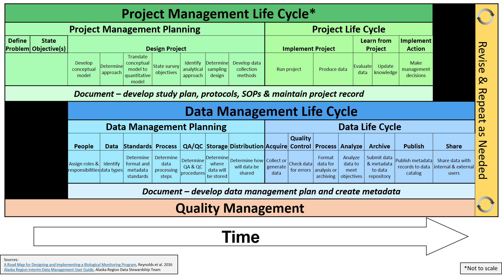
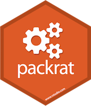
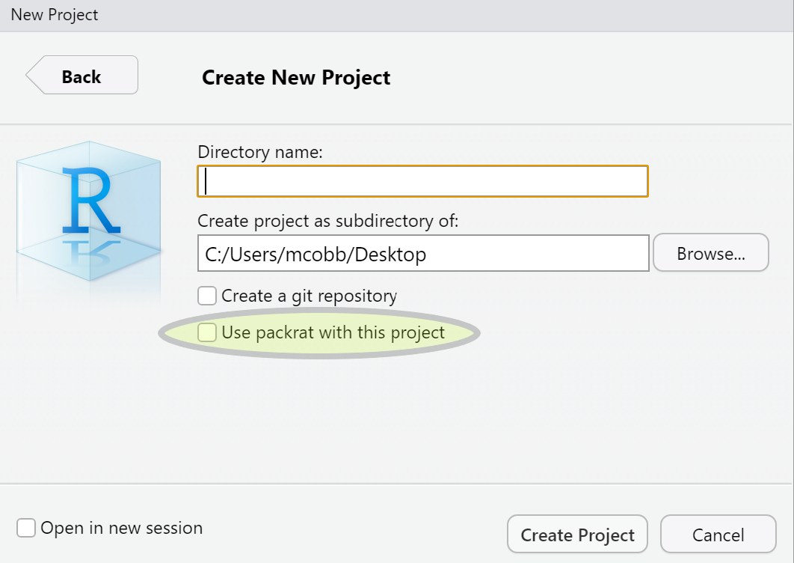
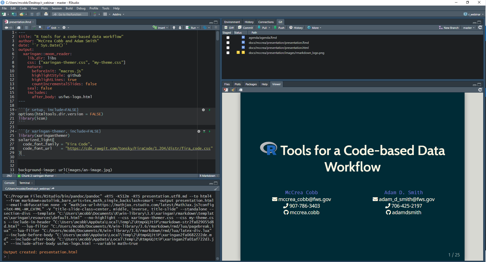

```{r setup, include=FALSE}
knitr::opts_chunk$set(warning = FALSE, message = FALSE, 
                      fig.retina = 3, fig.align = "center")

options(htmltools.dir.version = FALSE)
library(knitr)
library(icon)
library(tidyverse)
library(crayon)
library(flair)
library(sbtools)
```

```{r xaringan-themer, include=FALSE, eval=TRUE}
library(xaringanthemer)
mono_light(code_font_family = "Fira Code",
  code_font_url    = "https://cdn.rawgit.com/tonsky/FiraCode/1.204/distr/fira_code.css",
  base_font_size = "22px",
  outfile = "css/xaringan-themer.css"
)
```

class: hide-logo, center, middle, inverse
#  Tools for a Code-based <br> Data Workflow

.pull-left[
`McCrea Cobb`  
`r icon::fa("envelope")` mccrea_cobb@fws.gov  
`r icon::fa("phone")` 907-786-3403  
`r icon::fa("github")` mccrea.cobb  
]

.pull-right[
`Adam D. Smith`  
`r icon::fa("envelope")` adam_d_smith@fws.gov  
`r icon::fa("phone")` 706-425-2197  
`r icon::fa("github")` adamdsmith  
]

<br>

`r icon::fa("github")` usfws.github.io/data-mgt-with-r/


???
Hello and welcome to "R Tools for a Code-based Data Workflow"! 

As mentioned, my name is McCrea Cobb. I am a biometrician for the Inventory and Monitoring Program within the National Wildlife Refuge Sytem, and I am located in Anchorage, Alaska. I am co-presenting with Adam Smith, who is quantitative ecologist with the I&M program based in Athens, Georgia.

At the bottom of this slide, you can find a link to our GitHub repository that contains this presentation and more R resources.


---
class: inverse, center, middle, hide-logo
# Outline


???
Ok, what will we be covering today?


---
class: inverse, center, hide-logo

<br>
<br>
<br>
<br>

# Outline

#### Review the data life cycle and data workflow


???
First, we will **review** the data and project life cycles introduced earlier today by Jared and Maren and then discuss how these models fit into a scientific data workflows. We will **compare** what we're calling the **traditional** workflow that involves manually manipulating data using propritary software, to a **code-based** data workflow using R, a programming language for statistical computing and graphics.


---
class: inverse, center, hide-logo

<br>
<br>
<br>
<br>

# Outline

<span style="color:gray">Review the data life cycle and data workflow</span>

#### Present tools in  for efficiently and effectively working with data along the life cycle


???
Next, we will follow the steps of a data life cycle, from Planning to Archiving, as a guide to **introduce** tools and tips for developing a data workflow in R.


---
class: inverse, center, hide-logo

<br>
<br>
<br>
<br>

# Outline

<span style="color:gray">Review the data life cycle and data workflow</span>

<span style="color:gray">Present some tools in  for efficiently and effectively  working with data along the life cycle</span>

#### Demonstrate a data workflow in  with a case study


???
Finally, we will **demonstrate** how these tools can be applied to real-world data, with a FWS case study focused on mobile acoustical bat monitoring.

Our focus today is on **scientific data** but the tools and tips that we cover apply to a wide range of data.


---
background-image: url(images/draw_owl-kosher.jpg)
background-size: contain
class: hide-logo

???
Before starting though, we should include a **disclaimer**. It can be **frustrating** trying to learn a new language like R. Much like learning to draw well, you cannot learn R in a hour and a half. If we tried to do this today, it might come across like **this**. 

**Be warned** that this webinar is not an "Introduction to R" or a "How to get your data into R" or "Learn the Tidyverse". We have included links in the slides to additional resources and we encourage you to visit our github site where there are many more additional resources listed. If you are interested in learning R, there are many courses that cover these materials, from online courses from DataCamp or in-person courses through NCTC courses (CSP1004 Data Wrangling in R)

Our **message** is simply: it is possible to use a scripting languaging like R to complete a scientific data workflow that largely mirrors the data life cycle. We believe that this approach is often more efficient and reproducible, and less error prone than the traditional point and click approach to managing data.


---
# Project and data life cycles

.center[]


???
As I mentioned, the project and data life cycles that Jared and Maren introduced in the previous webinar on data management will be our guide for introducing R tools. 

As you can see here, both the data and project life cycles start with a **Planning** step, and so we will start with recommended actions that we think should be considered during the planning step, and cover some associated tools in R.


---
background-image: url(images/life_cycles-data.png)
background-size: 90%
class: hide-logo


???
After that, we will progress through th rest of the data life cycle: starting with the Acquire step, and moving through the Process, Analyze, Share and Achive steps. We will also cover documenting in R.


---
class: hide-logo
# `r icon::fa("times", color = "red")` Traditional data workflow


???
Ok. So how are these steps typically accomplished? Let's first walk through the traditional data workflow that is probably familiar to everybody here.


---
background-image: url(images/traditional_workflow_1.png)
background-size: 90%
class: hide-logo
# `r icon::fa("times", color = "red")` Traditional data workflow


???
First, you start with data. These could be paper datasheets, maybe some data that were collected using a mobile app like Collector or Survey123, or data that you found in a online repository like ServCat or data.gov. 


---
background-image: url(images/traditional_workflow_2.png)
background-size: 90%
class: hide-logo
# `r icon::fa("times", color = "red")` Traditional data workflow


???
The first step is to acquire these data. This is generally done by digitizing paper data into Excel, Access or ArcGIS; and downloading data from a repository by navigating to their webpage in your browser. 


---
background-image: url(images/traditional_workflow_3.png)
background-size: 90%
class: hide-logo
# `r icon::fa("times", color = "red")` Traditional data workflow


???
Next, these data are processed and quality-checked using these same software. Occasionally, data might be imported into R for processing, and then exported as the clean dataset with a new name like "data_clean.csv" for version control and to differentiate it from the raw data.


---
background-image: url(images/traditional_workflow_4.png)
background-size: 90%
class: hide-logo
# `r icon::fa("times", color = "red")` Traditional data workflow


???
Data are then analyzed using a suite of software. For spatial data, this step is often done in ArcGIS. For exploratory data analysis of non-spatial data, this might be a accomplished using Excel or Access. More complex analyses might require the user to convert the data to a csv, load it into R, run from models, and write CSV tables of results. 


---
background-image: url(images/traditional_workflow_6.png)
background-size: 90%
class: hide-logo
# `r icon::fa("times", color = "red")` Traditional data workflow `r icon::fa("frown-open")`


???
Producing a report and presentation of these results requires the user to write text in a Word or Powerpoint files. Then, ArcGIS, Excel, Powerpoint, and R are used to create figures and tables that are often saved as JPG files.

To merge the text with the figures and tables, the user is required to manually copy and paste the images into the Word or Powerpoint document.


---
class: center, middle, hide-logo
background-image: url("images/workflow_criteria.png")
background-size: contain

???
So is this is a "good" data workflow? To evaluate this, we need criteria from which to measure success. Luckily, we have some criteria that Jared and Maren introduced earlier today. Let's evaluate the traditional data workflow using these criteria. 
 
- First, is it is reproducible? Not really. If someone else were attempting to reproduce this effort, they might not know which data were used to generate the figures and tables, and without that, they are unlikely to be able to consistently produce the same output. 

- Is it replicable? Unlikely. Even the person that completed the workflow might have trouble replicating the same steps for the next year's annual report.

- Is it documented? Perhaps if there was a complete record of all the steps, but it is unlikely. I can tell you that never did that.

- Is it efficient? No, it is heavily relient on manual repetive tasks. Humans are much slower than computers. 

- Is it robust to error? Not really. Each manual step introduced the potential for human-caused errors. Any potential software updates compound this problem.

- Is it scalable? No. Every time that new data are generated or the original data change, then the workflow breaks and needs to be restarted, often from the Acquire step. 
    
    
---
class: center, middle, hide-logo
background-image: url("images/workflow_criteria.png")
background-size: contain


???
So based on these criteria, this workflow does not appear to do well.

Ok, so is there a better way??


---
background-image: url(images/workflow.gif)
background-size: contain
class: hide-logo


???
- What we need is a seamless and integated workflow like this guy's breakfast, where data effortlessly move from hand to mouth.

I think you know where I'm going with this...


---
class: hide-logo
# `r icon::fa("check", color = "green")`  data workflow 


???
This is where R comes in. Let's take a look at a code-based workflow in R.


---
background-image: url(images/r_workflow_1.png)
background-size: 90%
class: hide-logo
# `r icon::fa("check", color = "green")`  data workflow 


???
To start, the input data are often the same, although eliminating paper datasheets can eliminate transcription error and, as we will touch on later, allows us to acquire data in R directly through web services.


---
background-image: url(images/r_workflow_3.png)
background-size: 90%
class: hide-logo
# `r icon::fa("check", color = "green")`  data workflow


???
As we will show, R can directly import data from a variety of sources. This is now easier than ever thanks to a number of R package that provide flexible data import functions, including functions for spatial data.


---
background-image: url(images/r_workflow_5.png) 
background-size: 90%
class: hide-logo
# `r icon::fa("check", color = "green")`  data workflow


???
R offers a number of tools for quality control, including both passive data profiling and active assertive programming approaches. 

More to come on that. 

Where R starts to really shine is tidying up messy data, and there are a whole suite of packages called the "tidyverse" that address this need.


---
background-image: url(images/r_workflow_6.png)
background-size: 90%
class: hide-logo
# `r icon::fa("check", color = "green")`  data workflow


???
R was originally developed as a statistical software, and there are now too many packages to even start listing, which allow for an ever growing number of analytical approaches.


---
background-image: url(images/r_workflow_8.png)
background-size: 90%
class: hide-logo
# `r icon::fa("check", color = "green")`  data workflow


???
Maybe less known is the ability to generate reports using a mixture of text and R code. Let me repeat that: **you can now produce reports and presentations from R** without needing Word or Powerpoint. Recently, a number of packages have been developed to address this need that we will touch on.


---
background-image: url(images/r_workflow_9.png)
background-size: 90%
class: hide-logo
# `r icon::fa("check", color = "green")`  data workflow


???
These code-based reports can be saved in variety of file format; including html, PDF and Word files. Even more importantly, it is possible to archive these data and data products back to repositories from R, thereby pleasing your data managers and **closing the data life cycle loop**. 


---
background-image: url(images/r_workflow_10.png)
background-size: 90%
class: hide-logo
# `r icon::fa("check", color = "green")`  data workflow `r icon::fa("grin-stars")`


???
Last but not least, by coding these steps all within an R environment, it is possible to wrap up these steps into a reusable R package that that is fully documented. 


---
background-image: url(images/Rlogo.svg)
class: hide-logo, middle, right
background-size: 40%
background-position: 10% 50%


???
This presentation obviously focused on R and RStudio, which is a integrated development environment (IDE) for R to develop and share work.

But why R? Here's a few reasons:

R is:
- Free
- Relatively easy to learn (compared to other programming languages)
- Flexible and allows for:
  - statistical analyses
  - graphics
  - reporting
- Has a nice integrated development environment (RStudio)
- Popular (2+ millions users)
    - Active community of users
    -  Users have created over 15,000 packages for almost any task that you can think of
- GitHub integration


---
class: center, middle, inverse

# Planning


???
Ok. Let's get with the first step: Planning 


---
# Organizing an  project 

### `r icon::fa("sitemap")` Chose a standardized working directory structure

.pull-left[
Provides consistent relative directory paths for your scripts

R packages provide functions to create a standard file directory:

- [`MakeProject::MakeProject()`](https://cran.r-project.org/web/packages/makeProject/index.html)
- [`rrtools::use_analysis()`](https://www.rdocumentation.org/packages/rrtools/versions/0.1.0)
- [`refugetools::create.dir()`](https://github.com/USFWS/refugetools)
- [`prodigenr::setup_project()`](https://cran.r-project.org/web/packages/prodigenr/readme/README.html)
]

.pull-right[.tiny[
```{r, eval=FALSE}
project_name/
  admin/
  code/ #<<
    functions/
  data/ #<<
    derived_data/
    raw_data/
  incoming/
  metadata/
  output/
    figures/
    raw_analysis/
    tables/
  products/
  resources/ #<<
    data/ 
    publications/
    reports/
```
]
]


???
There are many decision that need to be made when starting project involving data. Perhaps one of the first is how to organize your work. While not necessarily a data management issue, having a standardized project directory has advantages when using a code-based workflow.

Project-oriented workflows are self-contained workflows enabling reproducibility and replicability. Ideally a collaborator or the next biologists should be able to run the entire project without changing any code or files. File paths should be workstation-independent. 

R has options for enabling self-contained workflows in their coding environments, and RStudio projects allow for analyses to be contained in a single working directory that can be given to a collaborator and run without changing file directory paths. 

The figure on the right shows an example of a working directory file structure. Notice that all data produced by the project are stored in a folder called data. Centralizing data like this makes the file paths in R consistent, and it also makes it easier to 

There are tools in R that produce a standardized directory structure. We don't have time today to go into detail about each of these, but there are links here to learn more about them.

- Examples: 
  - MakeProject package
  - SppDistMonProj:: dir_create()


---
# Organizing an  project 

### `r icon::fa("file-signature")` Decide on a standardized file naming convention

.pull-left[
- Call files what they are
- Keep names short
- Avoid spaces and $pec!@l characters
- ISO 8601 for dates

Programmically filter files:
.tiny[
```{r, eval=FALSE}
# Exclude files with 2016 or 2017 in their names
f <- list.files(path = "./filepath", 
                pattern = "[^2016|2017].csv$") #<<

# Load these files
dat <- lapply(f, read.csv)
```
]
]

.pull-right[

]


???
You might hear from data managers that it doesn't matter what you name your files, as long as they are full documented and securely archived. This is true. But, although descriptive file names might be required for data management, there are advantages to having a standardized file naming convention for R project management. Descriptive file names are an important part of organizing, sharing, and keeping track of data files.

Some general guidance includes: call files what they are, keep file names short, avoid spaces and special characters (which might not play well with some software), use a standard for dates such as ISO 8601. 

Deciding on a standard and using it for everything is a good approach. The figure on the right shows a few common naming standards, such as camel case and snake case.

Sticking to a standard allows you to do things in R that would be difficult otherwise, such as programmically filter files. For example, the code at the bottom imports a list of data files but excluded those containing 2016 or 2017.  


---
# Organizing an  project 

### `r icon::fa("book")` Consult a style guide

*"Good coding style is like correct punctuation: you can manage without it, butitsuremakesthingseasiertoread"*  
*-[Hadley Wickham](https://style.tidyverse.org/index.html)*

.pull-left[
- Strive for consistent and meaningful names

- Review existing style guides:
  - [tidyverse style guide](https://style.tidyverse.org/)
  - [Advanced R style guide](http://adv-r.had.co.nz/Style.html)
  - [Google's R style guide](https://google.github.io/styleguide/Rguide.html)

- Helpful R packages:
  - [`styler`](https://www.tidyverse.org/blog/2017/12/styler-1.0.0/) 
  - [`lintr`](https://cran.r-project.org/web/packages/lintr/index.html)
]

.pull-right[
```{r, eval=FALSE, results='markup'}
# R code readability

if(readability()) {
  be_happy()
} else {
  rewrite_code()
}
```
]

???

In addition deciding on a standardized file naming convention during the planning step, we advise settling on a consistent coding syntax. Again, this is not a requirement for good data management, and you can manage without it, but it sure makes things easier to read. Do it for your future self and anyone else who has to suffer through your code.

A good starting place is to consult a style guide. There are a number of them out there, and I list a few of the more popular ones for R here. 

If you are past the planning stage and are struggling to make sense of ugly code, you're in luck! There is an R package called `styler` that has functions to read through and clean up code to a standard of your choosing. Another package called `lintr` will perform on the fly checking to confirm that you are conforming to the style guide. Links to more information about these packages are included here.

Let's take a closer look at the `styler` package. 
 
 
---
# [`styler`](https://github.com/r-lib/styler) package

.pull-left[
Some messy code `r icon::fa("flushed", color = "grey")`

.small[
```{r messy1, include=FALSE, eval=FALSE, message=FALSE, warning=FALSE}
p =dat%>%#a comment
select(refuge ,lat, long) %>%filter(refuge!='kodiak ')%>%
  ggplot(data,aes(x =lat,y= long,group=refuge))%>%  geom_line()#comment without space"
```

```{r, echo=FALSE}
decorate("messy2", eval=FALSE) %>%
  flair("styler") %>%
  flair("select", background = "pink") %>%
  flair("filter", background = "pink") %>%
  flair("ggplot", background = "pink") %>%
  flair("geom_line", background = "pink") %>%
  flair("a comment", color="blue") %>%
  flair("comment without space", color = "blue")
```
]
.center[]
]


???
Here we see some messy code. The line spacing is irregular, there are equals signs for assigments, and there are excessively long lines that make it difficult to follow what the function is doing. What a mess!


---
# [`styler`](https://github.com/r-lib/styler) package

.pull-left[
Some messy code `r icon::fa("flushed", color = "grey")`

.small[
```{r messy2, include=FALSE, eval=FALSE, message=FALSE, warning=FALSE}
p =dat%>%#a comment
select(refuge ,lat, long) %>%filter(refuge!='kodiak ')%>%
  ggplot(data,aes(x =lat,y= long,group=refuge))%>%  geom_line()#comment without space"
```

```{r, echo=FALSE}
decorate("messy2", eval=FALSE) %>%
  flair("styler") %>%
  flair("select", background = "pink") %>%
  flair("filter", background = "pink") %>%
  flair("ggplot", background = "pink") %>%
  flair("geom_line", background = "pink") %>%
  flair("a comment", color="blue") %>%
  flair("comment without space", color = "blue")
```
]
]

.pull-right[
The `style_text()` function cleans it up! `r icon::fa("smile-beam", color = "grey")`
.small[
```{r cleaned, include=FALSE, message=FALSE, warning=FALSE, comment=""}
library(styler)

style_text("p =dat%>%#a comment
select(refuge ,lat, long) %>%filter(refuge!='kodiak ')%>%
  ggplot(data,aes(x =lat,y= long,group=refuge))%>%  geom_line()#comment without space") 
```

```{r, echo=FALSE}
decorate("cleaned", eval=TRUE) %>%
  flair("styler") %>%
  flair("select", background = "pink") %>%
  flair("filter", background = "pink") %>%
  flair("ggplot", background = "pink") %>%
  flair("geom_line", background = "pink") %>%
  flair("a comment", color="blue") %>%
  flair("comment without space", color = "blue")
```
]
]

???
After loading the `styler` package, we can run the `style_text` function to clean things up. The code at the bottom right now includes the commonly used **left arrow** for assignment, consistent spacing, and each of the piped functions are on their own lines. Much better!


---
# `r icon::fa("people-carry")` Project dependencies

### [Maintaining dependencies can be frustrating!](https://en.wikipedia.org/wiki/Dependency_hell)

.pull-left-30[
An R project should be: 

1. **Isolated**
2. **Portable**
3. **Reproducible**

There are R tools to help with this:
- [`packrat`](https://rstudio.github.io/packrat/) package
- [`rocker` package](https://www.rocker-project.org/)
]

.pull-right-70[

]


???
Let's talk about portability. Ideally, a data project should be isolated, portable and reproducible.

To be isolated mean that installing a new or updated package for one project won’t break your other projects, and vice versa. 

To be portable means that it should be easy to transport your projects from one computer to another, even across different platforms. 

To be reproducible means that it is clear to everyone which software versions are required to successfully rerun code. When new versions come out, they might not be backward compatible and certain functions might no longer be available. 

There are a couple of R packages that address project dependency. One is called `packrat` and I will cover that one in more detail in the next slides. 

Another is called `rocker`, which interfaces R with Docker. Docker is a program that allows you to launch multiple virtual operating environments (called containers) on your machine. By doing this, you can run older versions of a package for a specific task, while still keeping the package on your machine up-to-date.


---
#  Packrat

.pull-left[
**Option 1**: Add to a new project


]

.pull-right[
**Option 2**: Add to an existing project

.tiny[
```{r packrat1, include=FALSE, eval=FALSE}
# Install packrat
install.packages('packrat')

# Set up your project to use packrat
packrat::init()
```

```{r, echo=FALSE}
decorate("packrat1", eval=FALSE) %>%
  flair("init()") %>%
  flair("install.packages('packrat')", background = "pink")
```
]

.tiny[
```{r packrat2, include=FALSE, eval=FALSE}
# Install required packages
install.packages('tidyverse')

# Take a snapshot to save the changes to packrat
packrat::snapshot()
```

```{r, echo=FALSE}
decorate("packrat2", eval=FALSE) %>%
  flair("snapshot()")
```
]
]

???
Packrat is an R package that allows you to store your package dependencies in your working directory, instead of relying on your personal R library that is generally buried elsewhere on your computer. Therefore, when you share your project, you are also sharing all the required packages that your project depends on. This makes your project isolated and portable. Packrat also records the exact package versions you depend on, and therefore ensures those exact versions are the ones that get installed wherever you go.

There are two ways to start using packrat. If you are in the planning stage and just starting a new project, and are using RStudio (sorry eMac fans), it is as simple as checking the box at the bottom of the window to "Use packrat with this project". 

Alternatively, if you want to add packrat to an existing project, you need to install and load packrat, and then run the `init` function, as shown on the right. To add a package to packrat, you install the package as your normally would, but instead it installs into your working directory. You can then save your changes using the `snapshot` function.


---
background-image: url("images/version_control.png")
background-size: 55%
background-position: 95% 70%
# `r icon::fa("code-branch")` Version control 

.pull-left-30[
<br>
<br>
.center[
.large[Consider how you will manage versions when ***planning*** your project!]
]
]


???
Version control is the processes and tools designed to keep track of multiple different versions of data, including data products. It can be as simple as renaming the updated files to as complex as a distributed version control system like Git. Whatever the level of complexity, it is **important** to consider what version control system that a project will be using during the *planning stage* of your project.  


---
# `r icon::fa("code-branch")` Version control 

.pull-left[
- Benefits of a version control system
    - Collaboration
    - Storing versions
    - Restoring versions
    - Understanding what happened
    - Backup

- RStudio makes version control with Git and GitHub easier

- Check out:
  - Resources to learn git [(link)](https://try.github.io/)
  - Using git from RStudio [(link)](https://nceas.github.io/oss-lessons/version-control/4-getting-started-with-git-in-RStudio.html)
  - GitHub and R: An Intro for FWS Biologists [(link)](https://mccrea-cobb.github.io/r-github-presentation/#1)
]

.pull-right[

.center[]
.center[]
]


???
You are welcome to use whatever version control system work best for you. That said, there are a number of advantages to using a distributed version control system like Git in combination with the associated website called GitHub. I've listed some of them here. 

If you are using RStudio, using Git and GitHub is relatively straightforward. Unfortunately, I don't have time to run through the steps, but I've included some references to get you started. One of these is a presentation that I recently gave to the Great Lakes R Working Group that introduced Git and GitHub for FWS biologists.


---
class: inverse, center, middle, hide-logo

# Document


???

Before we dig into data acquisition, processing, and analysis, we need to have 
"THE TALK". Yep, we need to talk about documentation. 


---
class: center, middle, inverse, hide-logo
# Sharing and Archiving


???
Ok. We're on the final stretch folks! 

Last but not least, I will cover the sharing and archiving steps of the data life cycle.


---
class: center, middle, hide-logo
background-image: url("images/report_about_reporting.jpg")
background-size: contain


???
Or, in other words, I will attempt to **report about reporting**...


---
background-image: url("images/rmarkdown_logo.png")
background-position: 90% 60%
background-size: 30%

# Literate programming

.large[You can generate reports *directly from RStudio!*]

.pull-left-70[
**Allows for:**
- Code to be directly inserted into document
- Multiple outputs
- Easy to use
- Increased reproducibility
- Fewer sources of errors
]


???
As I touched on earlier, scientific writing and coding were traditionally separate activities. As such, a scientist who wants to use code to generate a figure for her report would have the code for generating that figure in one file and the document itself in another. This presents a challenge for **reproducibility**, and keeping track of where each piece of data came from and whether it's up-to-date. 

**“Literate programming”** provides an alternative approach, whereby code and text are interspersed within a single file. This file can be processed by software to produce documents with the output of the code (e.g. figures, tables, and summary statistics) automatically interwoven with the document’s body text. The most common literate programming file format in R is call RMarkdown.

Unlike cumbersome word processing applications, text written in Markdown can be easily shared between computers, mobile phones, and people. It’s quickly becoming the writing standard for academics and scientists. This approach has several additional advantages. For one, the code output of a literate programming document is by definition guaranteed to be consistent with the code in the document’s source. At the same time, literate programming can make it easier to develop analyses by reducing the separation between writing and coding.


---
class: middle, center
background-image: url("images/rmarkdown_wizards.png")
background-size: contain


???
That's all well and good, but how does it work? 

Well, unless you really want to get into the weeds...given our time constrainst today, let's just say that it's works like magic! 

As shown here, an Rmarkdown document is created by adding text and what's called "chunks" of code. You then run the **`knit`** function on the file. Magic happens and you can celebrate the percieved wizardy. A document is output in the file format that you specified, which is generally an html, Word, or PDF file.


---
#  The YAML header

````{r, eval=FALSE}
---
title: "My report"
author: "McCrea Cobb"
date: "6/24/2020"
output: pdf_document
---
````


???
Ok ok. Let's get under the hood a little bit more. So what does an RMarkdown file contain? There are two required sections: a header and the main body. As shown here, a simple header (written in YAML- Yet Another Markup Language) generally contains some metadata and the desired file output. 


---
#  A more complex header

.smaller[
````{r complex_header, eval=FALSE, include=FALSE}
---
title: |
    | {width=5cm}
    | 
    | \LARGE Region 4 Inventory and Monitoring Branch 
subtitle: |
    | \Large Mobile Acoustical Bat Monitoring
    | \Large Annual Summary Report
author: '`r params$year`'
date: '`r params$station`'
output:
  pdf_document:
    includes:
      in_header: MABM_report_preamble.tex
urlcolor: blue
params:
  year: 0 # placeholder 
  station: placeholder
  stn_start_yr: 0 # placeholder
  route_path: placeholder
  survey_path: placeholder
  bat_path: placeholder
  spp_path: placeholder
  out_dir: placeholder
  goog_API_key: placeholder
---

````

```{r, echo=FALSE}
decorate("complex_header", eval=FALSE) %>%
  flair("params")
```
]

???
Headers can get more complex as the documents gets more customized. For example, this one includes input parameters **(`params`)** that allow the user to customize the content of the report based on their input values. In this report, the user can select the year of data and refuge station on which to generate a report.


---
.pull-left[
.tiny[
`####` Some Rmarkdown code

This is an `**`R Markdown`**` document. You can write inline code like this: 1 + 1 = `` `r
1 + 1` ``.

You can embed an R code chunk like this:

    ```{r eval=TRUE, echo=FALSE}`r ''`
    DT::datatable(iris[1:3], 
                  rownames = FALSE,
                  options = list(pageLength = 3))
    ```

`####` Including Figures

You can also embed figures, for example:

    ```{r, eval=TRUE, echo=FALSE}`r ''`
    library(leaflet)

    leaflet() %>%
      addTiles() %>%
      addMarkers(lng = 174.768, 
                 lat = -36.852, 
                 popup = "The birthplace of R")
    ```

]
]


???
The meat of the report happens in the main body of an RMarkdown document. As I mentioned earlier, the main body, as shown here, is a combination of text written in markdown format and embedded R code that are either included as distinct chunks surrounded by three backticks or in-line surrounded by one backtick. 


---
.pull-left[
.tiny[
`####` Some Rmarkdown code

This is an `**`R Markdown`**` document. You can write inline code like this: 1 + 1 = `` `r
1 + 1` ``.

You can embed an R code chunk like this:

    ```{r eval=TRUE, echo=FALSE}`r ''`
    DT::datatable(iris[1:3], 
                  rownames = FALSE,
                  options = list(pageLength = 3))
    ```

`####` Including Figures

You can also embed figures, for example:

    ```{r, eval=TRUE, echo=FALSE}`r ''`
    library(leaflet)

    leaflet() %>%
      addTiles() %>%
      addMarkers(lng = 174.768, 
                 lat = -36.852, 
                 popup = "The birthplace of R")
    ```

]
]

.pull-right[
.small[
#### Some Rmarkdown code
This is an **R Markdown** document. You can write inline code like this: 1 + 1 = `r 1+1`.

You can embed an R code chunk like this:
]

.smaller[
```{r, echo=FALSE}
DT::datatable(iris[1:3], 
              rownames = FALSE,
              options = list(pageLength = 3))
```
]

.small[
#### Including Figures

You can also embed figures, for example:

```{r pressure, echo=FALSE, fig.width=6, fig.height=2, warning=FALSE}
library(leaflet)

leaflet() %>%
  addTiles() %>%
  addMarkers(lng=174.768, lat=-36.852, popup="The birthplace of R")

```
]
]


???
When the file is knitted, the result is a document that includes the text and the output of the R code. In this example, the R code chunk produced a table and a map. The in-line code calculated a value (1 + 1).


---

```{r, echo=FALSE, out.width="100%", out.height="100%"}
knitr::include_graphics("images/rmarkdown_report.pdf")
```


???
Here's an example of an RMarkdown PDF report that is automatically generated to summarize GPS collar data for quality control. As data regularly upload from the collars to the satellites to servers, the tables and figures in the report are also updated.


---
#  Presentations 

.center[]

???
As mentioned earlier, Rmarkdown documents can be rendered into multiple different formats.
You can even create presentations, such as the one that you are looking at right now!


---
background-image: url("images/shiny.png")
background-position: 90% 50%
background-size: 40%
# Web applications 

<br>
.pull-left[
.large[
- Build interactive web apps from R

- Host standalone apps online

- Embed them in RMarkdown docs
]
]

???
You can generate interactive content from R, such as websites and dashboards. The Shiny package allows for these. Shiny is an R package that provides a framework for building interactive applications using R, without HTML, CSS, or JavaScript knowledge. You can host standalone Shiny apps as webpages, or you can also embed them in RMarkdown documents.


---
class: center, middle, hide-logo

<video controls autoplay width="1200">
  <source src="images/collar_viewer.mp4" type="video/mp4">
</video>


???
Here's an example of a Shiny app in action. In this example, the user is pulling the Shiny app from GitHub and running it locally. After being provided data, the app maps GPS collar data, in this case from lynx in Alaska. The user can than select a subset of GPS collars, create home ranges, and do thing like measure the diameter of the home range.


---
class: hide-logo, center, middle

```{r, echo=FALSE, fig.width=15}
knitr::include_app("https://vac-lshtm.shinyapps.io/ncov_tracker/", height="600px")
```


???
Here's an example of a Shiny app that was develop to track COVID19 cases globally. The data are updated daily from a data repository. You can interact with the data to get at whatever your question might be.

---
background-image:url("images/cher_data.jpg")
background-position: 50% 80%
# `r icon::fa("file-archive")` Archiving 


???
Ok, now for the final and arguably the most important step that is often overlooked in the data life cycle: archiving. For the typical scientific data project, this should the raw data and the code required to reproduce the results.

Typically the process to do this is to visit a repository website, log in with your credentials, create a new record, and then manually upload data and metadata to that record. This is the right thing to do, but isn't it a pain!


---
background-image:url("images/cher_data.jpg")
background-position: 50% 80%
# `r icon::fa("file-archive")` Archiving 

.center[]


???
Our take-home message is: it's possible to do all of this programmically in R!

Just as Adam discussed about R's ability to *access* data from remote repositories, the opposite is also true; R code can also be used to *save* your data and products to a remote secure repository.

- Although it is *possible* to use web services to get, put and delete data in a remote repository, this is often *not straightforward*. - For example, instead of manually opening ServCat and saving your reports to as a product in a ServCat record, it is *possible* to use R code to save results to ServCat. Emphasis on "possible".

To aid in this process, *custom R packages* have been built to access and archive scientific data repositories, such as ScienceBase. These make it *much easier* to use the repositories web services.

Archiving data from R is still an active area of development, and unless there is an existing package, it is not for the faint of heart. If you are interested, I encourage you to reach out to your data managers and ServCat managers to look into this more option for your repository of interest.

Today I was cover an example of an R package called `sbtools` that was developed for interfacing R with data services from ScienceBase, the USGS data repository.


---

# Accessing web services in R 
```{r, echo = FALSE, fig.width=15}
knitr::include_url("https://cran.r-project.org/web/views/WebTechnologies.html",
                   height = "600px")
```


???
Here's a list of R packages that assist with interfacing with web services. As you can see, there are many resources, everything from web scrapping packages to accessing data from Facebook and your fitBit watch.


---
class: center, middle

[](https://github.com/karthik/zenodo)

[](https://github.com/ropensci/rfigshare)

???
There are many R package use web services to get data, but unfortunately fewer R packages are available that allow for archiving data in a repository. Some of the more notable for which R packages can fully interface include:

- Zenodo: an open repository for scientific data based at CERN in Swizerland. Zenodo also mints DOIs. The API allows for uploading, searching and downloading files. The R package is also named `zenodo`. 

- FigShare: online open access repository where researchers can preserve and share their research outputs, including figures, datasets, images, and videos. The R package to interface with FigShare is called, not too surprisingly, `rfigshare`.

Clicking on the images here will direct you to the associated R packages GitHub sites where you can install them. 


---
#  [`sbtools`](https://journal.r-project.org/archive/2016-1/winslow-chamberlain-appling-etal.pdf) 

.pull-left[
- Allows complete access to the USGS ScienceBase API from R. 
- Supports the creation, editing and access of data/metadata:


]

.pull-right[
Create a record:
.smaller[
```{r, echo=FALSE}
decorate('
library(sbtools)

# Log in
authenticate_sb(username = "username@usgs.gov",
                password = password)

# Create new item (record), by default under "My Items" parent
new_item <- item_create(title = "new test item")
', eval=FALSE) %>%
  flair("authenticate_sb") %>%
  flair("item_create") %>%
  flair("sbtools", background="pink")
```
]
]


???
Ok, let's take a look at how these work. I will use the `sbtools` R package for this example. `sbtools` enables direct access to the advanced online data functionality provided by ScienceBase, the U.S. Geological Survey’s online scientific data storage platform.
The package provides scripted R access to manage metadata and data files, to search the catalog of datasets, and to view and modify data in formats familiar to R users.

To do, you first install and load the `sbtools` package. To create a new record in ScienceBase, you first log in as an authenticated user with the `authenticate_sb` function.

You then run a function called `item_create`, as highlighted here. In this case, we are creating a new record called `new test item` and assigning it in R as `new_item`.


---
#  [`sbtools`](https://journal.r-project.org/archive/2016-1/winslow-chamberlain-appling-etal.pdf) 

.pull-left[
- Allows complete access to the USGS ScienceBase API from R. 
- Supports the creation, editing and access of data/metadata:


]

.pull-right[
Create a record:
.smaller[
```{r, echo=FALSE}
decorate('
library(sbtools)

# Log in
authenticate_sb(username = "username@usgs.gov",
                password = password)

# Create new item (record), by default under "My Items" parent
new_item <- item_create(title = "new test item")
', eval=FALSE) %>%
  flair("authenticate_sb") %>%
  flair("item_create") %>%
  flair("sbtools", background="pink")
```
]

Edit a record:
.smaller[
```{r, echo=FALSE}
decorate('
# Give the item a new title
edited_item <-  item_update(new_item, list(title = "new updated item"))

# Append data to the item
item_append_files(edited_item, "test.dat")
', eval=FALSE) %>%
  flair("item_update") %>%
  flair("item_append_files")
```
]
]


???
We can update metadata associated with the record using the `item_update` function.

We can then append data to the record using the `item_append_files` function.


---

#  [`sbtools`](https://journal.r-project.org/archive/2016-1/winslow-chamberlain-appling-etal.pdf): Accessing data

```{r, echo=FALSE}
decorate('
# Access the record
test_item <- item_get("572a2a7fe4b0b13d391a0f6c")

# Take a look at the citation
test_item
', comment = "") %>%
  flair("item_get")
```


???
To complete the data life cycle loop, let's look at how the package can then be used to access data. We can access a record using the `item_get` function and take a look at what's there. In this case, our record contains information about a moose survey at Tetlin Refuge in Alaska.


---

<style>
.leaflet {
    margin: auto;
}
</style>

.small[
```{r map_moose, include=FALSE, warning=FALSE, fig.height=5, fig.width= 10, fig.align='center'}
library(leaflet)

# Get study area boundaries
study_area <- item_get_wfs(test_item)

# Map it
leaflet() %>%
  addPolygons(data = study_area@polygons[[1]], 
              label = study_area$PopupInfo) %>%
  addTiles()
```


```{r, echo=FALSE, warning=FALSE}
decorate("map_moose") %>%
  flair("item_get_wfs") %>%
  flair("(leaflet)", background="pink")
```
]

???
Finally, once we have accessed a record in ScienceBase, it is straightforward to take a look at the data. For this example, I was interested in looking at the study area boundary for the moose survey. The `item_get_wfs` function downloads the spatial layer data using the Web Feature Service interface. I can then view the spatial polygon dataframe using the `leaflet` package. The study area appears to be the boundary of Tetlin Refuge.


---
class: center, middle, hide-logo
background-image: url("images/demo_thinking.jpg")
background-size: cover


???
Ok. That concludes our presentation on R tools for a code-based workflow! We hope that we were successful in demonstrating that features and packages in R allow for a contained data workflow that closely following a data life cycle model. Of course, we barely scratched the surface!

I will now pass it back to Adam, who will demonstate how these concepts and tools can be applied to a real-word a case study focused on mobile acoustical bat monitoring.
